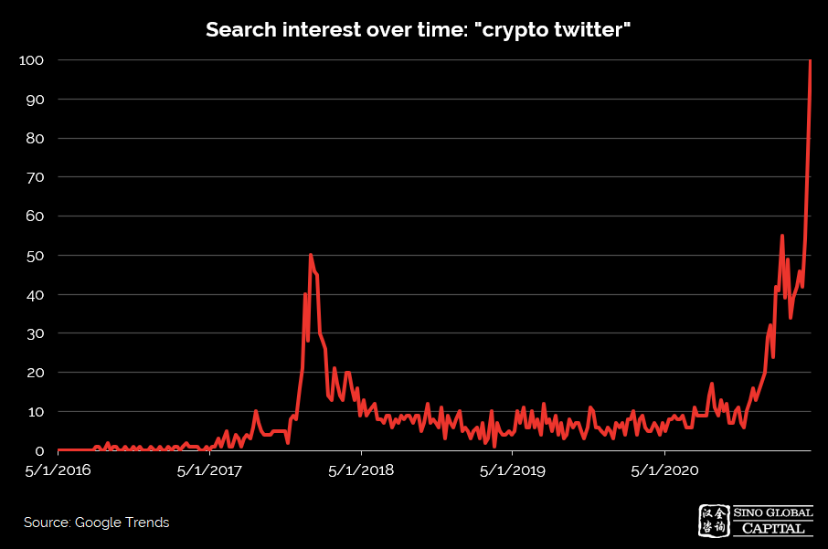
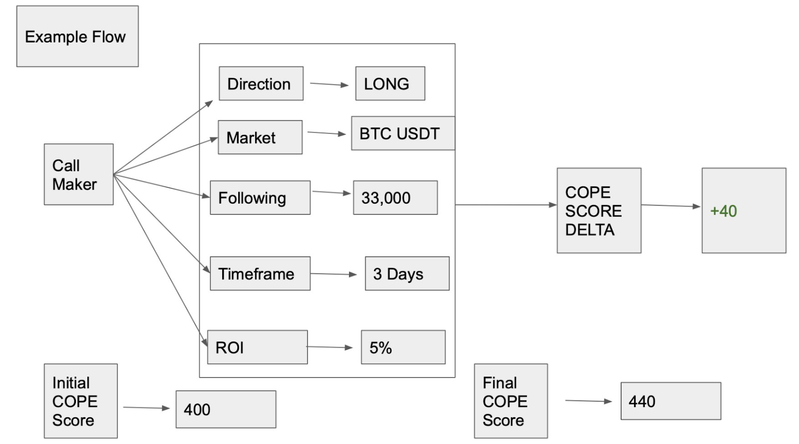
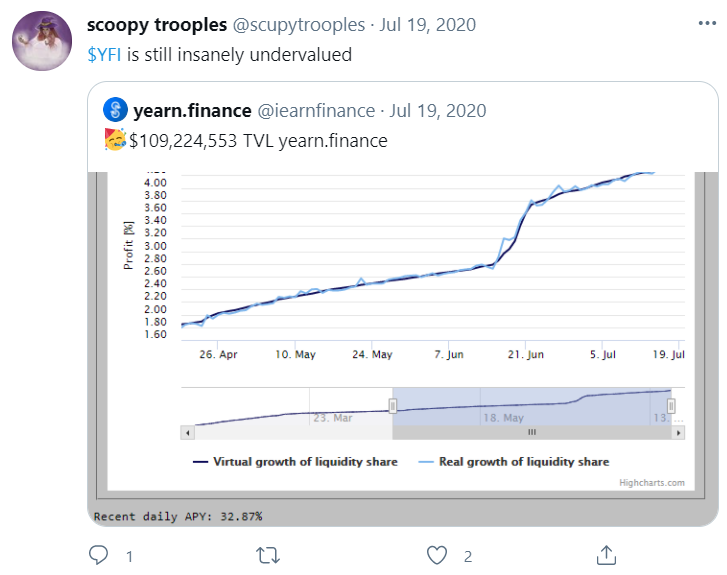
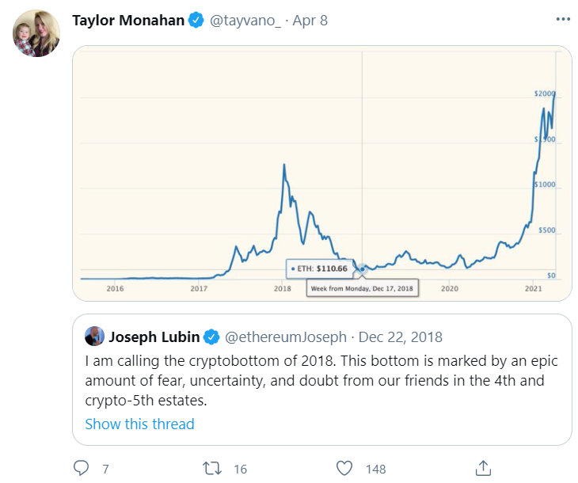
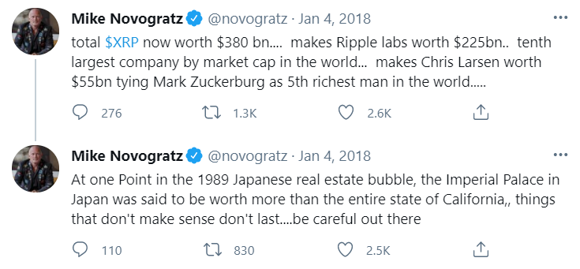
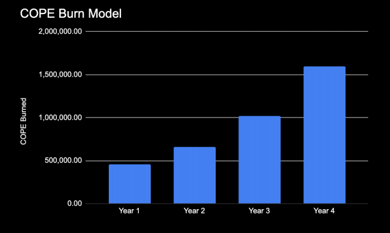
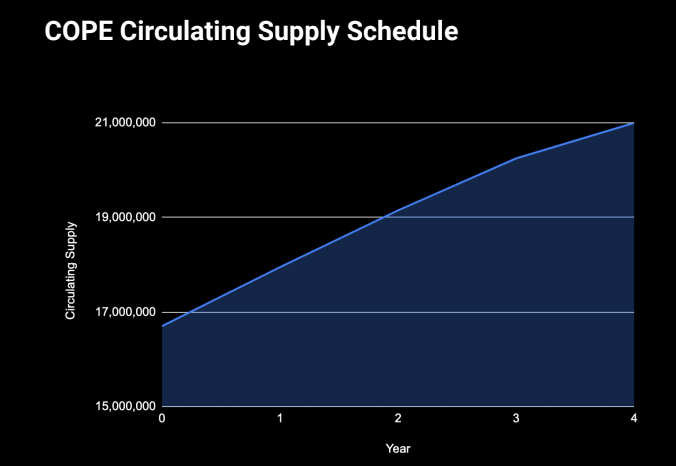

# لماذا استثمرنا في بروتوكول Cope؟

(هذا المقال ليس نصيحة مالية)

##مقدمة

مع ازدياد شعبية ورواج منظومة العملات المشفرة، تنشأ مشاريع جديدة كل يوم،
وتتدفق المعلومات بكثافة بشأنها عبر المدونات الصوتية، وتقارير البحوث،
وأدوات تحليل البيانات، والمجموعات على منصتي Substack، وتلغرام. وقد برزت
تويتر بصفتها المنصة الرائدة للبحث عن سبل البدء والانضمام إلى منظومة
العملات المشفرة. ولا يمكن التقليل من أهمية تويتر بالنسبة للعملات
المشفرة؛ فقد ساهم نشاط العملات المشفرة على تويتر في خلق العديد من
الوظائف، وإطلاق العديد من المشاريع أو اكتشافها، وإبرام الكثير من
الشراكات، وتحفيز الاتجاهات الرائجة. لكن لا يزال من الصعب تمييز المنشورات
السليمة والمناسبة وسط هذا الكم من الحسابات، ولا يرتبط عدد المتابعين
بجودة أفكار المستخدم (خاصةً لأن المنشورات عديمة القيمة غالبًا ما تعمل على
زيادة التفاعل). يغيّر بورتوكول Cope ذلك من خلال عمله كفلتر نهائي
للمنشورات الملائمة. تعد Cope، في أبسط صورها، وسيلة لقياس جودة \"خيارات
الشراء في السوق\" لمستخدمي تويتر، وتجعل من السهل قدر الإمكان نشر رأس
مالك خلف مستخدمي تويتر هؤلاء.

تويتر هي المنصة المفضلة لقطاع العملات المشفرة.

## الأسباب الرئيسية لنجاح Cope

-   مجتمع شعبي ينمو على نحو طبيعي.
-   الاستخدام المتسارع للغاية متأصل في تصميم البروتوكول.
-   يضمن اقتصاد الرموز السليم الانخفاض في القدر المطروح للتداول مع زيادة
    استخدام Cope وتبنّيها.
-   البروتوكول في وضع يمكّنه من الازدهار مع استمرار التقارب بين تأثير
    وسائل التواصل الاجتماعي والمشورة المالية.
-   الفريق المؤسس للبروتوكول سريع التطور ويتّسم بالاهتمام إلى حد كبير.

## المنتجات

مجموع نقاط Cope - القياس الكمي لأداء عمليات الشراء في السوق التي تنفذها
حسابات تويتر.

لوحة تسجيلCope - ترتيب منفذي عمليات الشراء بالسوق المستندة إلى تويتر.

مجمعات تداول Cope - مجمعات تداول لامركزية يديرها الروبوت تعمل على نسخ
أفضل منفذي عمليات الشراء بالسوق.

مؤشر Cope - مؤشر من عشرين رمزًا أختير بناءً على توصيات أفضل 100 من منفذي
عمليات الشراء، تتم إعادة موازنته كل 48 ساعة

##مجموعة نقاط Cope

تتراوح نقاط Cope من 0 إلى 1000، ولكنها تبدأ من 400، وتمثل مقياسًا كميًا
يستخدم لقياس دقة عمليات الشراء في حسابات تويتر. بعد إنشاء تقرير Cope،
تزحف روبوتات تويتر إلى الحساب وتبدأ في مراقبة جميع التغريدات اللاحقة. كل
أسبوعين، سيضبط النظام مجموع نقاط Cope لجميع الحسابات بناءً على جودة
عمليات الشراء في السوق. يستخدم مجموع نقاط Cope المتغيرات التالية لتقييم
الأداء:

##عائد الاستثمار

-   أكثر ما يهم في المعادلة هو عائد الاستثمار (ROI) - إذا اتبعت هذه
    النصيحة، فسيكون عائد الاستثمار هو العائد الذي تحققه. استنادًا إلى
    التحليل التاريخي لعمليات الشراء لمنفذي الشراء - يرتبط الإطار الزمني
    للاستثمار بالحساب (يمكن أن يكون مضاربة لحظية في دقيقة واحدة، أو
    صفقات الاتجاهات الحالية للسعر في فترة 5 ساعات، أو الصفقات المرتكزة
    على أطروحة في فترة شهر/ سنة). يُنشئ متغير الإطار الزمني هذا الفترة،
    بدءًا من لحظة الشراء، والتي سيتم فيها استخدام اتجاه وحجم تغير سعر
    السوق لحساب عائد الاستثمار للشراء.

## حجم الجمهور

-   يُستخدم هذا العامل بوصفه مقياسًا لصلاحية المستخدم. بعتبر الشراء الجيد
    من حساب به الكثير من المتابعين ذا أهمية أكبر للمجتمع وبالتالي سيكون
    له تأثير أكبر على مجموع نقاطهم من عملية الشراء نفسها من حساب أصغر.
    ومع ذلك، فإن هذا يعمل في كلا الاتجاهين، إذ سيخضعون لعقوبات مشددة على
    عمليات الشراء السيئة مقارنة بالحسابات الصغيرة.

## الفروق في حجم التداول على مدار 24 ساعة

-   غالبًا ما يأتي الارتفاع في حجم التداول مع زيادة التقلب وعدم
    الاستقرار، وتزداد مكافآت منفذي الشراء لإجراء عمليات الشراء المناسبة
    في الأيام التي يكون فيها نشاط التداول مرتفعًا، وعلى العكس من ذلك،
    يخضعون لمزيد من العقوبات على تنفيذ عمليات شراء خاطئة في تلك الأيام.

يخضع مجموع النقاط النهائي بعد ذلك إلى خصم استنادًا إلى مجموع نقاط Cope
السابقة للمستخدم، وقد صُمم ذلك بحيث تخضع الحسابات ذات مجموع نقاط Cope
الأعلى لعقوبات مشددة بدرجة أكبر على عمليات الشراء الخاطئة.

فضلًا عن حقوق التفاخر والاعتماد، فإن تحقيق مرتبة جيدة في لوحة تسجيل Cope
يمكن أن يترتب عليه أن يكسب أفضل منفذي عمليات الشراء قدرًا كبيرًا من عملة
Cope. مبدئيًا، سيتم توزيع 4000 وحدة Cope بشكل تدريجي كل أسبوعين بناءً على
مجموع نقاط Cope. ستخضع هذه الكمية للمراجعة من قبل المجتمع بعد نشر لوحة
التسجيل.

|  |
|:--:|
| *حركية COPE* |

يمكن الاطلاع على مزيد من المعلومات حول اقتصاد الرموز على Cope
[هنا](https://www.unlimitedcope.com/assets/COPE_Tokenomics_0.pdf).

## أمثلة على عمليات الشراء على تويتر

باستخدام روبوتات تحليل البيانات للتحرك عبر حسابات تويتر، تنتج Cope مجموع
نقاط Cope المستمرة التي تحدد أداء ودقة خيارات الشراء بالسوق لمستخدم
تويتر. أمثلة:

##زيادة مجموع نقاط Cope

-   تنصح التغريدة بالمشاريع الجديدة التي تستمر إلى 10 أضعاف:

|  |
|:--:|
| [المصدر](https://twitter.com/scupytrooples/status/1284847048559230982) |

-   الشراء عند أدنى مستوى سعر لتداول الرمز:

|  |
|:--:|
| [المصدر](https://twitter.com/tayvano_/status/1379879536377036803) |

-   تنتقد التغريدة المشاريع التي تنتهي قيمتها بالتدهور:

|  |
|:--:|
| [المصدر](https://twitter.com/novogratz/status/948901960132038656) |

## تقليل مجموع نقاط  Cope

-   التوصية بالمشاريع الجديدة التي تستمر قيمتها في التدهور.
-   إجراء عمليات شراء عند أعلى/ أدنى مستوى سعر تداول غير دقيق.
-   انتقاد المشاريع التي تستمر إلى 5 أضعاف.

تقدم Cope نهجًا مستندًا إلى الأدلة (الأداء السابق) لتقييم جودة الإشارات
على تويتر. لدينا بالفعل لوحة التسجيل PnL على منصتَي Binance وFTX وتلك
التي توجهك نحو المتداولين الجيدين، ولكنها لا توجهك بالضرورة إلى مشورة
سديدة؛ إذ إنه لا توجد مساءلة بين ما يكتبه أحد الأشخاص في تغريدة وبين
التداولات التي يُجريها والتي تحدد مرتبته على لوحة التسجيل PnL. تعمل Cope
على معالجة هذا الأمر، فلأول مرة يمكننا الاقتراب من سوق المعلومات الذي
يعتمد حصريًا على جدوى الآراء والأفكار. إذا أجريت عمليات شراء عالية
الجودة، فسيُسجل ذلك لك (لا يتطلب الأمر \"منشورات عديمة القيمة\").
تعملCope على إضفاء الطابع الديمقراطي على منفذي عمليات الشراء في السوق
بوسائل التواصل الاجتماعي.

## مجمعات تداول Cope

تقدم مجمعات تداول Cope وسيلة ساكنة لنسخ تداولات أي منفذ عمليات شراء على
لوحة تسجيل Cope. وفي حين أنه في الماضي يمكن أن تكون قد استخدمت إشعارات
التغريدات للتداول في أحدث عملية شراء بسرعة من حسابك المفضل، تقوم مجمعات
تداول Cope بأتمتة ذلك بأسلوب أنيق للغاية. ما عليك سوى إيداع عملة USDC في
مجمع التداول غير المقيد للحرية المفضل لديك وسيتداول الروبوت في أي أصل
أوصى به منفذ عملية الشراء مؤخرًا. عند إجراء عمليات شراء جديدة، تتحرك
أصولك ويتم تعديلها وفقًا لذلك. يجني منفذو عمليات الشراء الأرباح تلقائيًا
كل 48 ساعة:

-   تتم إعادة 65% من الأرباح للمستثمر.
-   تذهب 20% من الأرباح إلى محفظة منفذي عمليات الشراء.
-   تستخدم 10% من الأرباح لشراء وحرق عملة Cope.
-   تذهب 5% إلى برنامج المِنح المجتمعية (الذي يحدده حاملو عملة Cope)

لم يبدأ عمل روبوتات التداول وإدارة الأصول المشفرة Robo في منظومة العملات
المشفرة بعد. ويُعزى هذا جزئيًا إلى الطابع المعقد لمثل هذا المشروع الذي
يصبح باهظ التكلفة عند إطلاقه على شبكة إيثريوم. وباستخدام شبكة سولانا
تصبح رسوم المعاملات ضئيلة وتصبح حالة الاستخدام ممكنة. علاوة على ذلك، لا
يحتاج منفذو عمليات الشراء إلى استخدام تقنية جديدة أو تغيير سلوكهم
للمشاركة وتحصيل رسوم من عمليات الشراء، بل كل ما عليهم فعله هو الاستمرار
في كتابة التغريدات (وتفعيل تقاريرهم).

## مؤشر Cope

فضلًا عن توجيهك نحو أفضل حسابات تويتر لمتابعة أو نشر رأس المال خلفها،
تعمل Cope على بناء مؤشر ديناميكي من 20 رمزًا بناءً على عمليات الشراء التي
أجرتها لوحة تسجيل Cope. يوفر مؤشر Cope خيارًا يسيرًا لتخصيص رأس المال في
مجموعة متنوعة من الرموز التي يحددها منفذو عمليات الشراء على لوحة تسجيل
Cope. تخضع الرموز المدرجة في المؤشر لمتطلبات قبول صارمة بشكل معقول بما
فيها متوسط ​​القيمة السوقية/ حجم التداول على مدار الثلاثين يومًا الماضية،
والسيولة، وزوج تداول USDC نشط على منصة التداول اللامركزي Serum. وتتم
إعادة موازنة المؤشر كل بضعة أيام لتوفير الوقت الكافي للمنفذين لإجراء
عمليات الشراء.

على غرار مجمعات تداول Cope، يتم جني الأرباح من مؤشر Cope كل 48 ساعة:

-   تتم إعادة 80% من الأرباح للمستثمر.
-   تستخدم 15% من الأرباح لشراء وحرق عملة Cope.
-   تذهب 5% إلى برنامج المنح المجتمعية (الذي يحدده حاملو عملة Cope).

والجدير بالذكر أن رسوم مؤشر Cope أقل بكثير من مجمعات تداولCope ، إذ تبلغ
20% من الأرباح بدلاً من 35% من الأرباح. بالإضافة إلى ذلك، لا يوجد تقاسُم
للأرباح مع منفذي عمليات الشراء، لذلك تستخدم حصة أكبر من الأرباح لحرق
عملة Cope وتطوير المجتمع.

## مصارف القدر المطروح من الرموز

جدول جاذب لحرق العملة

-   تستخدم 15% من أرباح مؤشر Cope لشراء وحرق عملة Cope كل 48 ساعة.
-   تُطبق رسوم سحب 0.5% على مؤشر Cope، وهي تستخدم في شراء وحرق عملة Cope.
-   تستخدم 10% من أرباح مجمعات تداول Cope لشراء وحرق عملة Cope كل 48
    ساعة.
-   لإتاحة تقرير Cope الخاص بك للآخرين، سيكلفك ذلك 10 وحدات من عملة
    Cope. سيتم حرق 75% من هذه القيمة.
-   لإتاحة تقارير Cope غير محدودة، يجب على المستخدم أن يخزّن 1000 من
    رموزCope في مجمّع السيولة (يمكن أن تكون رموز مجمّع السيولة لـ Cope /
    Sol أو Cope / USDC أو Cope / Ray).
-   يمكن أيضًا استخدام موزع رموز مكتبة برنامج سولانا (SPL) من قبل مشاريع
    الأطراف الخارجية مقابل رسوم تبلغ 200 وحدة من عملة Cope والتي سيتم
    حرقها بعد ذلك.

ويُتوقع أنه في السنة الأولى، سيتم حرق 400 ألف وحدة من عملة Cope. ومع
تزايد استخدام منتجات Cope والطلب عليها، سيستمر مقدار عملة Cope الذي يتم
حرقه سنويًا في الزيادة.

### جدول القدر المطروح للتداول من العملة

سيزداد القدر المطروح للتداول من عملة COPE تدريجياً من مكافآت عملة Cope
التي تمّ إصدارها وتوزيعها على لوحة التسجيل (4000 كل أسبوعين)، وتنقيب
السيولة لعملة COPE وحوافز المجمّع الأخرى (5% من الإمداد)، ورموز Cope
المخصصة للمستثمرين الأوائل والفريق المؤسس (10% المكتسبة طرديًا لأكثر على
مدار 1 -- 3 سنوات). هذا يضع القدر المطروح للتداول الحالي عند 16.7 مليون
يحتفظ المجتمع بـ 90% منه. عند مستويات سعر عملة Cope الحالية، فإن القدر
المطروح للتداول من الرموز في 4 سنوات يعني أن القيمة السوقية السائلة تقل
عن 100 مليون دولار.

## الفريق

يجسد الأشخاص الذين يقفون وراء عملة Cope بعض صفات المؤسس التي نفضلها؛ إذ
يتمتع \"سيري\" وفريقه بخبرة واسعة في تطوير العملات المشفرة.

عند تطوير منتج جديد في مجال العملات المشفرة، غالبًا ما يواجه المؤسسون
عقبات غير متوقعة بسبب انعدام البنية التحتية اللازمة. عندما أدرك \"سيري\"
وفريقه أنه لا توجد أداة على شبكة سولانا لإجراء معاملات بمقادير كبيرة
(توزيع الرموز عن طريق الإسقاط الجوي \"التوزيع المجاني\")، قاموا ببساطة
ببناء أداة من الصفر؛ ما يدل على التزامهم بالمشروع وجدارتهم لشحن كود عالي
الجودة، بسرعة.

## المجتمع

في المنظومة اللامركزية مفتوحة المصدر، التي يمكن فيها تقسيم المشاريع
بنقرة زر واحدة، يصبح مجتمع المشروع أهم ميزة تنافسية. كان من الواضح على
الفور أن مجتمع Cope أظهر مستوى مذهلًا من الاهتمام والمشاركة.

يشترك مؤيدو بروتوكول Cope في العديد من السمات مع بعض أكثر مجتمعات
المشاريع ولاءً في مجال العملات المشفرة، ولكن من دون بعض الخصائص السيئة --
مجتمعات Link Marines وXRP Army ومناصرو إيثر والمناصرون المتطرفون لعملة
بيتكوين. لطالما كانت المجتمعات الشعبية المتحمسة محركًا رئيسيًا لنجاح
واستمرارية مشاريع العملات المشفرة.

-   **الإسقاط الجوي**

على عكس معظم عمليات الإسقاط الجوي لم يُطرح رمز Cope سريعًا في السوق ولكنّ
امجتمعه المخصص احتفظ به (HODLed)، ما جعله واحدًا من أنجح عمليات الإسقاط
الجوي في تاريخ العملات المشفرة، ويأتي في المرتبة الثانية بعد رمز Uniswap
من حيث القيمة الحالية.

-   **الاستخدام**

لدى المؤثرين في مجال العملات المشفرة على تويتر حافز مالي ضخم لاستخدام
عملة Cope والحصول على مكافآت Cope الخاصة بهم. وقد بدأوا العمل بالفعل،
والآن يمكنهم التحقق من صحة أدائهم السابق وكذلك كسب دخل إضافي منه. وعلى
غرار الآليات التي تقف وراء النمو السريع لمنصة Bitclout، فإن Cope في وضع
يتيح لها الانتشار على نطاق واسع.

**> _التحقق من المؤثر + الحافز النقدي للتفعيل = الاستخدام على نطاق
واسع_**

سيحرص المؤثرون في مجتمع العملات المشفرة على تويتر الذين لديهم مجموعة
نقاط جيدة من عملة Cope على مشاركة مجموع نقاطهم مع متابعيهم كشكل من أشكال
التحقق، بذات الطريقة التي يشارك بها العديد من الأشخاص لوحة تسجيل أرباحهم
أو لقطات شاشة لتداولاتهم الناجحة. يُعد تقرير Cope التقييم الأكثر مشروعية
للنصيحة التي يقدمها المستخدمون لمتابعيهم. سيتم تعزيز الوعي بالمشروع كي
ينتشر، إذ سيتم تحفيز المؤثرين على تويتر الذين حصلوا على مجموع نقاط جيد
بشكل طبيعي لمشاركة تقارير Cope الخاصة بهم مع متابعيهم. ستواجه الحسابات
الكبرى ضغوطًا اجتماعية متزايدة من متابعيها ومنافسيها لنشر نتائجها. ستستمر
هذه الحلقة في تعزيز الاستخدام والوعي والأهمية الاجتماعية لتقرير Cope
ولوحة تسجيل Cope.

فضلًا عن التحقق، سيتم أيضًا تحفيز الحسابات التي تتمتع بمجموع نقاط جيد
للترويج لمجموع نقاط Cope الخاصة بها، لأنه كلما زاد عدد الأشخاص الذين
يشتركون في مجمّع تداول Cope الخاص بهذه الحسابات، زادت المكافآت التي
يمكنها أن تكسبها من تقاسُم الأرباح.

1.  تنفيذ عمليات شراء بالسوق للعملات المشفرة على تويتر.
2.  فتح تقرير Cope لكسب مكافآت على عمليات الشراء.
3.  مشاركة تقرير Cope / مجمع تداول Cope على تويتر بغرض التحقق وتحصيل
    الرسوم.
4.  تعزيز المزيد من الاستخدام والوعي بعملة COPE.
5.  ازدياد الطلب على عملة Cope.

## ظهور المؤثرين المتداولين

لا يتلقى جيل الألفية والجيل زد (Z) نصائحهم المالية من مستشاري آبائهم،
وما حاجتهم إلى ذلك؟ إذ يحصل معظم المستشارين \"الموثوقين\" على عملائهم من
الأصول الأفضل أداءً في العقد الماضي؛ البيتكوين/ العملات المشفرة. وقد حدث
ثقارب بين المجتمعات الشعبية عبر الإنترنت، والمشاعر المناهضة للمؤسسات،
ووسائل التواصل الاجتماعي ذات الانتشار الواسع في مزيج متكامل لتكوين فصيلة
جديدة من المستشارين الماليين الذين يملكون لأول مرة في التاريخ تأثيرات
حقيقية على السوق. وفي حين أن هذا أمر جيد من نواحٍ كثيرة، مثل لامركزية
مصدر المشورة المالية، إلا أنه أثار مخاوف واضحة بشأن جودة هذه المشورة
خاصة عندما تأتي من أشخاص ليس لديهم شهادات/ خبرات أو مؤهلات. وإذا كانت
هذه هي الكيفية التي يستثمر بها الأشخاص في المستقبل، فمن الضروري أن نقيس
ما يحدث ونُخضع منفذي عمليات الشراء هؤلاء للمساءلة. توفر Cope الشفافية
والمساءلة للأشخاص الذين يقدمون نصائح استثمارية، ليس فقط للإبلاغ عن أولئك
الذين نفذوا عمليات شراء سيئة في الماضي، بل أيضًا لإبراز أولئك يعتبرون
الأكثر استمرارية ودقة. ويبدو هذا بديهيًا إذ إنه يجب أن يكون بوسعنا مقارنة
المستشارين الماليين عن طريق أدائهم، لكن إذا حاولت البحث في الأداء السابق
لمعظم المستشارين الماليين أو حتى تحليل وول ستريت، فسيكون من المستحيل
تقريبًا العثور على أي شيء ملموس.

أحد أكثر نماذج البدء المبتكِرة استخدامًا هو التسوق المقارن المستند إلى
المقاييس - الرحلات الجوية (السعر) - التأمين (السعر) - المطاعم
(التقييمات) - الأفلام (المراجعات) - المنازل (السعر) - التسوق (السعر/
التقييمات) - الأطباء (السعر/ التقييمات). وفي حين أن الكيانات المستهدفة
بالمقارنة يمكن أن تخشاه، لأنه يفرض ديناميكيات سوق أفضل مع تقليل التباين
في المعلومات، يستفيد المستهلكون من العثور على أسعار أفضل. تُعد لوحة تسجيل
Cope امتدادًا طبيعيًا لهذا النموذج، ولكن بدلاً من مقارنة التقييمات السماعية
أو الأقاويل غير المؤكدة بشأن الأداء، يمكننا مقارنة منفذي عمليات الشراء
المالية من الناحية الكمية بناءً على الأداء الفعلي - المسجل على سجل
الحسابات الذي لا يمكن التلاعب به - بلوكتشين سولانا (اقرأ أطروحتنا بشأن
سولانا
[هنا](https://github.com/sinoglobalcap/investment-theses/blob/main/why-we-are-bullish-on-solana-c2be784cfdf6)).

وفضلًا عن محبّي العملات المشفرة، تقدم لجنة Cope جزءًا مهمًا من البنية
التحتية التي ستدعم المستقبل الذي يتقارب فيه تأثير وسائل التواصل
الاجتماعي والاستشارات المالية.

## بناء مجتمع Cope في الصين مع Sino

تبحث Sino Global Capital عن المشاريع التي يمكننا إضافة قيمة استراتيجية
إليها عن طريق تيسير سبل النجاح لها في السوق الصينية. لدى Sino خبير في في
التسويق بالسوق الصينية وعلى دراية بالمجتمع الصيني على استعداد تام
لمساعدة شركات محفظتنا على تحقيق النجاح في الصين. في البداية، أنشأنا
مجموعة Cope China على منصة التواصل الاجتماعي WeChat، وهي تضم الآن 285
عضوًا، وننشر فيها مستجدات المشروع مثل اقتصاد الرموز لمجتمع Cope، وترجمنا
المجموعة إلى اللغة المندرينية. وسنتعاون في المستقبل مع مجتمعات العملات
المشفرة المحلية وشركات الوسائط الإعلامية لنشر الوعي والمشاركة في منظومة
العملات المشفرة الصينية الخاصة بـ Cope.

## المخاطر والتهديدات الرئيسية

-   **المرحلة المبكرة**. لم تُطلق Cope بعد. لذلك، بينما يثبت المجتمع
    والفريق واستراتيجية الاستخدام أنها مهيأة لتحقيق النجاح، سيكون
    الاختبار الحقيقي هو ما إذا كان بإمكانهم تقديم خارطة الطريق الخاصة
    بهم وإطلاق منتج ناجح.
-   **الدقة.** تتخذ عمليات شراء العملات المشفرة على تويتر العديد من
    الأشكال - هل يمكن للذكاء الاصطناعي لـ Cope تحديد عمليات الشراء في
    السوق التي لا تذكر بشكل صريح مؤشر العملة وإما إذا كانت عملية شراء أو
    بيع؟ يعد هذا إنجازًا صعبًا في مجال الهندسة والذكاء الاصطناعي وستكون
    دقته أمرًا بالغ الأهمية إذا كنا سنأخذ مجموع نقاط Cope ولوحة تسجيل
    Cope على محمل الجد. ولمعالجة احتمالية أن يتم تصنيف عمليات الشراء على
    نحو خاطئ، يقدم بروتوكول Cope نظامًا لتسوية المنازعات لفترة قصيرة بعد
    تنفيذ عملية الشراء - للاعتراض على التصنيف، يمكن لمنفذ الشراء تخزين
    Cope. إذا فاز بالمنازعة، سيكسب منفذ الشراء رمز Cope إضافيًا بناءً على
    الكمية المخزنة، وإذا خسر المنازعة، يتم حرق حصته.
-   **الغش في التقارير.** هل يمكن التلاعب بتقريرCope ؟ على سبيل المثال:

الحسابات المتعددة -- تنفيذ عملية شراء على أحد الحسابات ثم القيام بالعكس
على الحساب الآخر.

-   يصعب تنفيذ هذا الهجوم ليس فقط لأنه يتطلب حسابات متعددة (أكثر من 10
    حسابات) لها عدد كبير من المتابعين، ولكن لأنه بمرور الوقت تبدأ عمليات
    الشراء المعاكسة في إلغاء بعضها البعض. في بعض الأيام سيكون الحساب 1
    خاطئًا وسيكون الحساب 2 صحيحًا، وفي أيام أخرى سيكون الحساب 2 خاطئًا
    والحساب 1 صحيحًا، ومع حسابات إضافية يمكن أن يستمر هذا المخطط لفترة
    أطول قليلاً ولكن بمرور الوقت ستتبع هذا المنطق وسيكون لديها أيام
    بعمليات شراء سيئة وجيدة.
-   إذا كانت هناك حسابات تتداول مع بعضها البعض على مدى فترة طويلة، يمكن
    تدريب محرك عملة Cope على تحديد ذلك على أنه يحتمل أن ينتمي إلى الشخص
    نفسه، وبالتالي يمكن فرض عقوبة على حسابه على ذلك.

التغريدات المحذوفة -- تنفيذ عملية شراء ثم حذفها إذا ثبت خطؤها.

-   تلتقط برامج الزحف لـ Cope على تويتر جميع التغريدات بمجرد نشرها
    وتخزينها. إذا حُذفت عملية شراء لاحقًا على تويتر، فسيسجلها Cope رغم ذلك
    كي تتم مساءلة منفذ الشراء ومعاقبته على هذا السلوك السيئ.

تأخر موجز الأسعار - إذا كانت COPE تستخدم موجز أسعار معين لتحديد عمليات
الشراء، وحدث تأخير، فيمكن للمستخدمين تنفيذ عمليات شراء مؤكدة بالفعل دون
علم أوراكل.

-   كما اتضح، ستستخدم Cope موجز بيانات FTX، وهي واحدة من أسرع البيانات
    المتاحة، لذا فإن الشيء الوحيد الذي يهم هو عندما يتم تنفيذ عملية شراء
    وماذا سيحدث بعد ذلك.

النسخ - إذا كانت الحسابات تستخدم الروبوتات ببساطة لنسخ عمليات الشراء
للحسابات التي لديها مجموع نقاط مرتفع من Cope، فهل يمكنها أيضًا الحصول على
مجموع نقاط مرتفع؟

-   سيتمكن محرك Cope من التعرف على ما إذا كان الحساب \"أ\" ينشر باستمرار
    عملية الشراء نفسها التي ينشرها الحساب \"ب\" بعد بضع ثوانٍ فقط، وسيتم
    تقليل مجموع نقاطه.
-   **الغش في المجمّع.** هل يمكن التلاعب بمجمعات تداول Cope ؟

إذا طوّرت مجموعة تداول معينة مجموعة كبيرة من رأس المال خلفها، فقد يتم
تحفيز منفذ عمليات الشراء المسؤول عن المجموعة لإجراء المعاملات قبل كتابة
تغريدات بشأنها.

-   صُمم مجموع نقاط نتيجة Cope للحيلولة دون المعرفة المسبقة بالمعاملات.
    ستؤدي المعرفة المسبقة بالمعاملات إلى انخفاض عائد الاستثمار مما سيؤثر
    بشكل مباشر على مجموع نقاط Cope الخاص بها. وفي حين أنه من المرجح أن
    يستخدم بعض الأشخاص استراتيجيات ذكية لمحاولة الإفلات من ذلك، يمكن
    لبروتوكول Cope تنفيذ إجراءات مثل إصدار \"إشعار الكشف عن المعرفة
    المسبقة بالمعاملات\" - وإذا تكرر الأمر، سيتم إيقاف مجمع تداول
    الحسابات. سيترتب على هذا عقوبة كبيرة على سمعة الحساب الذي حصل على
    معرفة مسبقة بالمعاملات.

## خاتمة

مع استمرار التقارب بين تأثير وسائل التواصل الاجتماعي والنصائح المالية،
توفر Cope البنية التحتية الحيوية لدعم كل من مساءلة منفذي عمليات الشراء
واستخدام رأس مالك وراء منفذي عمليات الشراء هؤلاء. وقد ساهمت عوامل مثل
الفريق الممتاز، والمجتمع الشعبي، واقتصاد الرموز السليم، والاستخدام على
نطاق واسع، في تهيئة بروتوكول Cope لتحقيق النجاح.
