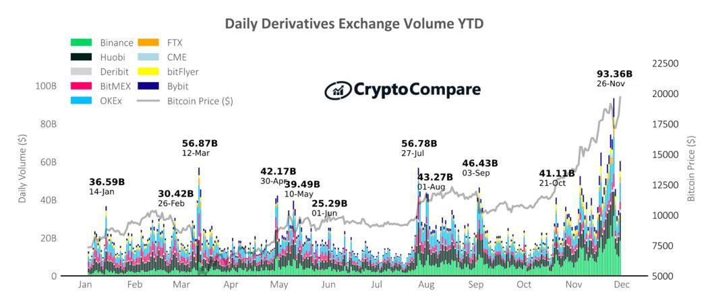
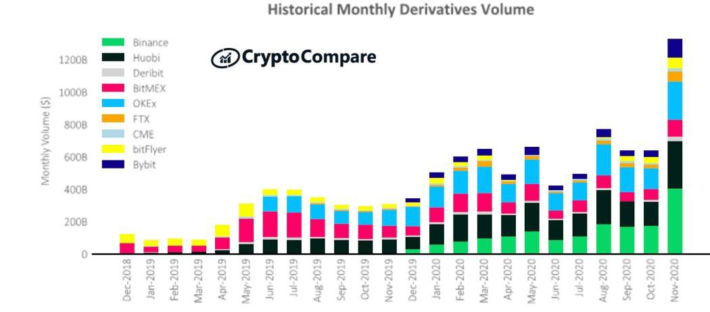
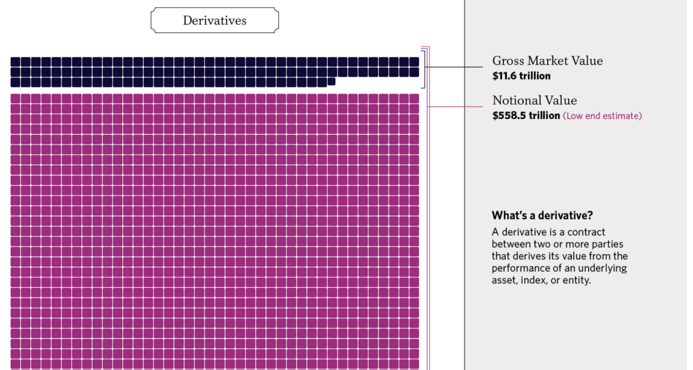
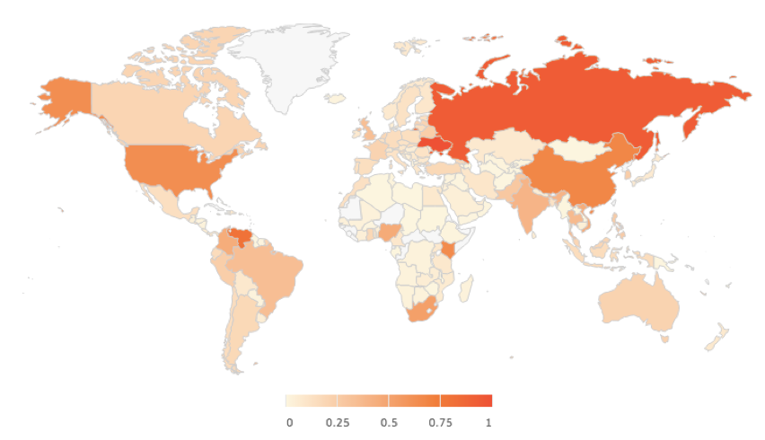
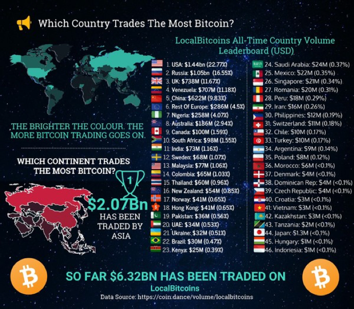
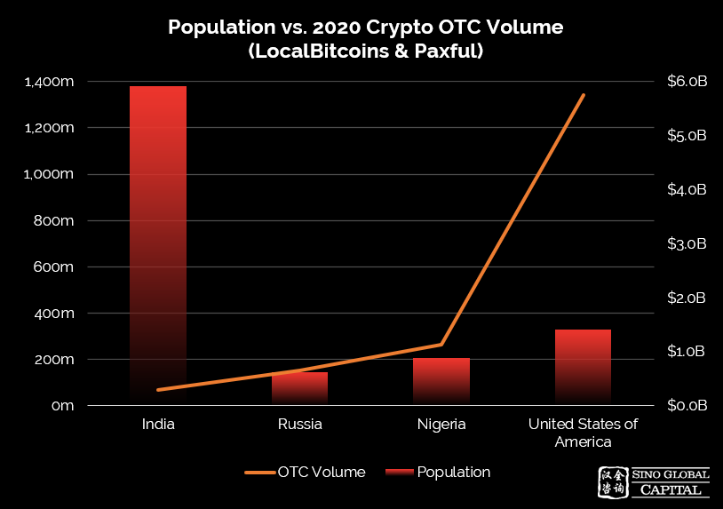
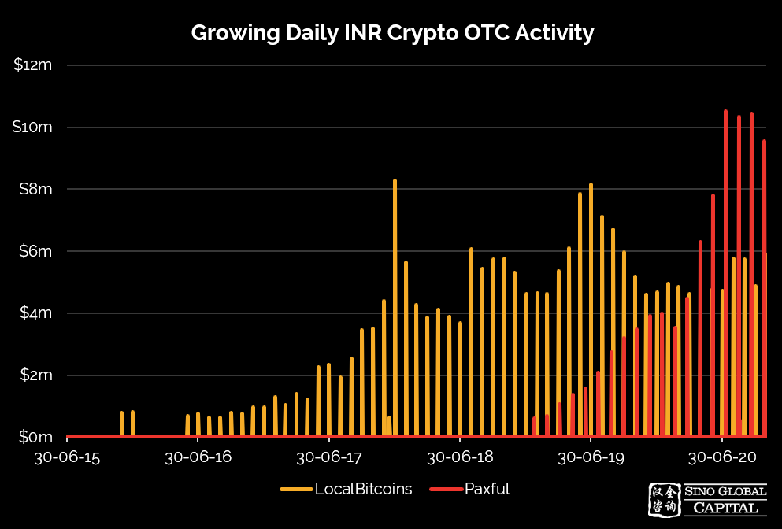
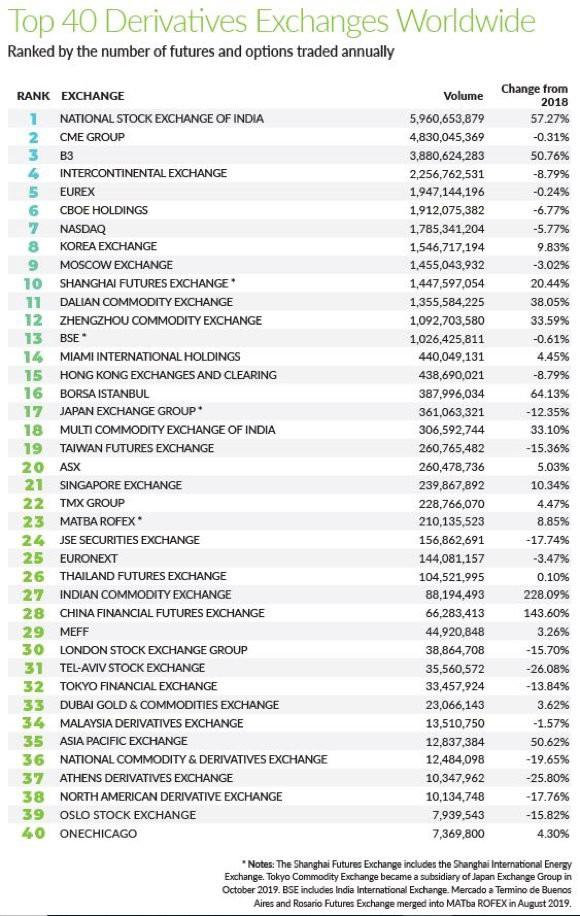
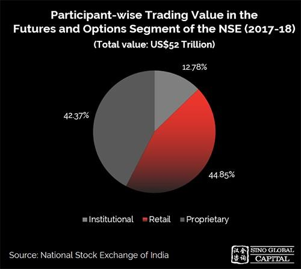

# لماذا استثمرنا في منصة Delta Exchange؟

(هذا المقال ليس نصيحة مالية)

## مقدمة

كتبنا سابقًا عن الأسباب التي دفعتنا إلى الاستثمار في منصتَي
[@ProjectSerum](https://twitter.com/ProjectSerum) و[@bonfida](https://twitter.com/bonfida). لكن في حين أن منصات التداول اللامركزي تحظى برواج لدى أنواع معينة من المستخدمين، إلا أنها لا تناسب الجميع.

تلعب منصات التداول المركزي دورًا مهمًا بالقدر نفسه في تطوير قطاع العملات المشفرة ولا تزال تمثل الأغلبية العظمى من حجم التداول. وتشمل مزايا منصات التداول المركزي ما يلي:

- السيولة العالية على نحو مستمر.
- السرعات الكبيرة في إجراء المعاملات.
- خيارات التداول التي تتّسم بقدر أكبر من التعقيد.
- التأمين: تتمتع معظم منصات التداول المركزي بالتأمين وتضمن أموال المستخدمين.
- الاسترداد: يمكن استرداد الأموال والحساب. بالنسبة لمنصات التداول غير المقيّدة للحرية، إذا فقدت العِبارة الأولية (seed phrase)، التي تستخدمها عند دخول محفظتك أول مرة، فستفقد أصولك الرقمية إلى الأبد.

توجد مجموعة من خيارات منصات تداول العملات المشفرة في مختلف المناطق الجغرافية وعروض المنتجات، ولكننا نعتقد أن Delta تُعد من بين أفضل الخيارات لعدد من الأسباب، بما فيها فريقهم ذو الخبرة والابتكار المستمر والنمو المطّرد والزخم الذي تتمتع به المنصة.

نحن نستثمر في الفِرق التي تتمتع برؤية واضحة. علاوة على ذلك، نحن نؤمن بتقنية البلوكتشين وقطاع العملات المشفرة بوصفِهِ وسيلة لإضفاء الطابع الديمقراطي على التمويل وإتاحة فرص تكوين الثروة لعامة الناس. ونؤمن بدعم التطوير والنضج المستمر للقطاع حتى يدرك عدد أكبر من الأشخاص مزاياه ويجدوه بديلاً مُجديًا للتمويل التقليدي.

تماشيًا مع هذه القيم، نعتزّ بالإعلان عن استثمارنا في منصة Delta Exchange (https://www.delta.exchange/). تُعد Delta منصة لتداول مشتقات العملات المشفرة تتخذ من الهند مقرًا لها، ولها طموحات عالمية، وتقدم العقود الآجلة، وعقود الخيارات، وعمليات المقايضة المستمرة، والفوائد، وفروق الأسعارفي العقود الآجلة، من بين منتجات أخرى متقدمة.

قبل أن نستكشف منصة Delta، دعونا نُلقي الضوء على الاهتمام المتزايد بمشتقات العملات المشفرة على نطاق عالمي وإمكانات سوق مشتقات العملات المشفرة الهندية.

## سوق مشتقات العملات المشفرة العالمية

نما الطلب على مشتقات العملات المشفرة بشكل كبير في عام 2020. وتزايدت مشتقات البيتكوين والإيثريوم بشكل كبير خلال عام 2020، إذ تقدم المنصات الكبيرة مثل Deribit وCME Group وOKEx وBinance خدمات العقود الآجلة وعقود الخيارات.

ومع دخول مؤسسات جديدة مثل Microstrategy وMassMutual إلى القطاع، سعيًا للتحوط من الدولار الأميركي، وكذلك الأسواق التقليدية المتأثرة بالجائحة، أصبحت مشتقات العملات المشفرة أكثر انتشارًا.

بالإضافة إلى عقود البيتكوين الآجلة وعقود الخيارات المتاحة حاليًا، ستُطلق مجموعة CME عقود إيثر الآجلة في فبراير/ شباط من هذا العام، والتي نتوقع أن تزيد من الاهتمام بأسواق مشتقات العملات المشفرة.

سجلت بورصات المشتقات الحالية مستوى قياسياً جديداً غير مسبوق لحجم التداول اليومي في عام 2020، إذ وصلت إلى 93.36 مليار دولار في 26 نوفمبر/ تشرين الثاني. ومثّل هذا الرقم تقريباً ضعف الرقم القياسي السابق البالغ 56.87 مليار دولار في 12 مارس/ آذار 2020:

|  |
|:--:|
| تزايد حجم مشتقات العملات المشفرة |

تضاعف إجمالي حجم مشتقات العملات المشفرة الشهرية تقريبًا في نوفمبر/ تشرين الثاني إلى مستوى جديد غير مسبوق بقيمة 1.32 تريليون دولار، في حين ارتفع إجمالي حجم السوق الفورية إلى 906 مليار دولار. وتمثل سوق المشتقات الآن نحو 60% من سوق العملات المشفرة بالكامل، ارتفاعًا من حوالي 50% في أكتوبر/ تشرين الأول:

|  |
|:--:|
| ارتفاع حجم التداول الشهري |

قد تبدو المشتقات التي تمثل 60% من إجمالي السوق كبيرة بالفعل، لكن عندما نقارنها بسوق المشتقات في التمويل التقليدي، تشير بعض التقديرات إلى أن سوق المشتقات تزيد قيمتها عن إجمالي الأصول المالية مجتمعة في العالم ككل. وعند تقدير القيمة المجمعة للأسهم العالمية بالإضافة إلى الديون بـ 343 تريليون دولار، والتقديرات المنخفضة للقيمة الإجمالية + الاسمية المجمعة لسوق المشتقات العالمية عند 570 تريليون دولار، فإن سوق المشتقات التقليدية أعلى بـ 66% من الدين العالمي + الأسهم العالمية.

ومن شأن التقديرات المتطورة لحجم السوق (1 كوادريليون دولار في القيمة الاسمية) أن تجعل هذه النسبة أعلى من ذلك بكثير.

وللاطلاع على رسم توضيحي للحجم الهائل لسوق المشتقات التقليدية، يمكنكم زيارة منصة Visual Capitalist على الرابط: ([https://www.visualcapitalist.com/all-of-the-worlds-money-and-markets-in
-one-visualization-2020/](https://www.visualcapitalist.com/all-of-the-worlds-money-and-markets-in%20-one-visualization-2020%20/))، والتي حصلنا منها على هذه التقديرات.

|  |
|:--:|
| هيمنة سوق المشتقات. المصدر: Visual Capitalist |

## مشهد العملات المشفرة في الهند

يتزايد انتشار العملات المشفرة واستخدمها في الهند، ولا يزال لدى البلاد الكثير من الإمكانات الكامنة في هذا المجال. يضع مؤشر Chainalysis لتبنّي العملات المشفرة على الصعيد العالمي الهند في المرتبة الحادية عشرة عالميًا:

|  |
|:--:|
| المصدر: Chainalysis |

أحد المقاييس الأخرى التي يُستشهد بها كثيرًا في تبنّي العملات المشفرة هو حجم منصة تداول البيتكوين LocalBitcoins، بما في ذلك هذا التقرير من أغسطس/ آب 2018 (المصدر: <http://coin.dance>):

|  |
|:--:|
| المصدر: coin.dance |

لقد أجرينا بحثنا باستخدام البيانات التي نشرتها كل من منصتي LocalBitcoins وPaxful بوصفهما مقياسًا للاهتمام بالعملات المشفرة بين عامة الناس في بعض أكبر البلدان المدرجة على قائمة تبني العملات المشفرة:

|  |
|:--:|
| إمكانات نمو هائلة للعملات المشفرة في الهند |

كما توضح الصورة، لا يزال لدى الهند الكثير من إمكانات النمو مقارنة بالدول الأخرى من حيث تبني عامة الناس للعملات المشفرة، ويتزايد الاهتمام بهذا المجال:

|  |
|:--:|
| اهتمام متزايد بمجال العملات المشفرة |

في حين أن رواج العملات المشفرة بين عامة الناس يُعد علامة إيجابية على المدى الطويل لمنصة Delta، فإن القوة الدافعة الرئيسية لنموها على المدى القريب تكمن في المجموعة غير المستغلة من المتداولين المتمرّسين في الهند.

لا يمكن إنكار إقبال المتداولين الهنود على المشتقات. ففي عام 2019، تجاوزت بورصة الهند الوطنية (NSE) مجموعة CME الأميركية لتصبح أكبر سوق للمشتقات في العالم من حيث الحجم:

|  |
|:--:|
| المصدر: https://fia.org/media/2407 |

لدى Delta طموحات عالمية وتحظى بفرصة متفردة للسيطرة على السوق الهندية في مشتقات العملات المشفرة واستخدام هذه القاعدة للنمو على الصعيد الدولي. ونتوقع أن يتفوق النمو في مشتقات العملات المشفرة على السوق الفورية في المستقبل حيث تتماشى تركيبة المنتجات مع مجال التمويل التقليدي.

نعتقد أن Delta تقف على قدم المساواة مع العديد من الشركات الأخرى في قطاع مشتقات العملات المشفرة العالمية، أو تتفوق عليها، من حيث الابتكار وسرعة التنفيذ. إذ إنها في وضع مناسب كي تصبح لاعبًا رئيسيًا من خلال الاستفادة من موطئ قدمها في سوق مشتقات العملات المشفرة الهندية المتنامية. حيث يقودها فريق لديه إلمام دقيق بالسوق ويتمتع بالدراية بأساليب التنفيذ.

فيما يلي نتطرّق إلى المنصة باستفاضة.

## منصة Delta Exchange

يعد فريق Delta، بقيادة بانكاج بالاني ([@pankaj_delta_ex](https://twitter.com/pankaj_delta_ex))، من بين أفضل الفِرق المؤهلة التي تعاملنا معها. عمل المؤسسان المشاركان في الأسواق المالية وتداول المشتقات في كل من شركات Citi وUBS وGIC، ويُعد مدير التكنولوجيا التنفيذي بالمنصة رائد أعمال متسلسلًا له سِجل حافل في تطوير المنتجات على نطاق واسع.

يبلغ متوسط ​​الحجم اليومي الحالي للمنصة نحو 70 مليون دولار، ولكننا نعتقد أن ذلك لا يمثل سوى البداية فحسب. يكتسب فريق الشركة مكانة متخصصة بوصفها منصة تداول العملات المشفرة للمتداولين المحترفين. وعند النظر إلى سوق المشتقات التقليدية في الهند من منظور تحليلي؛ فإن المتداولين الأفراد هم أكبر المشاركين، ويتفوقون على المؤسسات بفارق ضئيل:

|  |
|:--:|
| يشكل المتداولون الأفراد نسبة هائلة في سوق المشتقات التقليدية في الهند |

ينظر هؤلاء المتداولون إلى العملات المشفرة على أنها تمثل فحسب فئة أخرى من الأصول ويمكنهم الدخول إلى مجالها واستخدامها بسهولة أكبر من المتداولين المبتدئين. ونظرًا لأن Delta يقودها فريق من خبراء المشتقات المعروفين، فإنها في وضع أفضل لضمّ المتداولين المتمرسين، لأنّ هؤلاء المتداولين على دراية بالقطاع والأشخاص العاملين فيه.

فضلًا عن ذلك، يضيف الفريق باستمرار ميزات جديدة إلى المنصة ويُنشئ حوافز باستخدام رمز المنصة الأصلي، DETO. وتشمل هذه الميزات:

• استحداث صناع السوق الآليين: ستنشئ المنصة صناع السوق الآليين حيث يمكن لأي منهم المساهمة برأس المال. ستوفر Delta الخوارزميات والذكاء لهذه المجمعات. وستكون هناك مكافآت من رمز Delta الأصلي DETO، وتوزيعها بين موفري السيولة حسب نسبة حصتهم في المجمّع.

• حوافز التداول: سيحصل المتداولون على رمز DETO كاسترداد نقدي بما يتناسب مع تداولهم في منصة Delta Exchange.

• الحد الأدنى للسعر: يمكن للمستخدمين الذين يستخدمون الرمز DETO دفع بعض رسوم التداول عن طريق رمز DETO (بما يصل إلى 25% من الرسوم) والاستفادة من حد أدنى للسعر يبلغ 0.10 دولار.

• صندوق التأمين: حالما يتوفر سعر ثابت لرمز DETO، سيتم توفير عائد تخزين لدعم صندوق التأمين.

## خاتمة

خلاصة القول، أنّ الهند تُعد سوقًا متنامية للعملات المشفرة وسوقًا للمشتقات القائمة ويتمتع الفريق المناسب والمنتج الملائم بفرصة هائلة في هذه السوق. كما تتيح الهيمنة على هذه السوق قاعدة قوية للتوسع في سوق مشتقات العملات المشفرة العالمية المتنامية.

تُعد Delta منصة متطورة أسسها فريق يفهم أسواق المشتقات والعملات المشفرة ولديه المعرفة اللازمة لاكتساب حصة في السوق.

نتطلع في Sino Global Capital إلى مساعدتهم على بلوغ أقصى قدر من إمكاناتهم وقدراتهم في المستقبل.

أجرى الأبحاث لغرض هذا المقال كل من [@dermotmcg](https://twitter.com/dermotmcg)، [@OmniscientAsian](https://twitter.com/OmniscientAsian)، [@ianw888](https://twitter.com/ianw888).
