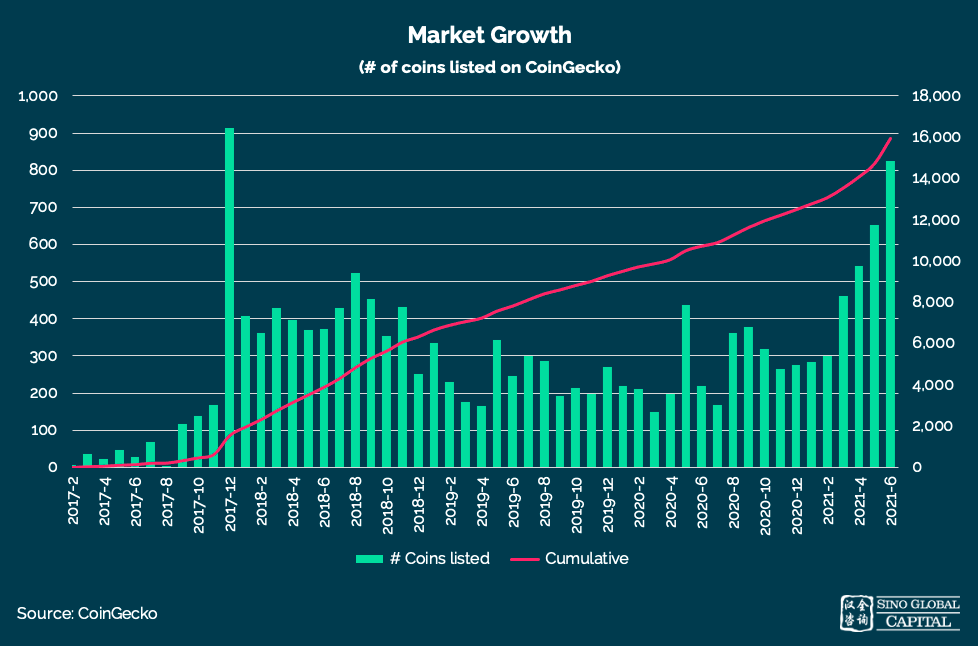
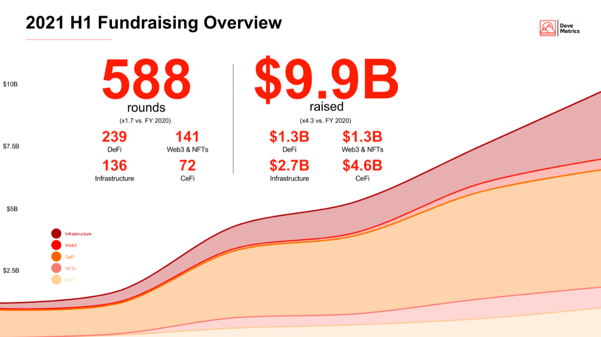
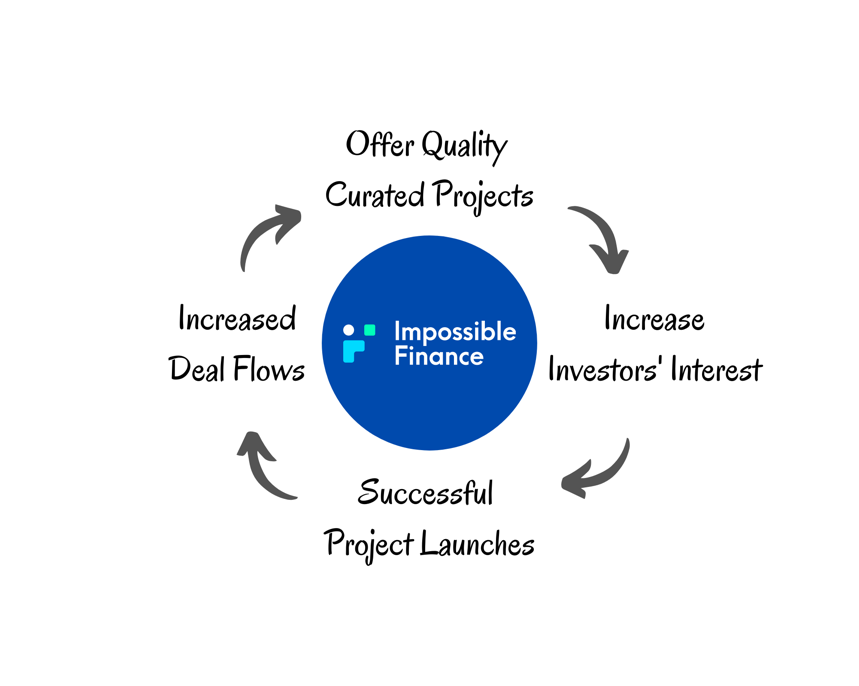
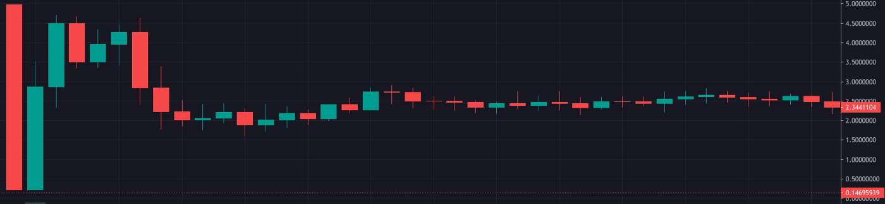

# لماذا استثمرنا في منصة Impossible Finance؟

(هذه الأطروحة ليست نصيحة مالية)

## مقدمة

يعد جمع التمويل جزءًا مهمًا في قطاع العملات المشفرة، إذ يمثل شريان الحياة للمشاريع ويمنحها الموارد اللازمة للبقاء والنمو. بدأ كل شيء مع أول طرح أولي لعملة Mastercoinوالذي تمّ على شبكة بيتكوين. إذ كان بوسع الأشخاص إرسال عملات بيتكوين للحصول على رموز Mastercoin في المقابل.

ثم جاءت شبكة إيثريوم التي عززت الطرح الأولي للعملة بوصفه وسيلة فعلية لإطلاق مشاريع البلوكتشين الجديدة، وهو الأمر الذي شكّل مشهد العملات المشفرة الذي نعرفه ونحبه اليوم. ونظرًا لأن الشركات في مجال العملات المشفرة قادرة على جمع رأس المال دون الحاجة إلى الخضوع لعمليات تنظيمية وجداول زمنية مكثفة تواجهها الشركات التقليدية، فقد أدت هذه البنية أيضًا إلى ميلاد الكثير من المشاريع المُغرضة التي تهدف إلى جمع التمويل بسرعة مع عدم الالتزام بتحقيق الرؤية المحددة خلال جمع التمويل. وقد أدى ذلك إلى ابتكار فيتاليك بوتيرين مفهوم DAICO \"الطرح الأولي الموزع والمستقل للعملة\" لجمع التمويل في عام 2018 للحصول على أموال مكتسبة من العقود الذكية والتي لا تصبح متاحة إلا عندما تحقق المشاريع بعض مراحل الإنجاز. وللأسف، فقد كانت تفتقر إلى الأدوات والدعم اللازمين لإنجاحها.

وبالانتقال إلى الوقت الحالي، نما سوق جمع التمويل بسرعة مع إطلاق آلاف المشاريع، ما دفع مجال العملات المشفرة إلى بلوغ شعبيته الحالية. وفي ضوء هذا النمو، أصبح الطلب متزايدًا على تحسين نوعية تنظيم المشاريع وإيجاد منظومة لدعمها.

وعلى هذا الأساس، فإنه يسرّ Sino Global Capital الإعلان عن استثمارنا في منصة Impossible Finance.

في أطروحة الاستثمار هذه، سنُطلعكم على أفكارنا بشأن أهمية جمع التمويل وكيف ستُحدث Impossible Finance تغييرات إيجابية في جمع التمويل، وتوفير أفضل آليات إطلاق المشاريع، والجمع بين المستثمرين والمستخدمين والمشاريع في منظومة متماسكة متعددة السلاسل.

## تحليل القطاع - منصات الإطلاق

|  |
|:--:|
| أضيف ما لا يقل عن 150 عملة شهريًا على منصة CoinGecko منذ نهاية عام 2017 |

ينمو سوق العملات المشفرة بوتيرة سريعة؛ إذ أدرجت أكثر من 15 ألف عملة على منصة CoinGecko على مدار السنوات الثلاث الماضية. وكما ترون على الرسم البياني أعلاه، أطلقت المشاريع وأدرجت بصرف النظر عن ظروف السوق منذ عام 2017. لكن عندما ننظر إلى تسارع عمليات التمويل على مدار السنوات، نرى، على نحو متوقع، أن المشاريع تحصل على أكبر قدر من التمويل خلال فترات تصاعد الأسعار في الأسواق وعلى أقل قدر من التمويل خلال الأسواق الهابطة فيما يتعلق بعدد عمليات التمويل وكذلك التقييمات.

|  |
|:--:|
| خلال فترة صعود السوق المستمرة للنصف الأول من عام 2021، جُمع أكثر من 588 جولة تمويل بقيمة 9.9 مليار دولار. المصدر: DoveMetrics |

تُعد منصات الإطلاق جزءًا من سوق العملات المشفرة شهد زيادة في الطلب والنمو بسبب الحجم الهائل للمشاريع التي يتم إطلاقها لمعالجة المشكلات واغتنام الفرص التي يوفرها سوق العملات المشفرة. تحظى منصات الإطلاق عالية الجودة برواج لدى المستثمرين الأفراد لأنها توفر خدمة تشتد الحاجة إليها، وهي بذل مستوى أعلى من الحيطة الواجبة. نظرًا للحجم الهائل للمشاريع ومشاريع الاحتيال التي يتم إطلاقها على أساس يومي، من الصعب للغاية على المستخدم الفرد العادي العثور على مشاريع عالية الجودة ويكاد أن يكون من المستحيل تنفيذ الحيطة الواجبة على مستوى الاستثمار للفريق. هنا تضيف منصات الإطلاق قيمة حقيقية بوصفها جسرًا بين المشاريع القانونية التي تتطلع إلى جمع رأس المال والمستثمرين الأفراد الذين يرغبون في المساعدة في نمو قطاع العملات المشفرة وتحقيق ربح منه.

تتمثل مسؤولية منصة الإطلاق في تحديد المشاريع وتنظيمها أولاً قبل عرضها على المشاركين من الأفراد. مع إطلاق المزيد من هذه المشاريع عالية الجودة واكتسابها زخمًا، فإن منصة الإطلاق تعمل على نحو طبيعي على استقطاب المزيد من المستثمرين. ومع تدفق المزيد من المستثمرين على منصة الإطلاق، تزداد احتمالية إطلاق مشروع ناجح ومع إطلاق المزيد من المشاريع الناجحة، يمكن أن تتوقع منصة الإطلاق زيادة تدفق الصفقات. هذه الدورة الفاضلة هي مفتاح نجاح منصات الإطلاق.

|  |
|:--:|
| الحلقة الإيجابية لمنصة انطلاق ناجحة |

على المدى الطويل، ستكون هذه الحلقة مفيدة أيضًا لمنصة Impossible Finance، إذ يبني كل من المستثمرين والمشاركين في المشروع الثقة والاطمئنان. وبالنسبة إلى منصات الإطلاق، باعتبارها الوسيط بين المشاريع والمستثمرين، من الضروري أن تحافظ على التوازن بين جميع الأطراف. إذ سيؤدي فشلها في الحفاظ على هذا التوازن إلى فشل منصة الإطلاق مع تراجع الثقة والاطمئنان إليها. باختصار، فإن الدوافع الرئيسية لنجاح منصة الإطلاق هي جودة تنظيم المشاريع وتطوير طلب المستثمرين.

## المشكلات الحالية

لفهم المشكلات التي تواجهها عمليات التمويل الحالية في الوقت الراهن، يجب علينا أولاً أن نستكشف المشاركين الثلاثة الرئيسيين؛ وهم المستخدمون الأفراد والمستثمرون من المؤسسات والمشاريع.

غالبًا ما يكون **المستثمرون الأفراد** هم آخر من يُمنح الفرصة للاستثمار في مشروع تهدف فيه معظم الفِرق إلى جمع التمويل الأولي أو ما قبل الأولي من دائرة أصدقائهم و/ أو من صناديق رأس المال الاستثماري الاستراتيجية. يوفر استحداث مبيعات الجمهور (الطرح الأولي للعملة ووجوهه المتعددة) وسائل بديلة للمشاريع لجمع التمويل، ما يتيح للمشاريع في المرحلة المبكرة الوصول إلى جمهور كبير من المستثمرين الأفراد إذا رغبت في ذلك. لكن بالنسبة للمشارك الفرد العادي، فإن ذلك لا يمنحه أفضل سبل الوصول؛ إذ تعمل تقييمات البيع العامة المرتفعة والحصول المسبق على المعلومات بواسطة الروبوتات، والقائمة البيضاء الخاصة، جميعها عوامل تعمل ضد موقف المستثمرين الأفراد.

وفيما يلي مثال على البيع العام:

أدناه مخطط بياني لمدة 5 دقائق لعملية بيع عام لأحد الرموز على صانع السوق الآلي (AMM). للحفاظ على السرية، لم يتم الكشف عن اسم المشروع. ولكن توجد العديد من الأمثلة المماثلة التي يمكن العثور عليها في جميع أنحاء القطاع.

|  |
|:--:|
| مخطط لمدة 5 دقائق لإطلاق عام. سعر الإدراج في قائمة الإدراج البيضاء 0.03 دولار. سعر الإدراج للبيع العام 0.05 دولار |

فور فتح مجمع السيولة، سارعت الروبوتات التي لديها معلومات مسبقة لشراء الرموز ما تسبب في ارتفاعها إلى 5 دولارات ثم بيعها بعد أن بدأت الروبوتات في جني الأرباح من زيادة الأسعار بنسبة 10.000%. بالنسبة للمستثمرين الأفراد العاديين الذين كانوا يعتزمون المشاركة في هذا البيع العام، وجد الكثير منهم أنفسهم في موقف ضعيف بسرعة كبيرة.

توجد مشكلة أخرى يواجهها المستخدمون الأفراد وهي منحهم مخصصًا عبر القائمة البيضاء. يمكن أن تكون القائمة البيضاء طريقة جيدة لمكافأة الداعمين الأوائل ومختبِري الإصدار التجريبي المتحمسين للمشروع. لكنها تكون غير عادلة في بعض الأحيان، إذ غالبًا ما يتم تقديم/ اختيار القائمة البيضاء بصورة تمييزية وفقًا لتفضيلات أعضاء الفريق على الرغم من تسويقها للجمهور على أنها اختيار نزيه.

تشكل هذه المشكلات عقبة للمستثمرين الأفراد ما يضعهم في وضع غير مواتٍ منذ البداية. يجب أن تنصح منصات الإطلاق التي تسعى إلى تحقيق النجاح على المدى الطويل المشاريع بشأن وسائل جمع التمويل التي يمكن أن تكون أكثر إنصافًا لكل من المشروع والمستثمرين الأفراد، مع الأخذ في الاعتبار أنه يجب تحقيق توازن دقيق لتحقيق النجاح على المدى الطويل لجميع المشاركين والقطاع.

## المستثمرون من المؤسسات

غالبًا ما يواجه المستثمرون من المؤسسات عدد كبير من المشاريع للبحث فيها وعليهم مواجهة منافسة شديدة بشأن المخصصات في المشاريع عالية الجودة. وغالبًا ما تكون المشاريع في وقت مبكر جدًا من الحلقة ولا تحتوي على منتج ملموس لتقييمه.

## المشاريع

تواجه المشاريع خيارًا صعبًا يتمثل في متابعة جمع التمويل وفق جدول زمني سريع مقابل التركيز على تطوير المنتجات أولاً. قد يكون جمع التمويل للمشروع أمرًا صعبًا ويستغرق وقتًا طويلاً، ما يؤدي إلى استنزاف الموارد الثمينة على الفريق، وينتج عنه إبطاء عملية تطوير منتجهم ورؤيتهم. يتعين على بعض الفرق التي تختار جمع التمويل بنفسها عبر المبيعات العامة أن تخصص الموارد لتطوير الأدوات والميزات اللازمة في الاستعداد. وقد تجد الفرق الأخرى التي تختار جمع التمويل من خلال المبيعات الخاصة نفسها تقضي وقتًا ثمينًا في مقابلة العديد من المستثمرين من المؤسسات. بالإضافة إلى ذلك، يتم شحن بعض منصات الإطلاق مقدمًا، ما يمنع المشروعات من استخدامها.

## رؤية منصة Impossible Finance

تعد Impossible Finance منصة إطلاق متعددة السلاسل تهدف إلى تغطية السلاسل المتوافقة مع جهاز إيثريوم الافتراضي (EVM) أولاً، تليها سلاسل أخرى غير تابعة لجهاز إيثريوم الافتراضي. ومن خلال نهج المبدأ الأول، تركز على بناء نموذج التعامل بين مؤسسات الأعمال والمطورين (B2D) الذي يعالج القضايا المتأصلة في البنية التحتية التقليدية للإطلاق أثناء إنشاء مسارات استثمار متخصصة خاصة بقطاع معين والتي توجه المخصص نحو المستخدمين المتمرسين وبعيدًا عن المضاربين. وبتنفيذها ذلك، تعتزم منصة Impossible تقديم حل شامل لمساعدة المشاريع على جمع التمويل مرة واحدة والاستمرار في التطوير إلى الأبد مع إتاحة الفرصة للمستثمرين الأفراد والمؤسسات على حد سواء للمشاركة العادلة، ما يخلق دعمًا ثابتًا لمشاريع جمع التمويل.

## الفريق

كالفن تشو هو منشئ منصة Impossible Finance، وقد عمل سابقًا في منصة Binance Research، ولديه خبرة قيّمة في قيادة Binance Staking عبر 30 شبكة من شبكات البلوكتشين، مع دعم الحيطة الواجبة في المشاريع التي تتقدم بطلب للحصول على منصة إطلاق على بينانس. ستساعد رؤيته وخبرته في تشكيل منصة الإطلاق لتصبح خيارًا رئيسيًا تفكر فيه المشاريع والمستخدمون على حد سواء ممّن يبحثون عن خيار أكثر انفتاحًا لجمع التمويل. يتمتع الأعضاء الآخرون في الفريق المساهم بخبرات في مجالات المدفوعات، والتداولات المركزية، وشبكات البلوكتشين من المستوى الأول للمساعدة في توسيع نطاق البنية التحتية لدعم فرق المشروع.

## الميزات الرئيسية

لا تعد Impossible Finance منصة إطلاق عادية، إذ إنها ستعمل على إنشاء ميزات رئيسية للمساعدة في إطلاق المشاريع بنجاح، وتخفيف معظم الاحتكاك الذي تنطوي عليه جميع حالات التلامُس ومعالجة المشكلات الرئيسية الموجودة اليوم.

### منصة إطلاق متعددة السلاسل

يعد توفير إمكانية الوصول إلى السلاسل المختلفة الموجودة في مجال العملات المشفرة اليوم عنصرًا مهمًا في الحصول على تدفق الصفقات من المشاريع والطلب من المستخدمين. بدءًا من منصة Binance Smart Chain، سيتم إطلاق Impossible Finance على منصات أخرى متوافقة مع جهاز إيثريوم الافتراضي، تليها سلاسل أخرى غير تابعة لجهاز إيثريوم الافتراضي.

بالنسبة للمشروعات التي تتطلع إلى الإطلاق، يعد إجراء عملية بيع عامة على السلسلة الأصلية أمرًا مهمًا لضمان الدعم المطلوب وزيادة إمكانية وصول المستخدمين إليها. علاوة على ذلك، تتطلع العديد من المشاريع مؤخرًا إلى إطلاقها عبر سلاسل متعددة، ما يسمح لها بالاستفادة من مزايا إضافية مثل الحصول على قدر أكبر من السيولة، وقاعدة مستخدمين موسعة، ورسوم أقل من بين مزايا أخرى. وستكون هذه ميزة رئيسية في تأمين المزيد من تدفق الصفقات في المستقبل حيث ستكون منصة Impossible Finance في وضع يتيح لها دعم عمليات الإطلاق متعددة السلاسل.

### منصات التداول اللامركزي متعددة الأغراض

أحد الأجزاء الرئيسية التي تشكل منظومة Impossible Finance هو قدرتها على توفير السيولة لمبيعات الإطلاق الأولية والأسواق الثانوية لأي أصل من خلال بروتوكول Impossible Swap. يعد توفير وسيلة لاكتشاف الأسعار بعد البيع العام أمرًا بالغ الأهمية للمشاريع لزيادة الوعي وأيضًا لإضفاء اللامركزية على المقتنيات من خلال توزيع الرموز على عدد أكبر من المستخدمين. ويعد توفير السيولة مباشرة على المنصة أكثر ملاءمة ويسهل وصول الداعمين إليه على المدى الطويل. يتميز بروتوكول Impossible Swap بابتكارات لتحسين كفاءة رأس المال ما يؤدي إلى تسعير أفضل وتقليل العقبات. ولمزيد من التفاصيل الفنية، يمكنكم مراجعة هذا [المنشور](https://medium.com/impossiblefinance/the-impossible-v2-swap-4441b054ad17) على منصة Medium.

### عمليات الإطلاق الذكية/ SSIDO

تُنشئ Impossible منصات إطلاق موجهة من خلال إنشاء قوائم انتظار قطاعية لمخزّني العملة للإشارة إلى انجذابهم لمشاريع معينة تتناسب مع أطروحتهم، ثم كسب مخصصات عادلة في إطلاق المشاريع عبر رموز الوصول إلى حاضنة Impossible Finance اللامركزية (IDIA).

رموز الوصول إلى حاضنة Impossible Finance اللامركزية (IDIA) هي أدوات سائلة تمنح المستثمرين أولوية الوصول إلى تدفق الصفقات والمخصصات داخل قطاع معين. ولردع التنقل بين القطاعات، قد تكون هناك أقفال أو رسوم مدمجة في المستقبل. كما أن هذه المواءمة تردع \"المستثمرين المأجورين\" الذين يتطلعون إلى المضاربة والبيع السريع، وتعطي الأولوية للمستثمرين على المدى الطويل للوصول إلى عمليات إطلاق المشاريع المرغوبة للغاية. تسعى هذه الآلية إلى تقليل المضاربين وبدلاً من ذلك تعزيز قاعدة مستخدمين أكثر ولاءً وذات توجه طويل الأجل.

سيكون بوسع منصة Impossible تغطية العديد من القطاعات، بدءًا من الأدوات التي يتعامل معها المستخدم، والأصول (Synths) والأسواق (منصات التداول اللامركزي وصناع السوق الآليين) والرموز غير القابلة للاستبدال والإقراض والتوسع والخصوصية والبنية التحتية. ويمكن إضافة فئات أخرى عبر عروض الحوكمة على Impossible Finance.

تقدم منصةImpossible حلولاً لبعض المشاريع المذكورة أعلاه من خلال الآليات التالية.

## الخيارات الأساسية:

- طوابير التخصيص المسبق لرموز الوصول إلى حاضنة Impossible Finance اللامركزية، فكلما زاد اهتمام المستخدم بأحد القطاعات، زادت الأولوية التي يحصل عليها من خلال \"حق الأولوية\". يحفز هذا المستثمرين ليصبحوا قادة في القطاع. ويمكن إضافة حواجز للحماية مثل \"معاملات جيني\" المستهدفة للمشاركة في البيع والحدود القصوى (لا يمكن للمستثمر تجاوز 20% من إجمالي المبلغ المحسوب) كقيود، لمكافأة جميع المستخدمين المقيّدين في قطاع قبل الإعلان عن مشروع منصة الإطلاق، و يوفر الحق في المطالبة بتخصيص منصة الإطلاق بما يتناسب مع إجمالي المبلغ المرصود في القطاع. تضمن هذه الآلية إمكانية تخصيص التوزيع المناسب للمستثمرين الأكثر ولاءً للمشروع بدلاً من عدد قليل من المشاركين الذين يأخذون المخصص بالكامل.
-   مزاد الأولوية لرموز الوصول إلى الحاضنة اللامركزية - على غرار الجمع بين رسوم مجمع السيولة التمهيدي (LBP) ورسوم التشغيل (Gas fees)، ستتبع رموز الوصول إلى الحاضنة اللامركزية لكل مبلغ تخصيص منحنى مجمع السيولة التمهيدي خلال فترة المزاد. يقدم المستخدمون عطاءات بالدولار (سعر ثابت) + رموز الوصول إلى الحاضنة اللامركزية (بناءً على منحنى مجمع السيولة التمهيدي الآني) للحصول على إمكانية الدخول لصفقة معينة. يؤدي هذا إلى تحديد الأفضلية للمستخدمين الذين يبدون اهتمامًا بطرح العطاءات مع رموز الوصول إلى الحاضنة اللامركزية للتخصيص بعد الإعلان. تضمن هذه الآلية عدم جدوى الحصول على معلومات مسبقة للتخصيص (سيدفع المستخدمون قسط تأمين كبير) إذ إنه بمرور الوقت سيعدّل مجمع السيولة التمهيدي ويتجه نحو الانخفاض.

## خيارات إضافية

- القائمة البيضاء على السلسلة - (إما عن طريق مجموعة معايير \"اعرف عميلك\" المدعومة من منصة Synaps أو منصة Tor.us أو منصة Argent، أو الخدمات الأخرى المتكاملة مع المحفظة، أو المنظمات اللامركزية المستقلة المشاركة، أو مشروع Galaxy، أو بروتوكول إثبات الحضور (POAP)، أو منصة Degenscore، وغيرها) لجذب المستخدمين المتمرّسين أو مستخدمي العملات المشفرة المعتمدين.
- المؤهل المستند إلى الاستخدام وذو الأثر الرجعي - لتقديم مبيعات محدودة للعناوين المستهدفة التي استخدمت بعض المنتجات على السلسلة.
- السحب بالحظ - عمليات الإسقاط الجوي \"التوزيع المجاني\" على حاملي رموز الوصول إلى الحاضنة اللامركزية (متعددة القطاعات) للمخصصات.

علاوة على ذلك، هناك ميزة رئيسية أخرى تقدمها منصة Impossible للمشاريع والمستثمرين على حدٍ سواء وهي نموذج الطرح الأولي الموزع والمستقل للعملة (DAICO) المذكور أعلاه. يمكن للمشاريع التي ترغب في إظهار التزامها برؤيتها أن تستخدم هذا النموذج لزيادة ثقة المستثمرين. سيكون التمويل الذي يُجمع متاحًا على دفعات وفقًا لمراحل الإنجاز التي حققها المشروع. يمكن أن يستخدم الفريق الأموال المتاحة للنمو والتوسع بينما يتم تخصيص الأموال المحجوزة لمجمعات صانعي السوق الآليين المدرّة للعائد للمساهمة في سيولة منظومة Impossible Finance. ويمكن استخدام العائد الناتج لتغطية نفقات المشروع. ويؤدي هذا إلى تحقيق مكاسب لجميع الأطراف المعنية ويغرس درجة عالية من الثقة لدى المستثمرين في المشروع.

يمكن للمشاريع استخدام مجموعة من الخيارات المذكورة أعلاه لتوزيع رموزها وتحقيق أهدافها. سواء كان الأمر يتعلق بالتسويق، لخلق مشاعر وتوقعات إيجابية، أو لمكافأة المستخدمين المخلصين، ولمستخدمي ألفا/ بيتا أو للتبليغ عن الأخطاء، فإن منصة Impossible مهيأة لتوفير هذه الخيارات للمشاريع. ومن خلال هذه الخيارات، يمكن للمشاريع التركيز على المهام المطروحة والاطمئنان عند إطلاقها.

على المدى الطويل، صُممت منصة الإطلاق لدعم عمليات التكامل اللامركزية، مثل الاستثمار بدون خسارة للمستخدمين في خزائن العملات المستقرة وإعادة استثمار صناديق فريق المشروع في خزائن العملات المستقرة لإنشاء عمليات طرح أولي للمنصات اللامركزية قائمة بذاتها - يمكن للمشاريع أن تحقق عائدًا من رأس المال الذي جُمع عن طريق الإضافة إلى خزائن العملات المستقرة واستخدامها لتمويل تطويرها.

## مجموعة خدمات ما بعد الإطلاق

لا تنتهي مشاركة منصة Impossible مع فِرق المشروع باكتمال بيع عملية الإطلاق، إذ إن منصة Impossible صُممت بحيث تتواءم مع فِرق المشروع عبر توفير دعم طويل الأجل للمشاريع بقدرة استشارية لما بعد مرحلة الإطلاق. من خلال هذا التصميم، فإن منصة Impossible تضمن أن تكون لها خبرة في المجال لمساعدة المشروع على النجاح وأيضًا تحقيق التوافق مع المستخدمين الذين استثمروا في المشروع قبل الإطلاق وبعده.

## صندوق التأمين

ستخصص منصة Impossible أيضًا جزءًا من رموز الحوكمة والإيرادات من خطوط منتجاتها لإنشاء صندوق تأمين يضمن للمستخدمين الاطمئنان عند الإيداع في عقودImpossible الذكية.

في عالم التمويل اللامركزي، لا يزال هناك العديد من الأمور المجهولة ونقاط الضعف على الرغم من جميع الاحتياطات المتخذة، ومن هذا المنطلق فإن صندوق التأمين سيعمل بوصفه حاجزًا وقائيًا في حالة حدوث كارثة.

## الحوكمة

#### منظمة Impossible Finance اللامركزية المستقلة (IFDAO)

تعمل منصة Impossible على إضفاء اللامركزية تدريجياً على بنيتها التحتية وعملياتها عبر منظمة Impossible Finance اللامركزية المستقلة (IFDAO)، والتي سيكون بوسع المستخدمين من خلالها لعب دور أكبر في توجيه نطاق وبنية منظومة منصة الإطلاق على Impossible.

منظمة Impossible Finance اللامركزية المستقلة هي هيكل منظمة لامركزية مستقلة لها رمزان، IF وIDIA.

- يعمل رمز IF بصفته الحوكمة الأساسية للمنظومة، فهو يحكم كل الأمور على منصة Impossible Finance (التفاصيل [هنا](https://medium.com/impossiblefinance/the-impossible-dao-85dc558a6efb)).
- يعمل رمز IDIA بصفته حوكمة لمنصة الإطلاق لتنسيق المعايير أو العروض المختلفة، ويحكم أيضًا صندوق IDIADAO، وهو صندوق عام على السلسلة للاستثمار في مشاريع منصة Impossible. (التفاصيل [هنا](https://gateway.pinata.cloud/ipfs/QmWdoJWPDNgsmwCarij5k5CLyknsXmKX5wRV1LMQ3oqSuN/Impossible%20Finance%20IDIA%20Whitepaper.pdf))

من خلال هذه الآليات، يمكن أن تصبح رؤية إنشاء منصة إطلاق لامركزية حقيقة واقعة. ونحن في Sino نعتقد أن وجود مجتمع لامركزي قوي يشارك بنشاط في مشروع ما هو أمر أساسي لنجاح المشروع ونتطلع بتفاؤل إلى نجاح منصة Impossible Finance.

## المخاطر

- الطلب الدوري/ الموسمي - لجمع التمويل في العملات المشفرة اتجاه دوري، وأسواق صاعدة وهابطة. ولهذا تأثير من حيث عدد جولات جمع التمويل والتقييمات التي يمكن للمشاريع أن تجمع عندها التمويل. بالنسبة إلى منصة الإطلاق، يمكن أن يمثّل ذلك مشكلة. فخلال الأسواق الصاعدة، يوجد حجم كبير من تدفق الصفقات مع انتظام الفِرق بسرعة وسعيها إلى جمع التمويل، ما يخلق ضغوطًا على جودة تنظيم المشاريع. بينما خلال الأسواق الهابطة، يوجد نقص في الطلب على تمويل المشاريع ما يؤدي إلى عدم قدرة المشاريع على جمع التمويل المستهدف.
- المنافسة - حدة المنافسة التي يمكن أن تواجهها منصة Impossible Finance والمتمثلة في منصات إطلاق خاصة بكل سلسلة على حدة تركز بشكل خاص على منظومتها، فضلاً عن الصناديق الاستراتيجية والمستثمرين من المؤسسات. ونظرًا لتركيز هذه المنصات على كل سلسلة على حدة، يمكن أن تكون منصات الإطلاق هذه مهيأة على نحو أفضل وتتمتع بخبرة أوسع في المجال لجذب بعض أنواع المشاريع واستقطاب مستخدمي مجال معين.

## خاتمة

نعتقد أن منصة Impossible ستغير قواعد اللعبة في مجال جمع التمويل. وبينما تبني Impossible مجموعة منتجاتها وتعمل على تطوير منظومتها، فإنها ستحل العديد من هذه المشكلات الرئيسية وتصبح منافسًا قويًا لمنصات الإطلاق الحالية. نحن نتطلع إلى نمو Impossible ودعمها لكل من المشروع والمجتمع في المستقبل.

أجرى البحوث لغرض هذا المقال [\@cweihan](https://twitter.com/cweihan)

**إخلاء المسؤولية:** *هذا المحتوى للأغراض الإعلامية فحسب، ولا يجب تفسير أي من هذه المعلومات أو المواد الأخرى على أنها مشورة قانونية أو ضريبية أو استثمارية أو مالية أو غيرها. لا شيء ممّا وردَ في هذه الأطروحة يشكل تحريضًا أو توصية أو إقرار أو عرض من قِبل Sino أو أي مزود خدمة تابع لجهة خارجية لشراء أو بيع أي أوراق مالية أو أدوات مالية أخرى تكون فيها هذه التوصية أو العرض غير قانوني بموجب قوانين الأوراق المالية في أي دولة من الدول.*
