# لماذا استثمرنا في بروتوكولJet ؟

(هذه الأطروحة ليست نصيحة مالية)

## مقدمة

يسعدنا أن نعلن عن استثمارنا في بروتوكولJet (Jet Protocol)، وهو بروتوكول إقراض متطور يستفيد من السرعة الفائقة والتكلفة المنخفضة لشبكة البلوكتشين سولانا. توجد العديد من مشاريع التمويل اللامركزي المذهلة التي تُبنى في الوقت الحالي على شبكة سولانا، ولكن حتى الآن لم يكن هناك بروتوكول أساسي للاقتراض/ الإقراض يسمح للمشاركين في السوق بالاقتراض مقابل أصولهم على سولانا. سيعمل هذا البروتوكول الأساسي على تسريع تبني التمويل اللامركزي على شبكة سولانا ليس فقط من خلال توفير تسهيلات الإقراض/ الاقتراض بل أيضًا عبر الجسور التي تسمح بالتفاعل والمراجحة فيما بين السلاسل؛ ليتيح بُعدًا جديدًا لاكتشاف الأسعار لأصول التمويل اللامركزي، مدعومًا بأوقات تبلغ أقل من الثانية لإنشاء الكتلة على شبكة سولانا. في هذه الورقة، سنقدم صورة إجمالية بشأن أهمية الإقراض لمنظومة التمويل اللامركزي، وسبب جاهزية شبكة سولانا كي تكون البنية التحتية الرائدة للتمويل اللامركزي ولماذا استثمرنا في Jet باعتباره البروتوكول الأساسي للاقتراض/ الإقراض على رأس هذه البنية التحتية.

## مدخل عن اقتراض/ إقراض العملات المشفرة

على غرار وضع المدخرات تحت مرتبة، فإن الاحتفاظ بأصول العملات المشفرة في محفظة يعد إحدى وسائل الحفاظ على الأصول آمنة إلى أن ترتفع قيمتها، لكن هذه الطريقة ليست فعالة للغاية من حيث استثمار رأس المال. وهنا يأتي دور التسهيلات الائتمانية التي يمكن أن تلعب دورًا مهمًا في هذا الصدد. كما هو الحال مع البنوك التقليدية، تتيح بروتوكولات التمويل اللامركزي الاقتراض/ الإقراض للمدخرين بتلقي فائدة على مقتنياتهم مع منح المقترضين الفرصة للاستفادة من قيمة أصولهم الرقمية باستخدامها كضمان للحصول على قرض. يعد الإقراض أمرًا بالغ الأهمية لأي سوق، بما فيها العملات المشفرة؛ إذ إنه يتيح استغلال الأصول، ويوفر عائدًا استثماريًا للمقرضين ويسمح للبروتوكولات الجديدة بالنمو والازدهار. وعندما يكون بوسع المستهلكين والشركات اقتراض الأموال، يمكن أن تتم المعاملات الاقتصادية بكفاءة ويمكن للاقتصاد أن ينمو، وهذا ينطبق بالقدر نفسه على الاقتصادات المستندة إلى العملات المشفرة. بدون الإقراض والاقتراض، تظل الأصول راكدة وقد تتعثر البروتوكولات دون وجود التسهيلات الائتمانية الضرورية.

القول المأثور أنّ \"المال يُحرّك العالم\" صحيح ولكنه غير كافٍ. والأصحّ أن نقول إن التمويل يُحرّك العالم.

عند الاستثمار في العملات المشفرة، فإن أحد أكبر التحديات هو إدارة التدفقات النقدية؛ أي الحصول على المال النقدي اللازم للاستفادة من فرصة في الأجل القصير. أصعب ما يواجه المستثمر أن يضطر إلى بيع أصول لتغطية التكاليف قصيرة الأجل. ويعد هذا أحد الأمثلة التي يمكن فيهل لإقراض العملات المشفرة أن يحل مشكلة كبيرة.

## كيفية عمله

في صفقات لا يتوفر بها قدر كبير من الثقة مثل إقراض العملات المشفرة، يجب على المقترضين، للحد من مخاطر التخلف عن السداد وكذلك مخاطر السيولة الناتجة عن تقلب أسعار الضمانات، تقديم ضمانات تزيد عن القيمة التي يرغبون في اقتراضها. يضع المقترض الضمانات في عقد ذكي، وفي المقابل، يُسمح له باقتراض مبلغ أقل من أصل آخر يقدمه المُقرض. تُعرف هذه العملية بتوفير قدر زائد من الضمانات. قد يكون هذا مفهومًا غريبًا بالنسبة للمقترضين الذين اعتادوا على القروض المصرفية التقليدية، ولكن هذا يتيح ميزة الوصول المفتوح إلى خدمات التمويل اللامركزي للجميع. علاوة على ذلك، نظرًا لأن المستخدمين اختاروا الاقتراض بدلاً من بيع أصولهم في المقام الأول، فمن المرجح أن يتوقعوا زيادة في قيمة أصول الضمان الأساسية ولا يمانعون في حجزها طوال مدة القرض.

## عمليات التصفية

على الرغم من توفير قدر زائد من الضمانات، فمن الشائع أن تنخفض قيمة الأصول ذات المخاطر العالية إلى أقل من الحد الأدنى للمتطلبات الذي حُدّد. وعندما يحدث هذا، تتم التصفية من أجل الحفاظ على سلامة سوق الإقراض. تعد التصفية ضرورية لأن المقترضين العقلانيين يتم تشجيعهم الآن على التخلف عن السداد والاستيلاء على الأصل المقترَض؛ فمن وجهة نظرهم، لماذا تعيد 100 دولار من عملة تيثر المستقرة مقابل 85 دولارًا من عملة إيثر؟ من المحتمل أن يترك هذا المقرضين يدفعون الثمن. وإذا حدث هذا على نطاق واسع بالقدر الكافي، فسيفشل المُقرض وينهار السوق.

إذا لم تتم زيادة الضمان إلى الحد الأدنى الذي وافق عليه المقترض مسبقًا، يمكن لجهات التصفية الخارجية القيام بمهمة تتضمن بيع الضمانات، وفرض رسوم تصفية باهظة على المقترض. دعونا نلقي نظرة على أحد الأمثلة:

- يقترض عميل الأصل X بمعدل تصفية يبلغ 150%، وهو ما يتطلب حدًا أدنى قدره 1.50 دولارًا من قيمة الضمان لكل دولار واحد من الأصل X المقترض.

- إذا انخفضت قيمة الضمان إلى 1.30 دولار، على سبيل المثال، تحدث التصفية. يقوم طرف ثالث بتصفية المركز (يبيع الضمانات، عادةً بخصم صغير) لتغطية المبلغ الأصلي المقترض البالغة قيمته دولار واحد، ويتقاضى رسومًا ضخمة مقابل ذلك، ويعيد الباقي إلى المقترض.

تدفع عقوبة التصفية المقترضين إلى تجنب التخلف عن السداد مع تشجيع جهات التصفية الخارجية على مراقبة المخاطر وتصفية المراكز غير المقبولة، وبالتالي الحفاظ على نظام السوق. للاطلاع على تحليل يتضمن قدرًا أكبر من التفصيل بشأن كيفية عمل التصفية على منصة MakerDAO، يمكنكم زيارة الرابط: https://medium.com/@natanbaredes/makerdao-cdps-liquidation-analysis-28ee462cf43e

## اتجاهات الإقراض في مجال التمويل اللامركزي

في حين أن توفير قدر زائد من الضمانات يساعد في حماية السوق من التقلبات، تظل هذه النسب المطلوبة ثابتة ومرتفعة جدًا (غالبًا 150%) بسبب بطء تحديثات أوراكل والقدرات الحسابية.

وقد دفع ذلك المطورين إلى البحث عن حلول أخرى. وفقًا لتقرير الصناعة للربع الأول من عام 2021 الصادر عن منصة DappRadar (<https://dappradar.com/blogdapp-industry-report-q1-2021-overview>)، حتى عام 2021، فإن مصدر نحو 90% من التحويلات على شبكة إيثريوم هو أفضل 10 تطبيقات موزعة في التمويل اللامركزي، وهو ما يُظهر أن شبكة إيثريوم تتمحور في الغالب حول التمويل اللامركزي في عام 2021. ولا تزال إيثريوم تمثل شبكة بلوكتشين مهمة في منظومة التمويل اللامركزي في الوقت الحالي:

| 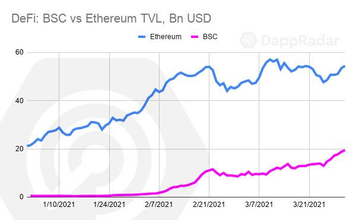 |
|:--:|
| المصدر: منصتاDappRadar و Defistation.io |

لكن من الملاحظ أن المستخدمين يبدو أنهم على استعداد للتنازل عن شيء من الطابع اللامركزي بحثًا عن قدر أكبر من السرعة في تطبيقات التمويل اللامركزي. وفقًا للتقرير السابق، تتفوق العديد من التطبيقات اللامركزية لسلسلة بينانس الذكية BSC Dapps على أكبر منافسيها على شبكة إيثريوم في الأشهر الأخيرة:

| 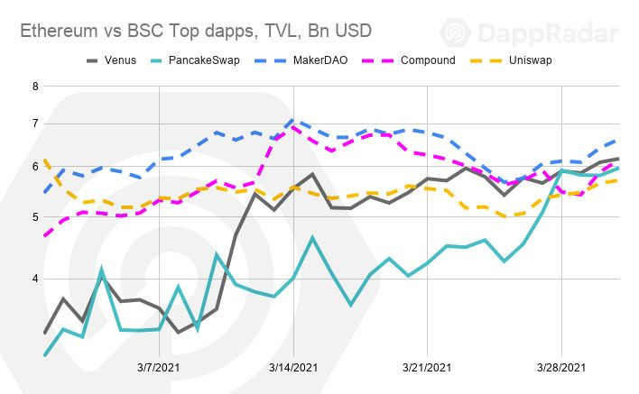 |
|:--:|
| المصدر: منصتاDappRadar و Defistation.io |

## مشكلات في التمويل اللامركزي

### التكلفة

صُممت شبكة إيثريوم لزيادة رسومها مع تزايد عدد المستخدمين. وقد أدى النمو الهائل في التمويل اللامركزي دون التوسع المطلوب في إنتاجية الشبكة إلى زيادات هائلة في أسعار إجراء المعاملات وتنفيذ العقود وبالتالي زيادة متوسط ​​تكاليف المعاملات:

تعد رسوم إجراء المعاملات وتنفيذ العقود المرتفعة عقبة أمام تعزيز استخدام التمويل اللامركزي، لأنها تجعل تجربة بعض الاستراتيجيات مثل إقراض العملات المشفرة أو تخزينها على منصات التداول (yield farming) غير مجدية اقتصاديًا للمستثمرين الصغار. فيما يتعلق بالإقراض على وجه الخصوص، تعد الرسوم المرتفعة عقبة واضحة أمام المعاملات الأصغر حجمًا وتمتد إلى تنفيذ عقود التصفية الذكية.

### تجزئة الأصول

عندما تصبح الأصول مجزأة في سلاسل مختلفة، ينشأ تفاوت في العائدات ومعدلات الإقراض، ما يخلق أسواق إقراض غير فعالة. تنتُج أوجه التفاوت هذه في أسعار المنتجات عن التخصيص غير الفعال للأموال بسبب بطء البروتوكولات الأساسية والترابط غير المكتمل عبر قطاع التمويل اللامركزي ككل.

### السرعة

لم يتمكن التمويل اللامركزي بعد من تقديم نطاق مشابه من الخدمات على غرار التمويل التقليدي بسبب قيود السرعة. يؤدي الحساب الإلكتروني البطيء إلى العديد من المشكلات بما فيها:

- ضعف اكتشاف أسعار الأصول المشتقة المعقدة.
- التصفيات غير المنظمة للقروض.
- التنفيذ البطيء للتداول ما يحد من استراتيجيات التداول.

علاوة على ذلك، في أوقات الضغط، يتم فتح البوابات وتندفع موجة من المعاملات إلى الشبكة، وكلها تتنافس على رسوم إجراء المعاملات، ما يؤدي إلى بعض المعاملات التي تستغرق ساعة أو أكثر ليتم تضمينها في السلسلة، وبعضها يفشل تمامًا. يتسبب هذا في عدد من المشكلات الخاصة بإقراض العملات المشفرة مثل الإدارة المنظمة للتصفية، وسهولة الدخول/ الخروج من القروض، والتسعير الآني للضمانات وغيرها.

## شبكة سولانا كحل

تتميز شبكة سولانا من حيث تكلفة المعاملات مقابل التحقق من الصحة، وهي خيار رئيسي لمشاريع التمويل اللامركزي التي تبحث عن المستوى الأول الأساسي من بنية البلوكتشين الذي يتمتع بالثقة والسرعة وقلة التكلفة:

| 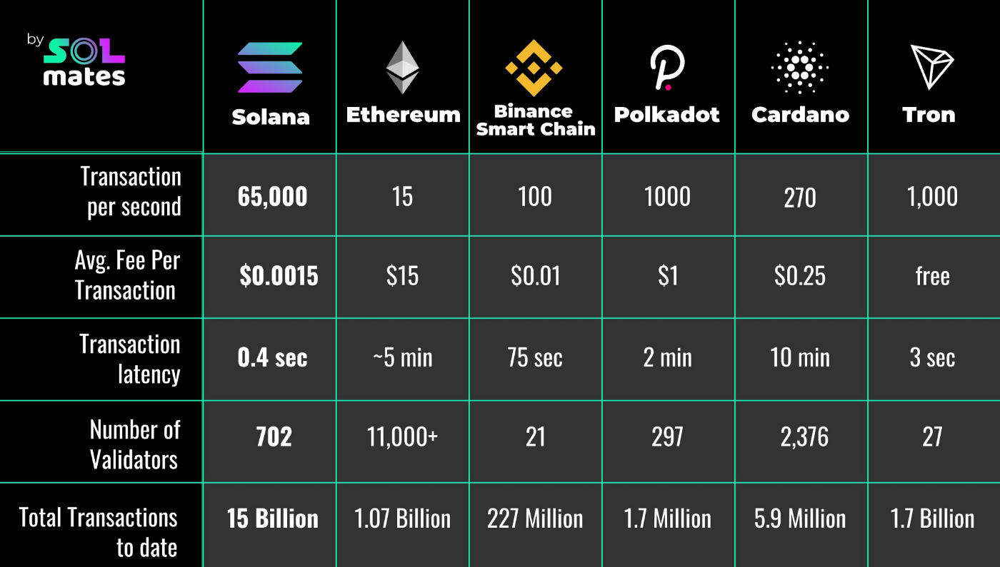 |
|:--:|
| المصدر: https://twitter.com/Solana_Mates/status/1382692005659168782 |

وبالنظر إلى سولانا وسلسلة بينانس الذكية وشبكة Polkadot بوصفها سلاسل التمويل اللامركزي ذات الشعبية في الآونة الأخيرة، نرى المكاسب الحقيقية للتضحية باللامركزية:

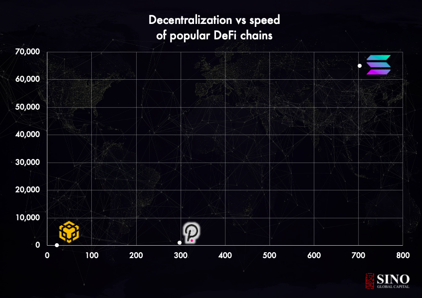

من الواضح أن سولانا هي أفضل خيار لتطوير تطبيقات سريعة في مجال التمويل اللامركزي. ولكن قبل أن يحدث هذا، يلزم وجود بعض البنية التحتية الأساسية. وفرت منصة Serum الأدوات اللازمة، والمطلوب في الخطوة التالية هو بروتوكول إقراض أساسي يمكنه استغلال أصول سولانا من خلال الإقراض والتوسع في منتجات جديدة والعمل كجسر إلى سلاسل أخرى. وهنا يأتي دور بروتوكول Jet.

## بروتوكول Jet

أعلن عن بروتوكول Jet في أبريل/ نيسان 2021 مؤسساه \@wilbarnes و@jrmoreau بوصفه بروتوكول إقراض واقتراض على سولانا، وأشارا إلى أن \"مهمة المنصة القائمة على مشاركة المجتمع تتمثل في الاستفادة من سرعة السلسلة التي لا مثيل لها والرسوم المنخفضة لدفع حدود الإقراض على السلسلة في مجال التمويل اللامركزي، وتوقعا اهتمامًا أوسع بتداول أكثر كفاءة من السلاسل الأخرى مع تحسين بيانات أوراكل، وزيادة كفاءة عمليات التصفية على غرار منصات التداول المركزي.

## كفاءة دورة تطوير المستخدم الأولى

فريق Jet متحمس للتعاون مفتوح المصدر وتعليقات المستخدمين. أدرك الفريق أن المصدر المفتوح، القائم في الأصل على برنامج إقراض الرموز في سولانا (<https://github.com/solana-labs/solana-program-library/tree/master/token-lending>)، مهم ولكنه كان بحاجة إلى دورة تطوير أسرع وتكرارية أكثر من الدفع بالتغييرات ببساطة إلى مستودع قائم. على هذا النحو، أعاد فريق Jet تشكيل نموذج الإقراض على بروتوكول Anchor بالكامل. للاطلاع على مزيد من المعلومات، يمكنكم زيارة صفحتهم على منصة Github على الرابط: <https://github.com/jet-lab>.

## الميزات وخارطة الطريق

ستبدأ منتجات الإقراض ببروتوكول إقراض كامل الهوامش قابل للتمديد عبر واجهة برمجة التطبيقات. وبصفتهم مطورين، أدرك فريق Jet أن تزويد المطورين والمشاركين الآخرين في السوق بواجهة برمجة تطبيقات سلسة للتفاعل مع البروتوكول سيؤدي إلى زيادة استخدام بروتوكول Jet وإضفاء الطابع الشخصي عليه. يوفر منتج الحد الأدنى (MVP) الحالي للمشاركين في سوق سولانا مكانًا للإيداع والاقتراض مقابل أصولهم، وإدارة مراكز ديونهم، واتخاذ مواقف بشأن فروق معدلات الفائدة بين المستويات الأساسية الأخرى مثل شبكتي إيثريوم وتيرا وغيرهما. بدءًا من هذه العمليات الأساسية، نرى القدرة الحقيقية لبروتوكول Jet على شبكة سولانا لإحداث ثورة في خدمات التمويل اللامركزي عن طريق طرح منتجات أكثر تعقيدًا في المدى القريب بناءً على هذه الوظائف الأساسية. وتشمل هذه المنتجات:

## إدارة المركز الآلي للاقتراض برفع مالي.

تتيح تكاليف المعاملات المنخفضة للغاية مقارنة بشبكة إيثريوم تحديث المراكز بسرعة وكفاءة. يمكن للمستخدمين الذين يرغبون منح الموافقة للبروتوكول لإدارة وإعادة توازن مراكزهم ذات الرافعة المالية بصورة آلية مثل الحلول التي توفرها منصة DeFiSaver لمالكي صندوق الوادئع MakerDAO.

## الأسواق الثانوية للمضاربة على أسعار الفائدة.

عندما يقوم المستخدم بإيداع أصل في البروتوكول، يُعاد إليه رمز يمثل إيداعه الأساسي ورمز يمثل الفائدة المكتسبة. وانطلاقًا من ذلك، يمكن للمستخدم تداول سعر الفائدة المودع مقابل أسعار الفائدة الأخرى في سجل طلبات الحد المركزي على منصة Serum.

## توفير السيولة لمراكز الديون الكبرى والصغرى.

سيقدم بروتوكول Jet سلسلة من منتجات المخاطر المنظمة والمعقدة على شبكة سولانا، لتحقيق إثبات مفهوم الدين الأكبر/ الأأصغر الذي استكشفه الفريق لأول مرة في هاكاثون Solana Wormhole الأول في نوفمبر/ تشرين الثاني 2020.

| 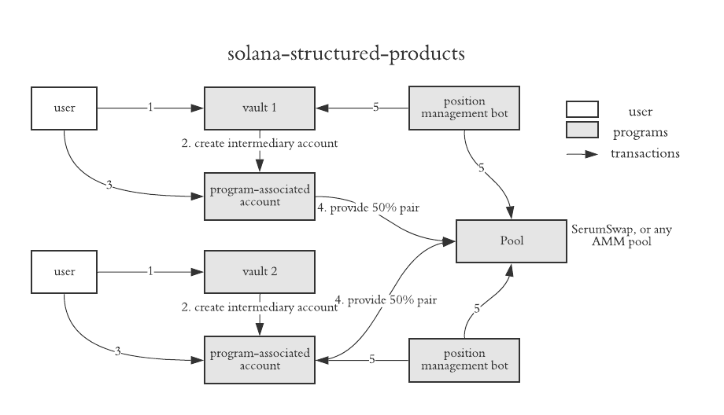 |
|:--:|
| https://github.com/wilbarnes/solana-structured-products |

واصل الفريق توضيح بعض الأمثلة للاستراتيجيات الأكثر تعقيدًا التي تتطلب السرعة والتكلفة المنخفضة لتنفيذ مركز المراجحة المترابط مثل بروتوكول Jet:

| 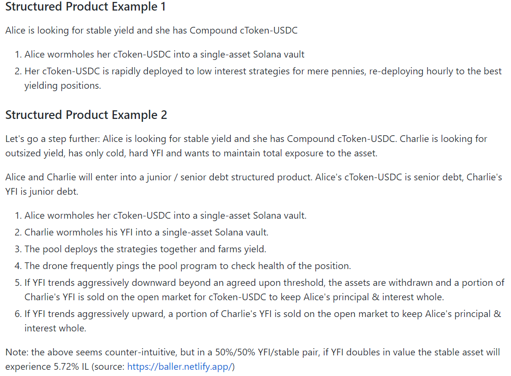 |
|:--:|
| https://github.com/wilbarnes/solana-structured-products |

يمهّد بروتوكول Jet الطريق لطرح منتجات تتجاوز معايير التمويل التقليدي إلى التمويل اللامركزي.

## حل المشكلات في التمويل اللامركزي

كما هو موضح أعلاه، فإن العديد من المشكلات المتعلقة بالإقراض في مشهد التمويل اللامركزي الحالي تنبع من بطء سرعة المعاملات واكتشاف الأسعار والحساب الإلكتروني. بالاستفادة من القدرة الحسابية الأولية لشبكة سولانا مع حلول أوراكل المبتكرة والسريعة، سيوفر بروتوكول Jet إدارة أفضل للسيولة، وتسعيرًا ديناميكيًا أكثر ابتكارًا عبر استيعاب بيانات السوق، والقدرة على التعامل مع التصفية بشكل أكثر رشاقة عن طريق تحليل التسلسل والثقة للسيولة المتاحة خلال أوقات الضغط. كل ذلك غير قابل للتطبيق على شبكة إيثريوم. كما توفر أوجه التحسين على السرعة هذه مزايا ملموسة أخرى مثل معالجة متطلبات الضمانات العالية: إذ سيقدم بروتوكول Jet تسعيرًا ديناميكيًا لنسبة الضمان، ما يسمح بتعديل النسب بناءً على مستوى التقلب في النظام، وهو ما يعني أنه خلال فترات التقلب القليل، يمكن أن تنخفض نسب الضمانات إلى مستويات معقولة بدرجة أكبر على نحو يجعل قدرًا أكبر من رأس المال متاحًا ويقلل عبء الاقتراض. وكما أوضح فريق Jet: \"ببساطة، من خلال إنتاجية سولانا، يمكن للبروتوكول استيعاب البيانات بشكل أسرع، وتقديم تحديثات الأسعار والفوائد بشكل متكرر خلال أوقات تقلب السوق، ونشر بيانات عملية عبر الشبكة لجميع المشاركين في السوق في ثوانٍ. ومن الناحية الأخرى، خلال فترات عدم النشاط، يهدأ البروتوكول\".

يُستفاد من آليات أوراكل للتسعير السريعة التي يوفرها بروتوكول Jet في خفض نسب الضمانات لبعض الأصول. واستنادًا إلى هذه الميزة وحدها، يمكن لبروتوكول Jet التنافس مباشرة مع بروتوكولات cRatio الأعلى مثل Compound وغيرها، ما يسمح بزيادة كفاءة رأس المال.

نظرًا لقدرته على الاستفادة من منظومة منصة Serum، فإن عمليات التصفية على بروتوكول Jet تكون أكثر تنظيمًا وتتيح قدرًا أكبر من التحكم مقارنة بروبوت التصفية القياسي. تتمثل التصفية بصفة أساسية في تسديد الديون ثم تصفية الضمانات، وبطبيعة الحال، توجد حالات قد لا يرغب فيها المصفّون في بقاء الأصل المصفى في دفاترهم. باستخدام منصة Serum كطرف خلفي لمواصلة أو مبادلة عمليات التصفية (Anchor Serum Swap)، يمكن للمصفّي أن يعود على الفور إلى الأصل الأصلي المستخدم في سداد الديون، بتكلفة منخفضة، ما يتيح بالضرورة تصفية خالية من المخاطر.

تترتب على معاملات المبادلة رسوم، وإن كانت منخفضة جدًا، ولتشجيع جميع أصحاب المصلحة في البروتوكول، يمكن أن يقدم بروتوكول Jet خصومات على الرسوم لحاملي رمز MSRM في المستقبل.

## جميع الطرق تقود إلى بروتوكول Jet

نعتقد أن الاستخدام الأمثل لشبكة سولانا سيكون هو مجال التمويل اللامركزي، بوجود بروتوكولات تطور أدوات جديدة ومثيرة تستغل معاملاتها التي تتم في أقل من الثانية ورسومها المنخفضة (يمكن أن تصل رسوم تحويل الرمز البسيط إلى 0.00001 دولار). ونعتقد أن بروتوكول Jet سيؤدي إلى أسواق إقراض واقتراض أكثر كفاءة بالإضافة إلى اكتشاف الأسعار. سيتيح Jet للمستخدمين نقل الأصول من سلاسل أخرى إلى البروتوكول بالإضافة إلى نشر استراتيجيات المراجحة لموازنة الأسعار عبر السلاسل والبروتوكولات. يتم تحقيق ذلك عبر جسور Wormhole وRenVM وهي تقدُّم كبير في تحقيق اتساق سعر السوق عبر التمويل اللامركزي.

التباين الحالي في معدلات الاقتراض بين السلاسل المختلفة يخلق فرصًا سانحة للمراجحة لبروتوكول فائق السرعة مرتبط مركزيًا مثل Jet:

|  |
|:--:|
| المصدر: بروتوكولات Compound وAave وVenus و Cream |

سيتم تسعير فروق أسعار الفائدة من حيث الرموز التي تحمل فائدة (على سبيل المثال، رمز cToken من بروتوكول Compound، ورمز aToken من بروتوكول AAVE ، وأسعار الفائدة لبروتوكول Anchor). باستخدام بروتوكولي Wormhole وRenVM، سيتيح Jet للمشاركين في السوق موازنة أسعار الفائدة عبر السلاسل من خلال المراجحة وصنع السوق للرموز التي تحمل فائدة. سيتم تحصيل مدفوعات التمويل عبر السلاسل اعتمادًا على العقد المحدد، الذي سيتولى إطلاقه وإدارته حاملو الرمز.

تشجع سرعة التنفيذ التي يوفرها بروتوكول Jet مقترنة مع القنوات عبر السلاسل الضرورية توفير السيولة في البروتوكول ومنظومة سولانا ككل. علاوة على ذلك، يمكن لهؤلاء المستخدمين الاستفادة من الأدوات الموجودة في المنظومة (مثل منصتي Serum وRaydium) لتحسين استراتيجياتها، على سبيل المثال يمكن للمقرضين بيع الرموز للإقراض (الممنوحة عند إيداع الأصول في البروتوكول) على منصة التداول اللامركزي Serum. سيكون للتسعير الفعال للفرص التي يخلقها هذا الوضع تأثيرات إيجابية على القطاع ككل وسيحقق المزيد من النمو لشبكة سولانا.

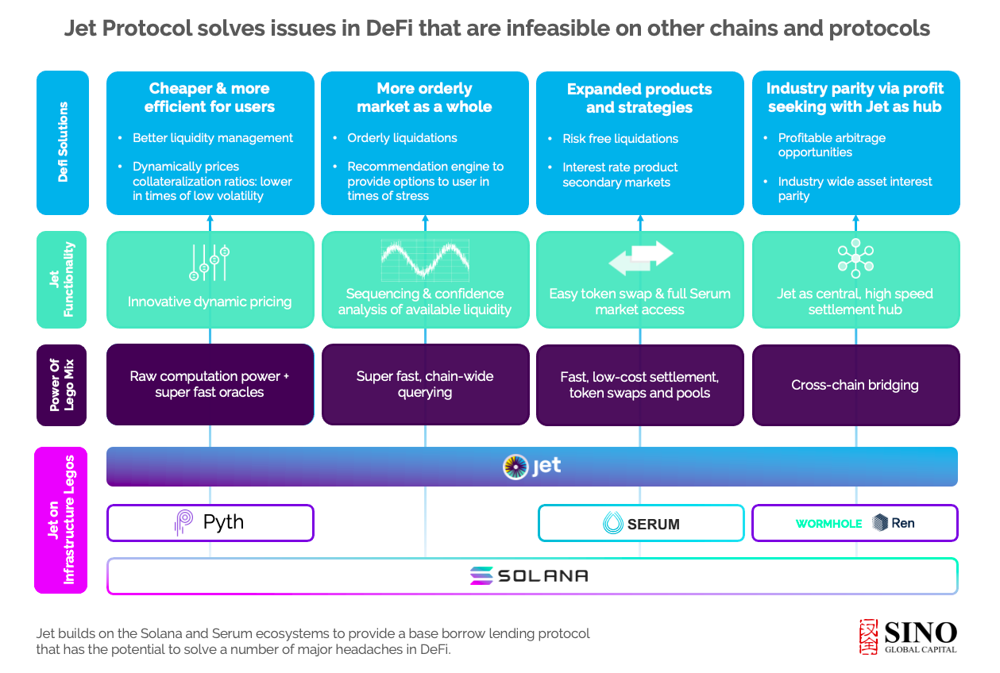

## سهولة الاستخدام

تتمثل المعضلة الشائعة لمطوري تطبيقات التمويل اللامركزي في مقدار "اللوازم الأساسية" المعقدة في شبكة البلوكتشين التي يجب أن يتم تبقى بعيدة عن الوظائف التي يتعامل معها المستخدم. وفي حين أنه من المهم منح مستخدمي العملات المشفرة القدرة على الاستفادة الكاملة من أدوات البروتوكول (ويخطط بروتوكول Jet لبعض الأشياء الرائعة)، للخبراء والمبتدئين على حد سواء، يدرك الفريق أن النجاح النهائي لبروتوكول Jet وأي بروتوكول آخر يعتمد على سهولة الاستخدام. الهدف من أي نظام لامركزي هو التبني الجماعي له. كيف تحقق التبني الجماعي؟ عبر تكلفة دخول منخفضة من حيث المعرفة اللازمة لاستخدام المنصة. تُظهر نظرة أولية على واجهة المستخدم أنها واجهة أنيقة بلوحة معلومات موجزة واضحة تتميز بسهولة الوصول إلى الميزات عبر الشريط الجانبي. يتمثل الهدف الرئيسي لواجهة المستخدم في أن يكون بوسع المستخدمين الاطلاع على لمحة عن ميزات بروتوكول Jet من الواجهة وحدها.

**قمرة القيادة** -- الاطلاع على جميع الأصول واستكشاف التفاصيل واستخدام وظائف الإيداع والسحب والاقتراض والسداد. غالبًا ما تحتوي البروتوكولات المتنافسة على قدر زائد من المعلومات ويمكن أن تكون شاقة للمستخدمين الجدد. في \"قمرة القيادة\" على بورتوكول Jet، نرى موجزًا بسيطًا للأموال المودعة والمقترضة ونظرة عامة على ضماناتك الحالية:

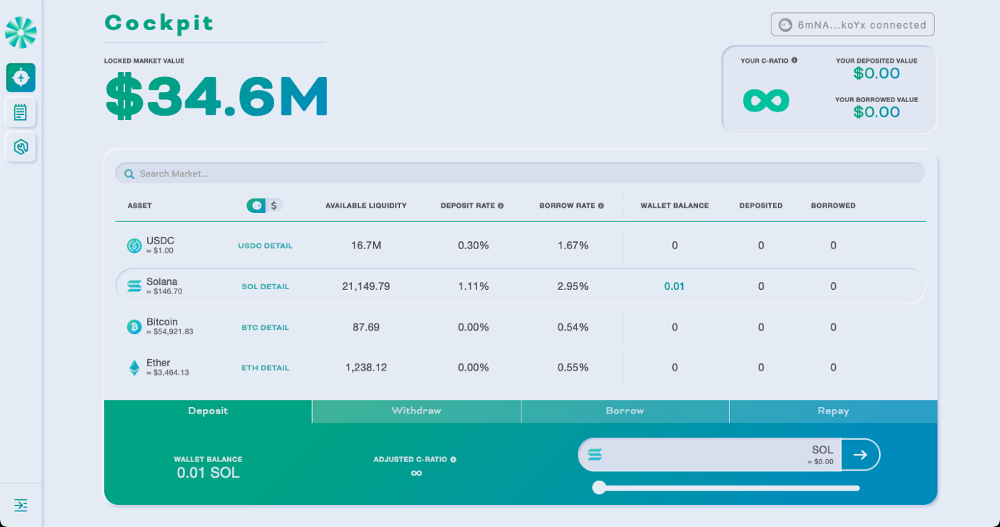

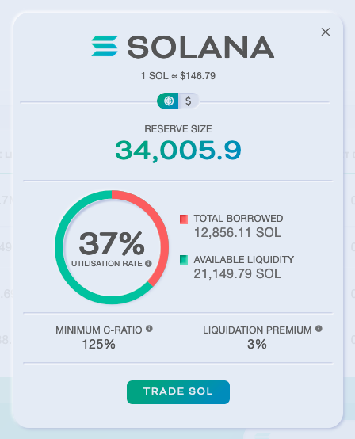

يتدخل المساعِد عندما يجد أي أخطاء:

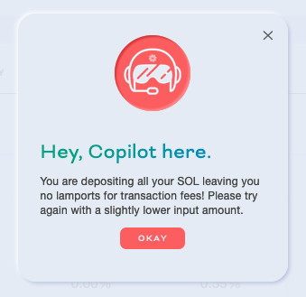

الإيداع والاقتراض:

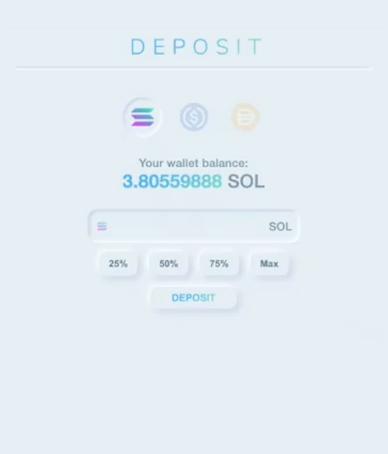

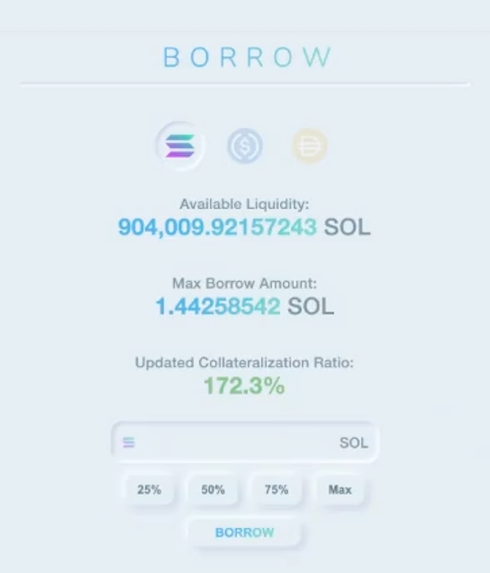

**تجربة المستخدم الواضحة والبسيطة** - أودعت عملة DAI وتريد استعادة بعض منها؟ اضغط على "استرداد":

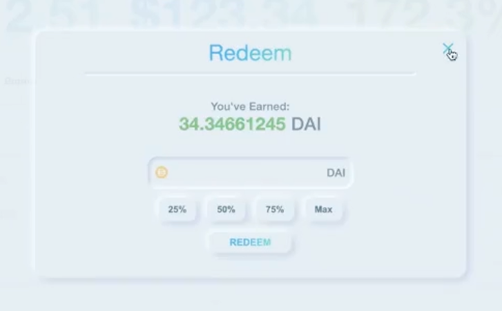

أيضًا وضعية داكنة لإتاحة سهولة الوصول:

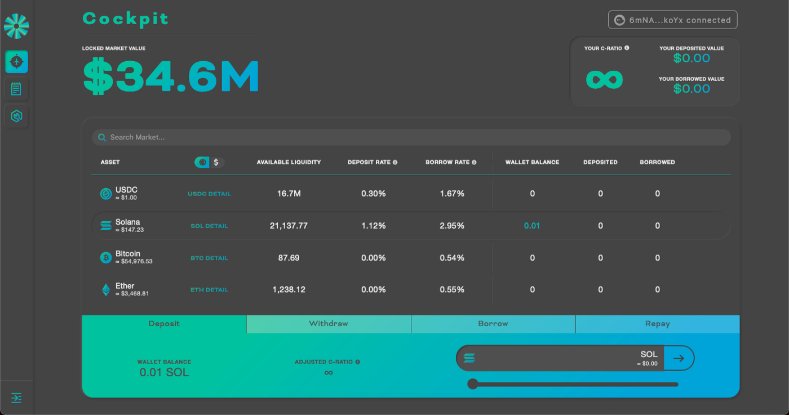

## المساعِد: تبسيط التمويل اللامركزي

إدارة الضمانات لجميع الأصول، وإيجاد استراتيجيات النشر المثلى لتحقيق أقصى عائد، وإدارة المراكز في أوقات التقلبات. لا تعد الحلول الحالية سهلة الاستخدام للغاية وغالبًا ما يتحرك المستخدم دون رؤية الاتجاهات ويكون تحت رحمة السوق. ماذا لو كان هناك ذكاء اصطناعي آلي من شأنه تعزيز سلامة قرارات التمويل اللامركزي؟ هذه هي الخطة الخاصة بوظيفة المساعد على بروتوكول Jet.

## الصورة العامة والأهداف طويلة المدى للمساعد:

- ينظر إلى السوق (العائدات السنوية الحالية ونحو ذلك)، ويراجع مقتنياتك الحالية من الأصول والمركز المالي ويقترح سلسلة جيدة من المعاملات.
- سيكون مشاركًا ويمكن للمستخدمين قراءة التوصيات لأغراض الرقابة أو التعلم قبل التأكيد.
- بعد التأكيد بنقرة زر، سينفذ الطرف الخلفي عددًا من الصفقات بناءً على التوصية.
- يمكن أن يتم نشره في أعلى العائدات السنوية بناءً على الودائع، أو التوصية بإيداع الأصول أو سداد الديون لإعادة الضمانات إلى اللون الأخضر.

    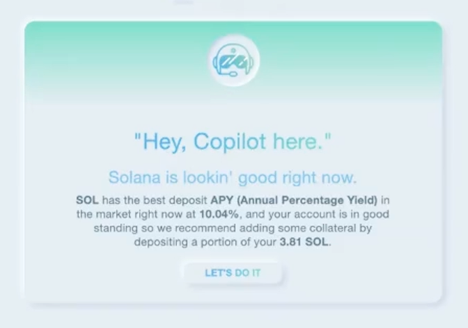

- يعد المساعد دليلًا على القناعة الرئيسية لدى الفريق والمتمثلة في الكيفية التي يمكن بها لبروتوكول Jet المساعدة في الحفاظ على السلامة المالية
للمستخدمين.

- ستكون وظيفة الذكاء الاصطناعي المؤتمتة بالكامل على المدى الطويل على رأس بروتوكول Jet.
- يمكن للمساعد أن يجذب المستخدمين من جميع مستويات الخبرة ويمكنه تكوين هياكل صفقات معقدة تلقائيًا دون أن يحتاج المستخدمون إلى بنائها بأنفسهم. حتى أنه من المفيد للمستخدمين المتمرسين رؤية الاستراتيجيات التي ربما غفلوا عنها. أيًا يكُن مسار عملك، يريد بروتوكول Jet أن يجعل العملية سهلة قدر الإمكان.
- في ضوء سرعة البنية التحتية الأساسية، ثمة قدر أكبر من الثقة في التنفيذ ولن يتم تنفيذ الإجراءات الموصى بها إلا إذا تم تنفيذ جميع تسلسلات التداول.
- يمكن للمساعد المشاركة وتلقي الاقتراحات حسب ظروف السوق. وكلما اقترب المستخدم من حد الضمان، سينبهه المساعد أكثر وأكثر للتأكد من أنه على دراية بالخطر.
- في المستقبل، في أوقات الضغط، يمكن أن يوصي المساعد بمجموعة من الإجراءات لتعزيز مركز (مثل مبادلة عملة سولانا مقابل عملة USDC لسداد دين). الفكرة هي التأكد من أن المستخدم على دراية بمركزه قبل التصفية، لتجنب رسوم التصفية والمصاعب المترتبة عليها، ومنحه أكبر عدد ممكن من الخيارات لتفاديها. يضع عدد قليل من البروتوكولات الأولوية لسلامة المستخدم المالية ولا يقدم مثل هذه السيطرة على موارده المالية. انتفت حاجة المستخدمين أن يكونوا تحت رحمة تحديثات الأسعار البطيئة والتصفية الفوضوية.
- يعمل المساعد بشكل أساسي على تسريع قدرة المستخدم على تدارُك المواقف السلبية. عندما تتحرك الأسواق ضدك، بسرعة، قد لا يرغب العديد من المستخدمين في إيجاد سبيل للخروج. ينطوي ذلك على عنصر من عناصر الضغط واحتمال حدوث خطأ بشري. في المستقبل، هناك عدة وسائل ممكنة يمكن للمساعد عبرها تبسيط الموقف: مثل إمكانية إنشاء وظيفة "الإخراج" للتخلص من جميع المراكز على الفور (محاولة فعل ذلك على البروتوكولات الأخرى)، وإعادة التوازن التلقائي، وتنبيهات الإيداع، وعمليات البيع الاستراتيجية وغيرها. يمكن للمستخدمين في المستقبل تخويل بروتوكول Jet لفعل ذلك تلقائيًا.

نعتقد أن المساعد يتمتع بالقدرة على أن يكون إنجازًا ثوريًا في الإدارة المالية بمجال التمويل اللامركزي ونتطلع إلى رؤية مجموعة أدواته تتطور.

## الفريق

أسس البروتوكول ويل بارنز، وهو مطور موهوب للبلوكتشين ويتمتع بخبرة واسعة في المجال بما في ذلك عمله بشبكتي MakerDAO وConsensus، وجيمس مورو، وهو خبير مجتمعي لديه خبرة في العمل بمنصتي Blockdaemon وConsenSys. يتمتع الفريق بالخبرة في الإقراض، والمهارات الفنية في البلوكتشين والخبرة في إدارة المجتمع لإعطاء الأولوية للمجتمع، وبروتوكول الإقراض فائق القوة على شبكة سولانا.

## نهج الحوكمة أولًا

بالاستفادة من خبرته في شبكة MakerDAO، يعمل فريق Jet على إنشاء بروتوكول للجميع منذ البداية. سيشمل Jet \"نقطة اتصال\" للحوكمة، ما يتيح لأي شخص تنفيذ التغييرات وإكمال ترقيات البروتوكول عند الحصول على عدد كافٍ من الأصوات. ستتم حماية النقاط الطرفية لنقطة الاتصال هذه، من خلال أقفال زمنية واتفاقيات رموز المتبني المبكر لمواجهة العروض المخادعة عند الإطلاق، والتي سيتم تخفيفها بمرور الوقت بعد أن يثبت البروتوكول نجاحه على أرض الواقع وأنه صلب بالقدر الكافي لصدّ الهجمات على الحوكمة.

يتوخى الفريق منظومة شاملة للحوكمة على البروتوكول. سيتمكن أي شخص من إجراء تصويت وتغيير أي شيء على بروتوكول Jet، واستبدل الوحدات النمطية ونحو ذلك. وطالما أنه يمكنه الحصول على عدد كافٍ من الأصوات لتجاوز التصويت الأخير، سيدخل العرض في فترة انتظار )24 ساعة). إذا كان المرسل قادرًا على الدفاع عن العرض (بأن يظل صاحب التصويت الأعلى)، فسيُطرح للاقتراع. من المرجح أن يكون هناك الكثير من النقاشات العامة الحامية التي تعد صحية لبروتوكول متنامٍ.

نحن في Sino نؤمن بأن تولي المجتمع لزمام الأمور ومشاركته هي مفتاح نجاح المشروع ويسعدنا أن فريق Jet قد أعطى الأولوية للمجتمع من خلال الدمج الهادف على مستوى القاعدة.

## اقتصاد الرموز

تُحجز معظم رموز بروتوكول JET لفترة طويلة (3 سنوات)، ما يؤدي إلى حوافز متوافقة تمامًا مع جميع المعنيين: الفريق والمستثمرين ومجتمع المستخدمين والمشاركين في الحوكمة. فضلًا عن ذلك، يوجد جزء كبير من الرموز غير المحجوزة تحت تصرف منظمة لامركزية مستقلة، وستتطلب مساهمات حوكمة بشأن كيفية تخصيصها من قبل أصحاب المصلحة وأعضاء المجتمع.

- إجمالي القدر الثابت المطروح من رموز JET هو 1,700,000,000.
- القدر المطروح للتداول المبدئي: 156,257,200 من رموز JET.
- 25% من الرموز للفريق والمستشارين، 0% متاحة بعد 12 شهرًا، والباقي مستحق على مدار 24 شهرًا.
- 15% من الرموز للمستثمرين الأساسيين، 0% متاحة بعد 12 شهرًا، والباقي مستحق على مدار 24 شهرًا.
- 10% من الرموز لمستثمري المتابعة، 0٪ متاحة بعد 12 شهرًا، والباقي مستحق على مدار 24 شهرًا.
- 3.06% من الرموز للطرح الأولي لمنصة Ascendex + رأس مال التداول لصانع السوق، 100% متاحة في فعاليات إنشاء الرموز (TGE).
- 25.47% من الرموز تحت سيطرة منظمة لامركزية مستقلة، و3% متاحة في فعاليات إنشاء الرموز والباقي مستحق لمدة 24 شهرًا. يعزى سبب إتاحة نسبة منخفضة في فعاليات إنشاء الرموز هنا إلى منع الهجوم على حوكمة رموز المنظمة اللامركزية المستقلة . 21.47% من الرموز محجوزة للمساهمين المباشرين في المشروع، \"صندوق التطوير\"، 25% متاحة في فعاليات إنشاء الرموز والباقي مستحق لمدة 24 شهرًا.

يعمل فريق Jet على بناء بروتوكول إقراض مرن ودائم، كما أن Sino سعيدة بدعم فريق بروتوكول Jet ومجتمعه. لمزيد من المعلومات حول اقتصاد الرموز، يمكنكم الاطلاع على: <https://medium.com/jetprotocol/jet-tokenomics-lockup-and-our-long-term-vision-430a1fbe119f>.

## خاتمة

نعتقد أن شبكة سولانا هي مستقبل التمويل اللامركزي ولكنها لا تزال تفتقر إلى الخصائص الوظيفية الأساسية للتمويل اللامركزي وتكامل المنتج مع السلاسل الأخرى. يحل بروتوكول Jet العديد من هذه المشكلات الرئيسية ويتمتع بالقدرة على أن يصبح خدمة أساسية في مجال التمويل اللامركزي، مستفيدًا من الإنتاجية العالية والمعاملات ذات التكلفة المنخفضة وموجزات البيانات فائقة السرعة واكتشاف الأسعار الفعال لإتاحة إمكانية إطلاق العنان للإمكانات الحقيقية للتمويل اللامركزي. نتطلع إلى مساعدة Jet على تسريع توسعه في أسواق آسيا وسنواصل تقديم أي دعم استراتيجي يحتاجون إليه.

أجرى البحوث لغرض هذه الأطروحة [@dermotmcg](https://twitter.com/dermotmcg).

**إخلاء المسؤولية:** *هذا المحتوى للأغراض الإعلامية فقط، ولا يجب تفسير أي من هذه المعلومات أو المواد الأخرى على أنها مشورة قانونية أو ضريبية أو استثمارية أو مالية أو غيرها. لا يوجد شيء مما وردَ هنا يمثل اقتراحًا أو توصية أو عرضًا من قبل Sino أو أي مزود خدمة تابع لجهة خارجية لشراء أو بيع أي أوراق مالية أو أدوات مالية أخرى في أي دولة يكون فيها هذا الاقتراح أو العرض غير قانوني بموجب قوانين الأوراق المالية في هذه الدولة.*
