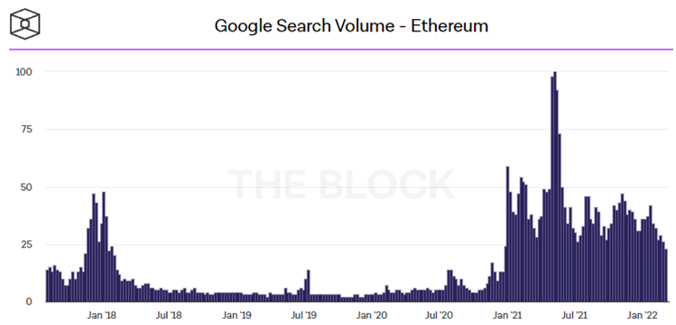
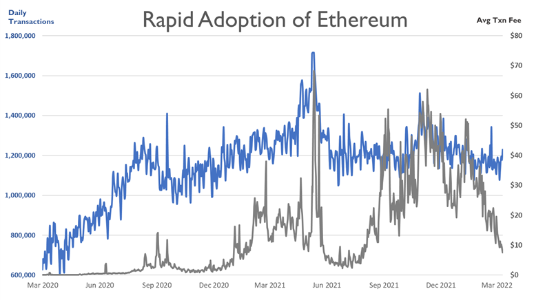
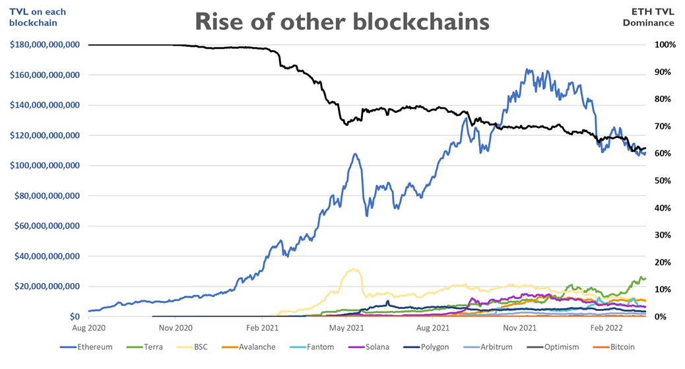

# لماذا استثمرنا في بروتوكول LayerZero Labs؟

(هذه الأطروحة ليست نصيحة مالية)

## مستقبل متعدد السلاسل ومتعدد الطبقات

على مدى السنوات القليلة الماضية، حدثت زيادة مطردة في استخدام تقنيات البلوكتشين. على سبيل المثال، فيما يتعلق بشبكة البلوكتشين الأكثر انتشارًا، إيثريوم، بلغ مقدار البحث في محرك البحث غوغل عن كلمة \"إيثريوم\" ذروتها في مايو/ أيار 2021، بالتزامن مع تحقيق مستوى قياسي بلغ 1.65 مليون معاملة يومية على شبكة إيثريوم. في الوقت نفسه، وبينما كان المشاركون في الشبكة على إيثريوم يتنافسون على مساحة كتلة محدودة، ارتفع متوسط ​​الرسوم لكل معاملة على إيثريوم إلى نحو 70 دولارًا. هذا لأن شبكة إيثريوم في وضعها الحالي، يمكنها دعم 15-45 معاملة فقط في الثانية، ويشجع المستخدمون المعدّنين لتحديد أولويات معاملاتهم من خلال عرض دفع رسوم أعلى. وقد أدى هذا إلى تجاهل الغالبية العظمى من المستثمرين الأفراد الذين لا يستطيعون دفع رسوم باهظة فقط لإجراء إحدى المعاملات. فضلًا عن ذلك، هذا يجعل إيثريوم خيارًا غير عملي للعديد من الاستخدامات ذات الإنتاجية العالية والقيمة المنخفضة.

|  |
|:--:|
| المصدر: [The Block Crypto](https://www.theblockcrypto.com/data/on-chain-metrics/ethereum)| 

|  |
|:--:|
| المصدر: [Coin Metrics](https://charts.coinmetrics.io/network-data/) |

وعلى نحو متوقع، فقد قد أفسح ذلك المجال لمجموعة متنوعة من شبكات البلوكشين المختلفة من المستوى الأول Layer-1 وحلول توسيع النطاق من المستوى الثاني Layer-2 لخدمة هذا السوق الهائل من المستثمرين الأفراد المهمشين وحالات الاستخدام. منذ بداية عام 2021، انخفضت هيمنة إيثريوم (من حيث القيمة الإجمالية المقفلة) من 90% إلى 65%. بدأ هذا من خلال انتشار سلسلة بينانس الذكية (BSC) في أبريل/ نيسان 2021 والذي أعطى المستخدمي الأفراد جرعة من رسوم المعاملات المنخفضة، نحو 1-2 دولار (وإن كان ذلك على حساب
اللامركزية).

منذ ذلك الحين، ظهرت العديد من شبكات البلوكشين من المستوى الأول وحلول توسيع النطاق من المستوى الثاني الأخرى لتحدي إيثريوم في الحصول على جزء من الغنيمة، عادةً بتوفير برامج حوافز سخية عن طريق التنقيب عن السيولة أو عمليات الإسقاط الجوي للمستخدمين الذين يربطون أصولهم بجسور عبر السلاسل.

|  |
|:--:|
| المصدر: [DeFi Llama](https://defillama.com/chains) |

تسعى شبكات البلوكشين من المستويين الأول والثاني إلى تقديم مزاياها الخاصة، والتي تضمن في الغالب رسومًا أقل أو عدد معاملات أكبر في الثانية (TPS) أو تجربة انضمام أكثر ملاءمة للأفراد. قد تسعى أيضًا كي تتواءم مع حالات الاستخدام المختلفة، ما يسمح للبروتوكولات بأن يكون لها وجود على سلسلتها الموازية الخاصة بها، أو أن تنطوي على بيانات واعدة عالية الدقة أو سلسلة بلوكشين رفيعة الأداء للتنافس مع الشركات القائمة على أرض الواقع مثل Visa التي تُجري أكثر من 15 ألف معاملة في الثانية. في الوقت الحاضر، يبدو أن احتمال وجود مستقبل متعدد المستويات متعدد السلاسل، كبير إلى حد ما. ومن المرجح أن تحتفظ إيثريوم بمكانتها المهيمنة إذ أختُبرت الشبكة وأثبتت بالتجربة أفضليتها، كما أن الجيل الثاني من شبكة إيثريوم مصمم لمعالجة مشكلات القابلية للتوسع. حُظيت سلاسل أخرى مثل Polygon وSolana وPolkadot بحصة كبيرة من الاهتمام داخل مجتمع المطورين ومن المرجح أن تتعايش جنبًا إلى جنب مع بعضها البعض، بما يناسب الاستخدامات الخاصة بكل منها.

علاوة على ذلك، بدأت البروتوكولات في تشكيل جوانب مختلفة من تطبيقها عبر شبكات البلوكتشين المختلفة. على سبيل المثال، قد تتطلب لعبة شبكة بلوكتشين تتمتع بعدد معاملات عالٍ في الثانية لدعم الإجراءات داخل اللعبة، مع الاستفادة في الوقت نفسه من شبكة بلوكتشين عالية الأمان لتداول الأصول القيّمة داخل اللعبة.

## مدخل إلى الهياكل والجسور بين السلاسل

طرحت هذه الرؤية بشأن مستقبل متعدد المستويات ومتعدد السلاسل الحاجة إلى بنية تحتية فيما بين السلاسل من أجل سد الفجوة بين شبكات البلوكتشين المختلفة وفيما بين حلول توسيع النطاق. وقد فرض ذلك مجموعة خاصة من المشكلات التي إما أن تعيق أو تسبب في إخفاق الغرض الأساسي من البلوكشين العام اللامركزي.

## المشكلات الحالية

### 1. المركزية

#### استخدام منصات التداول المركزي كجسور للأصول

عندما يربط المستخدمون الأصول بين سلسلة وأخرى، فسيستخدمون بشكل متكرر منصات التداول المركزي كطبقة وسيطة من أجل ربط الأصول بسلسلة الوجهة. وفي حين أن هذا قد يبدو وسيلة مناسبة لبعض المستخدمين، إلا أن هذه المنصات بطبيعتها توفر السهولة مقابل تكاليف أكبر بكثير من حيث:

**• انعدام الخصوصية وإخفاء الهوية -** تتطلب منصات التداول المركزي معايير \"اعرف عميلك\"، وقد يكون هذا الخيار غير عملي للعديد من المستخدمين الذين يرغبون في الحفاظ على خصوصيتهم.

**• المخاطر التنظيمية -** كانت هناك العديد من الحالات التي منعت فيها منصات التداول المركزي المستخدمين من دولة معينة أو حظرت سحب/ تداول أصول معينة لأسباب تنظيمية.

**• مخاطر الطرف المقابل -** يجب أن يثق المستخدمون في رعاية منصات التداول المركزي لأصولهم.

#### استخدام الجسور ذات الطابع اللامركزي

توجد حاليًا جسور متعددة يمكن للمستخدم الاختيار من بينها عند ربط أصوله بين السلاسل. ستستخدم بعض هذه الخيارات طبقة إجماع وسيطة ليست لامركزية تمامًا - إما لأن مجموعة صغيرة جدًا من المدققين لديها إذن، أو أن الجسر مؤمّن عن طريق تعدد التوقيعات. وهذه الوضع غير آمن بالكامل نظرًا لأن سلاسل الوجهة تثق ضمنيًا في السلاسل الوسيطة، التي تتمتع بسلطة توقيع كاملة على سلسلة الوجهة. ويعني هذا أن أي اختراق على السلسلة الوسيطة بإمكانه استنزاف كل السيولة المحجوزة داخل مجمعات سلسلة الوجهة.

فضلًا عن ذلك، يمكن أن يستهلك استخدام طبقة إجماع وسيطة موارد أو تكلفة كبيرة دون داعٍ لأنها تضيف نفقات زائدة عن الحاجة.

### 2. عدم القابلية للربط (مع بروتوكولات أخرى)

#### استخدام الرموز الوسيطة المؤلفة

ستستخدم بعض الجسور رمزًا وسيطًا إما لحل مشكلة السيولة المجزأة أو تحقيق مفهوم عدم الحاجة إلى الثقة بطرف خارجي. يضيف هذا الرمز الوسيط عبئًا وتعقيدًا غير ضروريين، خاصةً إذا انتهى الأمر بالمستخدم مع رمز وسيط عند حدوث خطأ أو عدم وجود سيولة كافية في سلسلة الوجهة. لا يؤدي هذا إلى تجربة مستخدم سيئة فحسب، بل قد يصبح لدى المستخدم رمز غير مفيد.

عدم الكفاءة الإضافية هنا هو السيولة المحجوزة داخل تجمع abcUSD - USD، وهو أمر غير ضروري تمامًا إذا تم استخدام الرموز المميزة في المقام الأول. علاوة على ذلك، سيكون لدى العديد من الجسور مجمع سيولة لكل سلسلة تدعمها، والتي تكرر بشكل أساسي نفس متطلبات السيولة غير الفعالة في كل سلسلة إضافية.

#### القابلية المحدودة للربط

في الوقت الحالي، عندما تدرس البروتوكولات أي البروتوكولات النظيرة التي يمكن أن تبني فوقها أو تتكامل معها، فإنها عادةً ما تقصر نطاقها على التطبيقات اللامركزية الأخرى المبنية على شبكة البلوكتشين نفسها أو داخل المنظومة نفسها. إلا أنه لا يوجد سبب يجعل البروتوكولات تقيد نفسها داخل حدود منظومة واحدة إذا كان بإمكانها أن تتشكل مع عالم كامل من التطبيقات اللامركزية والعقود الذكية عبر جميع شبكات البلوكتشين.

### 3. غير فعال ومكلف

#### استخدام العُقد على السلسلة

الحل الذي يتغلب على المشكلتين 1 و2 الواردتين أعلاه هو استخدام العُقد الموجودة على السلسلة، والتي تستقبل بشكل متسلسل كل رأس كتلة على حدة وتتحقق من صحته من المصدر إلى سلسلة الوجهة، والتحقق من صحة ذلك مقابل كل إثبات معاملة مُعاد توجيهه. إلا أن هذا النهج غير ممكن بالنسبة لمعظم شبكات البلوكتشين لأنه يتطلب قدرًا هائلاً من الموارد الحسابية والأموال لتشغيل مثل هذا النظام.

#### عدم كفاءة حركة المستخدم

في الوقت الحالي، عندما يفكر المستخدمون في استخدام بروتوكولات مختلفة على العديد من شبكات البلوكتشين، يجب أن يمروا بعملية مرهقة للعديد من الموافقات على الرموز والمبادلات والمعاملات الوسيطة لكل سلسلة جديدة ينقلون الأصول إليها. قد تتضمن هذه العملية فوضى من عناوين الرموز المختلفة وتطبيقات الويب والجسور المعرضة للأخطاء في كل منعطف. قد تكون حركة المستخدم غير الفعالة للغاية مكلفة للغاية ومربكة تمامًا للمستخدمين الجدد.

بينما نتوصل إلى فهم العدد الكبير من التحديات التي يعاني منها المشهد الحالي للبنية القائمة فيما بين شبكات البلوكتشين، يمكننا أن نمضي قدمًا لاستكشاف بروتوكول LayerZero وكيف يعالج هذه المشكلات الحالية.

## بروتوكول LayerZero Labs

بروتوكول LayerZero، في جوهره، هو بروتوكول قابلية التشغيل المتبادل على السلسلة. فكّر في طبيعته بوصفه طبقة البنية التحتية ذات الأهمية البالغة التي **تربط أي عقد معين عبر كل سلسلة معينة**. فهو خدمة الرسائل الأساسية الأولية التي تتيح بُعدًا جديدًا تمامًا من القابلية للربط والخصائص الوظيفية عبر سلاسل البلوكتشين.

#### الحل

أولاً، يجب أن نتعمق في التصميم الذي يمكّن بروتوكول LayerZero من تحقيق ذلك.

كي تتحقق من صحة كتلة على السلسلة، يلزمك معرفة معلومتين:

1.  **رأس الكتلة،** الذي يحتوي على أساس الإيصالات.

2.  **إثبات المعاملات** -- على سبيل المثال: دليل ميركل-باتريشياMerkel-Patricia على أجهزة إيثريوم الافتراضية EVMs.

يقسم بروتوكول LayerZero هذين المكونين عن طريق:

1. تعيد شبكة البلوكتشين أوراكل توجيه رؤوس الكتلة - أي شبكة أوراكل مختارة (على سبيل المثال، Chainlink، أو Pyth).

2. يعيد الناقل توجيه إثباتات المعاملات.

كلا من شبكة أوراكل والناقل مفتوحان بنسبة 100% وليس لديهما إذن، ويمكن لأي شخص أداء أي من الدورين.

بالنظر إلى أن هذين الكيانين مستقلان، وأنه يتم التحقق من صحة توليفة رأس الكتلة وإثبات المعاملة المقابل في السلسلة الوجهة، يمكن بعد ذلك ضمان أن تكون الرسالة المُعاد توجيهها صالحة وتم الالتزام بها في السلسلة المصدر.

يجب أن نلاحظ خاصيتي أمان مهمتين هنا. أولاً، إن أسوأ حالة أمان في هذا النظام تعادل أمان شبكة أوراكل المختارة. يحدث هذا الموقف إذا كانت شبكة أوراكل والناقل هما الكيان نفسه، وفي هذه الحالة نرث الأمان الأساسي لأوراكل، على سبيل المثال آلية الإجماع التي أنشأتها شبكة أوراكل اللامركزية التابعة للبلوكتشين Chainlink. ثانيًا، يمكن للبروتوكولات اختيار أو حتى تشغيل الناقل الخاص بها لجلب الإثباتات لمعاملاتها المعينة. هذا يعني أن البروتوكولات نفسها يمكن أن تضمن أن يكون كل من أوراكل والناقل كيانين مستقلين.

يوضح هذا التصميم للتسليم الصحيح الذي لا ينطوي على الحاجة إلى الثقة بطرف ثالث، مع انتفاء الحاجة تمامًا لأي كيان أو رموز وسيطة مركزية محتملة.

## سلطة البروتوكول

الميزة الأساسية الأخرى لـ LayerZero هي أن التطبيقات نفسها لها سيطرة كاملة على جميع مقاييس الأمان. كل بروتوكول لديه القدرة على تحديد أي من أوراكل والناقل الذي يريدون استخدامه. سيكون التنفيذ أيضًا معياريًا بدرجة كافية بحيث يمكن للبروتوكولات اختيار شبكة أوراكل تكون مجموعة من إجماعين يستعلمان عن أفضل سعر، أو حتى استخدام إجماعين من أصل ثلاثة إجماعات من عدة شبكات أوراكل. بالإضافة إلى ذلك، تحتوي البروتوكولات أيضًا على خيار تحديد عدد التأكيدات التي تتطلبها من سلسلة المصدر.

## المزايا الرئيسية لبروتوكول LayerZero

### البنية التحتية المجزأة للمخاطر

تعتمد البنية التحتية الحالية عبر سلاسل البلوكتشين على كيانات محددة إما للتحقق من صحة المعاملات أو إرسال الرسائل عبر السلاسل. في الثغرات الأخيرة، قد تكون نقطة الضعف الشائعة هي الناقل المخترَق أو الضار. تثق بعض تصميمات أنظمة ما بين سلاسل البلوكتشين ضمنًا في صلاحية أي رسالة من شبكة الناقل. يمكن للمهاجم استخدام هذه الثغرة الأمنية للاستفادة من مجمّع السيولة بالكامل، ما يؤدي إلى خسارة كارثية للأموال. يضع هذا قدرًا هائلاً من \"المخاطر المنهجية\" على المنظومة بأكملها، وأي بروتوكول يوفر سيولة إضافية فإنه يضيف المزيد من رأس المال المعرض للخطر لأي فشل أو استغلال محتمل للإجماع.

في تصميم بروتوكول LayerZero، يوفر الاستخدام غير المصرح به لكل من شبكة أوراكل والناقل، والذي يمنح البروتوكولات على تحديدها بشكل مستقل، ميزة عزل المخاطر التي يتحملها البروتوكول ومستخدموه. ونظرًا لأن تنفيذ الهجوم يتطلب تواطؤ شبكة أوراكل معينة وناقل معين، فلن يتأثر أي بروتوكول آخر لا يحتوي على الزوج نفسه المكوّن من شبكة أوراكل-الناقل على وجه التحديد. يؤدي هذا بشكل فعال إلى تجزئة المخاطر داخل أي منظومة إلى نطاقات ضيقة من \"المخاطر الخاصة بكل تطبيق\". تعد هذه خطوة كبيرة من حيث الأمان لأن أي مخترق لا يمكنه مهاجمة سوى جزء صغير من السيولة الضعيفة، بينما يظل باقي المجمع مؤمّنًأ. يجعل هذا التصميم تكلفة أي هجوم أعلى بشكل ملحوظ في حين أن المردود أقل بكثير.

### كفاءة بروتوكول LayerZero

كما هو موضح أعلاه، عادةً ما تأتي تصميمات الأنظمة فيما بين السلاسل مع طبقات السلسلة المتوسطة بحسابات إضافية أو إجماع و/ أو رموز وسيطة. ولا يعد هذا فعالًا أو ضروريًا على حد سواء، إذ يضيف مشكلات في الأمان وقيود الإنتاجية. يحاول بروتوكول LayerZero إضافة أقل قدر ممكن من التعقيد الإضافي مع الحفاظ على أمان الاتصال.

استنادًا إلى بساطة تصميم LayerZero، لا يشكل الناقل أو شبكة أوراكل أي إجماع أو يقومان بالتحقق من الصحة، فهما ببساطة ينقلان الرسائل. نظرًا لأن جميع عمليات التحقق تتم على سلاسل المصدر والوجهة المعنية، فإن قيود السرعة والإنتاجية تعتمد فقط على خصائص كل من سلاسل المعاملات. وهذا أيضًا يلغي أي عملية تحقق أو إجماع مركزية.

### قابلية ربط حقيقية عبر السلاسل (تتجاوز بكثير عمليات نقل الأصول فحسب)

تركز معظم عمليات التنفيذ عبر السلاسل بشكل أساسي على دعم نقل الأصول عبر الجسور بين السلاسل. وهذا أمر مفهوم إذ يمكن القول إن رموز الجسور هي حالة الاستخدام الأكثر شيوعًا. إلا أنه يوجد عالم من الفرص يشكل نقل الرسائل عبر السلاسل المدخل إليه.

يعد بروتوكول LayerZero برتوكول مراسلة شاملة أولي، ما يعني أن أي تطبيق يمكنه ربط أي عقد على شبكة البلوكتشين \"أ\" بأي عقد آخر على شبكة البلوكتشين \"ب\". وهذا يفتح مجال تصميم جديد تمامًا للمطورين، ما يوسع رؤيتهم لقابلية الربط وإمكانية التوافق بما يتجاوز شبكات البلوكتشين الأصلية إلى جميع شبكات البلوكتشين الأخرى. فيما يلي، سنتوسع في التوضيح بمثالين يغيران بشكل جذري تجربة المستخدمين والبروتوكولات مع القابلية للربط.

### منظور المستخدم: تجميع أسواق المال متعدد السلاسل

في الوقت الحالي، عندما يقوم المستخدمون بإيداع ضماناتهم لاقتراض الأصول، فإنهم مقيدون بحدود شبكة البلوكتشين التي توجد أصولهم عليها. إذا كانت هناك أسعار أفضل على تطبيق في أي شبكة أخرى، أو إذا كانوا يرغبون في إيداع أصولهم المقترضة في مزرعة بسلسلة أخرى، يجب عليهم استخدام جسر الأصول ودفع العديد من رسوم المعاملات في هذه العملية.

باستخدام بروتوكول LayerZero، يقوم المستخدمون بإيداع ضماناتهم في التطبيق المطلوب على السلسلة \"أ\". تُرسل رسالة إلى السلسلة \"ب\" للتحقق من صحة الضمان، ويمكن للمستخدم ببساطة استعارة الأصول الأصلية في السلسلة \"ب\"، وإيداع هذه الرموز في مزرعة في السلسلة \"ب\". بعد أن ينتهي المستخدم من الزراعة \"إقراض العملات المشفرة أو تخزينها\"، يمكنه سداد الأصول المقترضة في السلسلة \"ب\"، وفتح الضمانات في السلسلة \"أ\".

تعد تجربة المستخدم بسيطة وبديهية، إذ يتم إجراء المبادلات المتعددة والنقل بالجسور والرموز الوسيطة دون كل هذه التعقيدات.

### منظور البروتوكول: الحوكمة فيما بين سلاسل البلوكتشين

نحن نشهد بالفعل نشر العديد من تطبيقات التمويل اللامركزي المميزة على العديد من السلاسل. ويطرح هذا مشكلة مهمة فيما يتعلق بالحوكمة.إذ إنه نظرًا لأن مستخدمي البروتوكول وحاملي الرموز مجزأون بين ما يصل إلى 9-10 سلاسل بلوكتشين مختلفة، يمكن أن تكون الحوكمة مرهقة للغاية. هل يستضيف البروتوكول الحوكمة على أكبر سلسلة؟ أم في هيئة عرض أو تصويت منفصل على كل سلسلة بلوكتشين؟ أو ربما خارج السلسلة؟

يتيح بروتوكول LayerZero حوكمة موحدة، ما يسمح للمستخدمين وحاملي الرموز من كل سلسلة بالإدلاء بأصواتهم محليًا من أي سلسلة عبر رسالة بسيطة.

### التطبيق الأول: Stargate (نقل الأصول بالجسور)

نظرًا لأن بروتوكول LayerZero يعمل على إطلاق شبكته الرئيسية الرسمية، فقد طور أول تطبيق، وهو Stargate، والذي سيستخدم بنية LayerZero فيما بين سلاسل البلوكتشين لعرض مجال التصميم الجديد الذي جعله متاحًا.

حاليًا، يحتوي كل منصة تداول لامركزي/ صانع سوق آلي على عدة نسخ من مجمعات السيولة نفسها في كل سلسلة جديدة يتم نشرها فيها. إذا ضربنا هذا في العدد الهائل من صناع السوق الآليين المختلفين في كل سلسلة، فسينتهي بنا الأمر بنظام مجزأ وغير فعال بشكل كبير.

يعد تطبيق Stargate جسر الأصول القابل للربط الذي يحل هذا الأمر. يتميز التطبيق بثلاث ميزات رئيسية:

1.  **الأصول الأصلية:** هذا يعني أنه لا توجد حاجة إلى رموز مؤلفة/ وسيطة، إذ سيعرض Stargate فقط الرموز الأصلية التي يرغب فيها المستخدمون. وهذا من شأنه أن يلغي الرموز الوسيطة غير المرغوب فيها والمبادلات غير الضرورية.

2.  **السيولة الموحدة:** سيكون هناك مجمع واحد للسيولة يتم تقاسمه بين جميع السلاسل المتاحة في وقت واحد. هذه أيضًا مجمعات سيولة من جانب واحد بدون خسارة مؤقتة. هذا يحسّن بشكل كبير من كفاءة رأس المال لجميع السيولة المحجوزة.

3.  **ضمان الصيغة النهائية الفورية:** تعرف التطبيقات في السلسلة الوجهة على وجه اليقين أن المعاملة الملتزمة ستحل في السلسلة المصدر. هذا يتغلب على مشكلة مهمة في المعاملات بسبب نقص السيولة في السلسلة الوجهة.

يمكن أن يستغرق تنفيذ أي تكامل فيما بين سلاسل البلوكتشين وقتًا طويلاً للغاية ومعقدًا من الناحية الفنية. فضلًا عن ذلك، فإن الخطر الأكبر لأي تطبيق هو أن الرسائل الاحتيالية ما بين السلاسل يمكن أن تسحب كل السيولة منها. وقد أعاقت هذه المشكلات العديد من البروتوكولات من تنفيذ أي تكامل فيما بين السلاسل. يعمل بروتوكول LayerZero على حل هذه المشكلات عن طريق تسهيل التكامل مع عدم إجراء تغييرات على البروتوكول الحالي وعدم وجود مخاطر على مجمعات السيولة الخاصة بالبروتوكول. يتحمل تطبيق Stargate جميع المخاطر بالكامل.
 يمكن التفكير في تطبيق Stargate بوصفه التطبيق الذي كان يجب أن تبدو عليه جسور نقل الأصول منذ البداية.

## خاتمة

ختامًأ، بينما نمضي قدمًأ بثبات نحو عالم متعدد الطبقات ومتعدد السلاسل، نعتقد أن بنية بروتوكول LayerZero فيما بين السلاسل ستكون في الصميم من كل هذا، لأنها طبقة البنية التحتية الحيوية التي تحفز مستقبل التعامل عبر سلاسل البلوكتشين الذي لا يستند إلى الأذونات أو الحاجة إلى الثقة بأطراف خارجية.

***إخلاء المسؤولية:*** *هذا المحتوى للأغراض الإعلامية فقط، ولا يجب تفسير أي من هذه المعلومات أو المواد الأخرى على أنها مشورة قانونية أو ضريبية أو استثمارية أو مالية أو غيرها. لا شيء مما وردَ في هذه الأطروحة يشكل توصية أو حثاً أو عرضًا من قبل Sino أو أي مزود خدمة تابع لجهة خارجية لشراء أو بيع أي أوراق مالية أو أدوات مالية أخرى في أي دولة يكون فيها هذا العرض أو التوصية غير قانوني بموجب قوانين الأوراق المالية في هذه الدولة.*
