# لماذا استثمرنا في منصة Maps.me؟

(هذا المقال ليس نصيحة استثمارية)

## مقدمة

يسرُّنا في Sino Global Capital أن نعلن عن استثمارنا في منصة MAPS.ME (https://maps.me/). في أطروحة الاستثمار هذه، سنُطلعكم على أفكارنا بشأن إمكانات MAPS لاستقطاب حجم عالٍ من المتداولين والمستخدمين لقطاع التمويل اللامركزي من خلال بناء منظومة تمويل لامركزي على بنيتها الأساسية الحالية التي تُستخدم على نطاق واسع.

أولاً، دعونا نلقي نظرة على السياحة والدفع بالأجهزة المحمولة، والعوامل الرئيسية في انتشار الاستخدام المستقبلي لمحفظة MAPS.me.

## السياحة والأجهزة المحمولة

قبل تفشّي جائحة فيروس كورونا، شهدت السياحة ارتفاعًا مطردًا، حيث ازدادت حصة الطبقة الوسطى الصينية من نفقات السياحة الدولية العالمية.

| 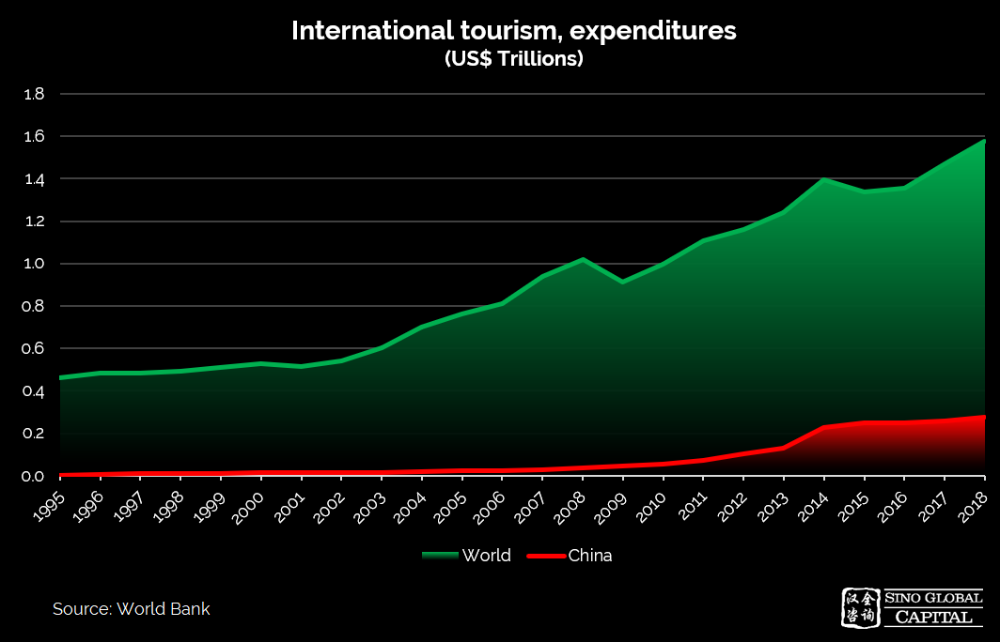 |
|:--:|
| تزايُد الإنفاق على السياحة قبل انتشار فيروس كورونا |

بعد الجائحة، أخذ السفر على الصعيد العالمي في العودة تدريجيًا إلى طبيعته، ومع مرور الوقت، سيستمر اتجاه النمو. وهذا أمر إيجابي أيضًا لشركات التكنولوجيا المالية، إذ إنّ الدفع بالأجهزة المحمولة أخذ في النمو أيضًا.

| 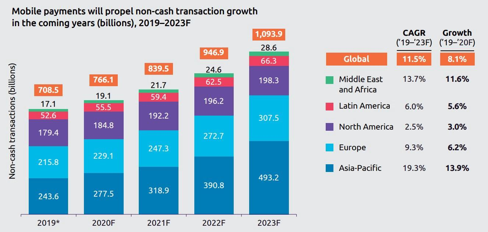 |
|:--:|
| المصدر: تقرير شركة الاستشارات الإدارية Capgemini (World Payments Report) لعام 2020 |

كما يتزايد حجم نقاط البيع المحمولة (POS) وهو أمر مفيد للسائحين الذين يستخدمون بطاقات الائتمان الافتراضية والمحافظ المحمولة المرتبطة بحساباتهم المصرفية في بلدانهم.

| 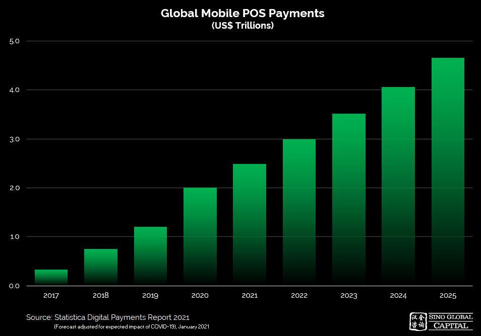 |
|:--:|
| زيادة المدفوعات بنقاط البيع |

**كيف سيُحدث التمويل اللامركزي تحوّلًا في الدفع بالأجهزة المحمولة التقليدية؟**

## نمو منظومة التمويل اللامركزي

نمت منظومة التمويل اللامركزي بشكل كبير خلال عام 2020، ما أدى إلى إحداث تطور تدريجي ونضج في عروض المنتجات والمنصات والبروتوكولات. إذ تعمل شركات القطاع في الوقت الحالي على تأسيس البنية التحتية اللازمة لإحداث تحوّل في المجال المالي التقليدي. ونشهد ارتفاعًا كبيرًا في الاهتمام ببروتوكولات التمويل اللامركزي الجديدة في مختلف القطاعات مثل الإقراض والتأمين والمشتقات والتداول اللامركزي وغيرها.

لتوضيح هذا النمو، سنراجع ثلاثة مقاييس رئيسية للنمو، هي: المستخدمون المستقلون، والقيمة الإجمالية المقفلة (TVL)، وحجم التداول المركزي مقابل التداول اللامركزي.

في مطلع يناير/ كانون الثاني 2018، لم يكن هناك سوى بضع مئات من مستخدمي التمويل اللامركزي المسجلين. وبحلول يناير/ كانون الثاني 2021 ارتفع هذا الرقم إلى نحو 1.3 مليون عنوان فريد. وبينما يمكن لمستخدم واحد إنشاء عناوين متعددة، فإن النمو الذي يقارب 6,360 ضعفًا على مدار 3 سنوات يعد هائلًا ومشجعًا.

| 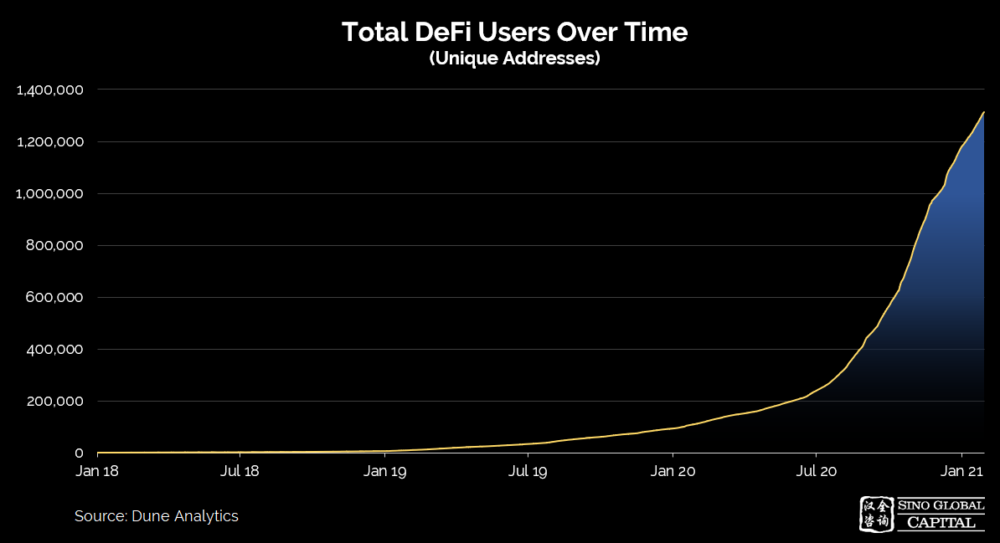 |
|:--:|
| النمو الهائل في التمويل اللامركزي |

بلغ إجمالي القيمة المقفلة (بالدولار الأميركي) في 2 يناير/ كانون الثاني 2018 ما مقداره 50.52 مليون دولار. وفي أواخر يناير/ كانون الثاني 2021) وصل إلى قيمة إجمالية مقفلة بلغت 23.45 مليار دولار. ويُعد هذا نموًا هائلًا بنسبة 46317%. وبعبارة أخرى، في غضون عامين، زادت الأموال المقفلة في التمويل اللامركزي، وهو مقياس للاستخدام والثقة في التطبيقات المالية اللامركزية، بمعامل قدره 463.

| 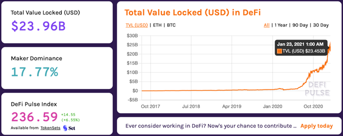 |
|:--:|
| تزايُد القيمة الإجمالية المقفلة، والثقة في التمويل اللامركزي. المصدر: DeFi Pulse |

وتتمثل إحدى العلامات الأخرى على نضوج قطاع التمويل اللامركزي وجاذبيته لقاعدة مستخدمين أوسع في الزيادة الكبيرة في حجم التداول على منصات التداول اللامركزي مثل Uniswap. ففي سبتمبر/ أيلول 2020، تفوقتUniswap على Coinbase في حجم التداول، مسجلة نحو 15.4 مليار دولار أو 65% من إجمالي حجم التداول اللامركزي (23.5 مليار دولار). فيما بلغ حجم التداول المقدر لـ Coinbase في سبتمبر/ أيلول 2020 ما مقداره 13.6 مليار دولار.

| 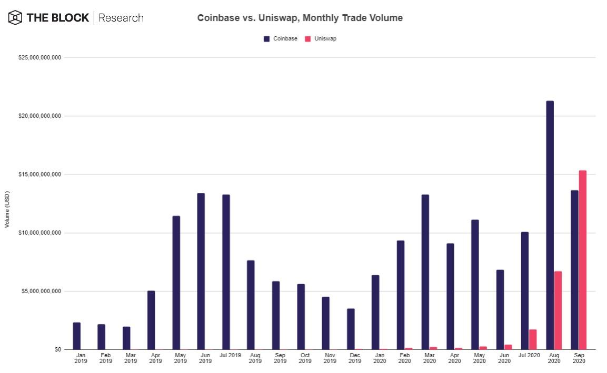 |
|:--:|
| تزايُد استخدام منصات التداول اللامركزي |

على الرغم من نمو منصات التمويل اللامركزي والزيادة في التداول والقيمة الإجمالية المقفلة للبدائل اللامركزية للتمويل التقليدي، لا يزال هناك مجال كبير للتحسّن فيما يتعلق بالسرعة والتكلفة وتجربة المستخدم وتصميم واجهات المستخدم.

دعونا نلقي نظرة على شركات التكنولوجيا المالية التقليدية.

## سوق التكنولوجيا المالية

عند قياس نمو التمويل اللامركزي، من المهم النظر إلى القوى الأخرى التي تُحدث تحوّلًا في التمويل التقليدي. إذ تتغلغل شركات التكنولوجيا المالية في جميع مجالات التمويل وتدخل الشركات الناشئة الجديدة إلى المجال لتقديم حلول مالية أكثر فعالية وكفاءة.

يشترك مجتمع التكنولوجيا المالية مع التمويل اللامركزي في العديد من الأهداف نفسها، على الرغم من أن اللامركزية هي نقطة رئيسية في الاختلاف بينهما.

| 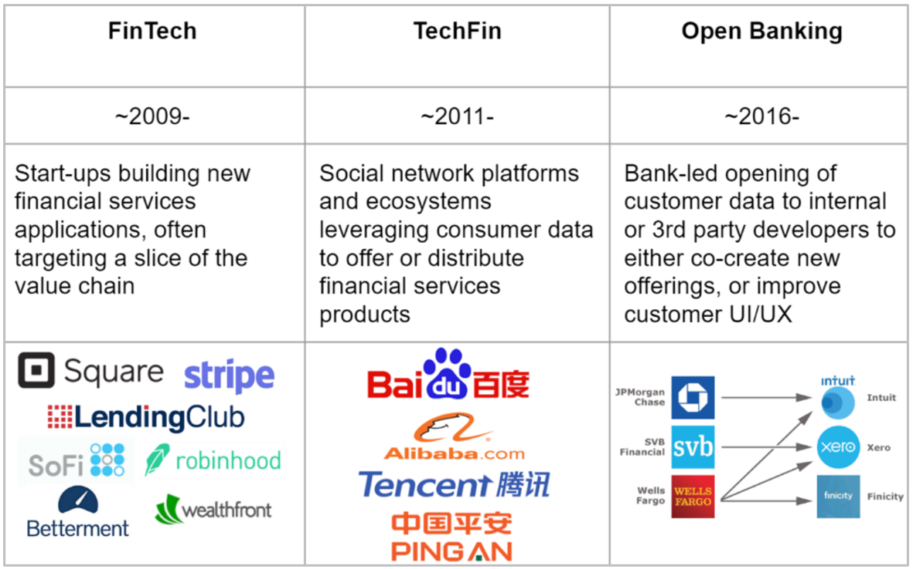 |
|:--:|
| المصدر: أندرو وونغ |

يُعد الاستخدام والرواج المتزايد لحلول التكنولوجيا المالية مثالًا واعدًا لمشاريع التمويل اللامركزي التي تحاول الترويج لحلولها وتعميم استخدامها. وكما أشرنا آنفًا، يشترك مجالا التمويل اللامركزي والتكنولوجيا المالية في بعض الأهداف مثل:

- تقليل حواجز الدخول أمام المنتجات والخدمات المالية - الشمول المالي.
- تقديم الخدمات المصرفية لمن لا يتعاملون مع البنوك.
- المزيد من الشفافية وإمكانية الحصول على المنتجات والخدمات المالية.
- توفير البدائل اللازمة للتمويل التقليدي.

إذا كان من الممكن جذب جزء صغير من مستخدمي التكنولوجيا المالية إلى التمويل اللامركزي، فسيكون من شأن ذلك أن يعزز بشكل كبير توسع حركة التمويل اللامركزي.

## تطور التكنولوجيا المالية

بعض الأرقام من مجال التكنولوجيا المالية:

في عام 2018، تمكن نحو 3 مليارات مستخدم في جميع أنحاء العالم من تلقي الخدمات المصرفية للأفراد من خلال أجهزة الكمبيوتر والساعات الذكية والأجهزة اللوحية والهواتف الذكية.

نظرًا لأن المستخدمين الأفراد على دراية بالفعل بسبل الحصول على الخدمات المالية واستخدامها عبر أجهزتهم الرقمية، فهناك فرصة كبيرة لإدخال بعض مستخدمي التكنولوجيا المالية الحاليين إلى مجال التمويل اللامركزي.

تتمثل إحدى النتائج الأخرى الجديرة بالملاحظة في أن 46% من العملاء يستخدمون القنوات الرقمية حصريًا للخدمات المصرفية الشخصية. تُغني التحسينات في الخدمات المصرفية على المنصات عبر الإنترنت عن الحاجة إلى زيارة الفروع الفعلية.

تحظى تطبيقات التكنولوجيا المالية بالرواج بين جيل الشباب على وجه الخصوص، ويُعزى ذلك بصفة أساسبة إلى ظهور بدائل الدفع عبر الأجهزة المحمولة.

يتطور وعي المستهلكين بخدمات التكنولوجيا المالية بشكل مطرد، إذ إن 96% من المشاركين في استطلاع أجرته شركة EY على دراية بحلول التكنولوجيا المالية في تحويل الأموال والمدفوعات. والأمر اللافت للنظر هو ارتفاع مستوى الطلب على التأمين في حين أن المدخرات والاستثمارات تلقى استحسانًا أيضًا:

| 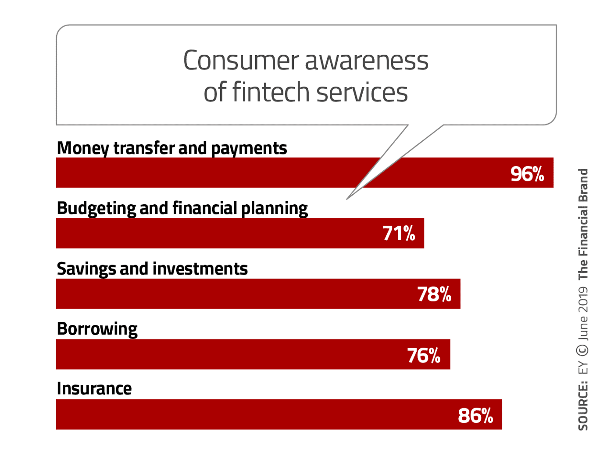 |
|:--:|
| المصدر: The Financial Brand |

يمضي هذا التقرير لتلخيص التغييرات في وعي المستهلكين بمرور الوقت لكل فئة من عام 2017 إلى 2019، موضحًا بجلاء زيادة الوعي والاستخدام المرجح في كل منها:

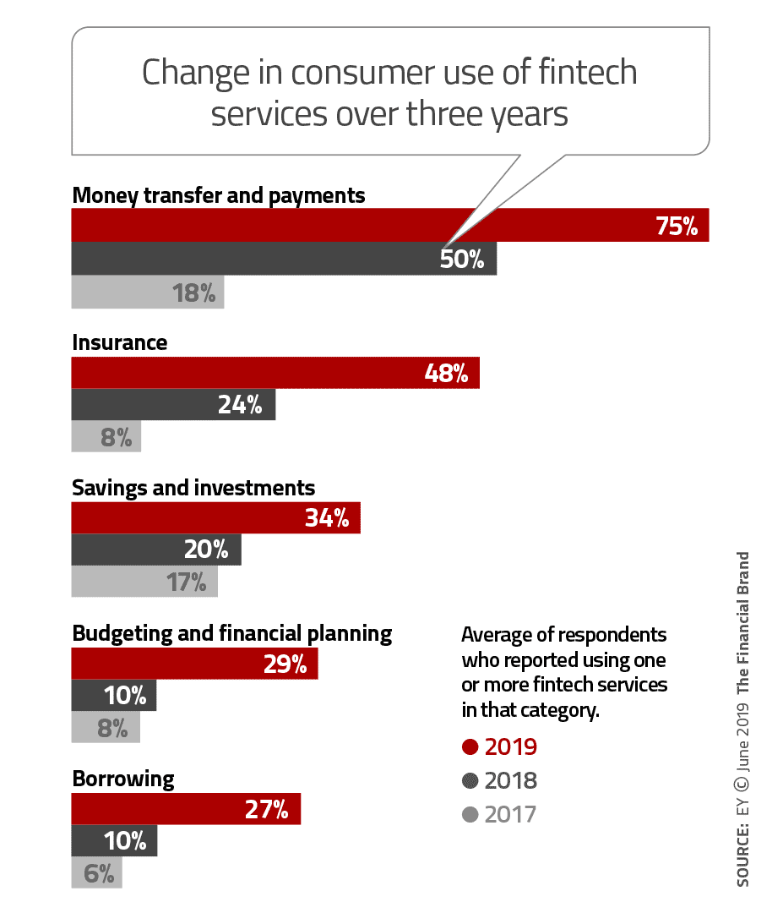

يوضح ذلك كيف أصبحت التكنولوجيا المالية بالغة الأهمية للمستخدمين العاديين. إذ يمكن للمستخدمين، من خلال امتلاك هذا البديل، استخدام منصات دفع أرخص، واستراتيجيات أفضل للادخار والاستثمار وخيارات متنوعة الاقتراض.

كما أوضحنا، فإن قطاعات التمويل والتكنولوجيا المالية كبيرة الحجم للغاية، حيث يبحث المستخدمون الأفراد عن بدائل مالية موثوقة. وغالبية هؤلاء المستخدمين ليسو من مستخدمي البلوكتشين أو التمويل اللامركزي بعد. لكن إذا ما قُدّمت لهم تجربة بطريقة مغايرة ووُفرت لهم الفرص التي لا يمكن أن تقدمها سوى العملات المشفرة والتمويل اللامركزي، فمن المرجح أن يتحولوا إلى مستخدمين جدد في هذا القطاع.
 وهنا يأتي دور منصة MAPS للمساهمة في تأهيل مستخدمي التكنولوجيا المالية في مجال التمويل اللامركزي.

## منصة MAPS.me

**لماذا تعد منصة MAPS مهمة لزيادة استخدام التمويل اللامركزي؟**

يمكن أن يحقق تطبيق MAPS 2.0 الاستخدام العالمي كتطبيق جوال في التكنولوجيا المالية، وباندماجه مع التمويل اللامرزي، فإنه يوفر إمكانية الحصول على الخدمات المالية إلى 140 مليون مستخدم.

يمكن لتطبيق التنقل هذا، بفضل تجربته الممتدة إلى 9 سنوات وقاعدة مستخدميه المخصصة، أن يغيّر بشكل جذري من طريقة تعامل المستخدمين التقليديين مع التمويل. حيث ستسمح محفظة جديدة ومبتكرة ومحسّنة مدعومة من شبكة البلوكتشين Solana للمستخدمين الأفراد بتحقيق أرباح على أموالهم وتداول العملات الأجنبية والتحويل الفوري والآمن. ويوفر تطبيق MAPS 2.0 إجراء المعاملات العابرة للحدود بصورة آنية.

دعونا نلقي نظرة دقيقة على الخدمات المتوفرة على تطبيق MAPS 2.0:

- **تحقيق الربح.** يمكن أن تتدفق أموال المشاركين إلى بروتوكول الإقراض على شبكة البلوكتشين سولانا، لتحقق لهم 8% من الدخل بلا عناء.

- **صرف العملات.** يمكن لمحفظة Maps.me الاحتفاظ بالأموال وتحويلها بين 35 عملة بأفضل الأسعار وبطريقة شفافة. لم يعد المسافرون بحاجة إلى دفع رسوم كبيرة مقابل صرف العملات الأجنبية.

- المدفوعات المباشرة. الدفع للتجار والفنادق والمطاعم مباشرة. إذ يتمتع المستخدمون بإمكانية الحصول على أفضل الأسعار للفنادق والمطاعم، بالإضافة إلى الدفع للتجار مباشرةً، بدون رسوم خفية، باستخدام محفظة MAPS.

- **تحويل الأموال بصورة آنية.** يمكن للمستخدمين إرسال الأموال إلى الأصدقاء والعائلة بدون دفع الرسوم الباهظة التي تفرضها البدائل التقليدية.

- **خدمات التداول.** في المستقبل، ستتيح محفظة Maps.me خدمات التداول وتوفر فرصًا استثمارية، وذلك عبر إتاحة إمكانية الوصول إلى الأسواق العالمية، وكل ذلك بدعم من منصة التداول اللامركزي Serum وشبكة البلوكتشين سولانا.

| 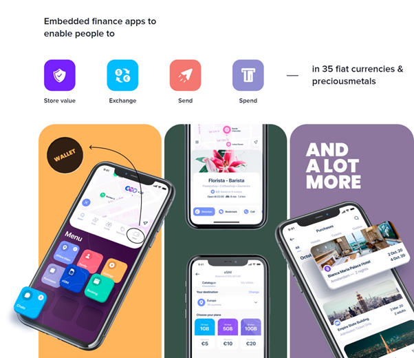 |
|:--:|
| محفظة MAPS ذات الاستخدامات المتعددة |

سيدعم منظومة Maps.me رمز MAPS. وسيعود 100% من صافي الإيرادات المحققة إلى حاملي الرموز. وإلى جانب تنفيذ شراء الرموز وحرقها، ستعمل MAPS بوصفهِ برنامج ولاء للمستخدمين. ويمكن لمستخدمي MAPS تخزين رمزها لتلقي عوائد إضافية.

يمكن للشركات استخدام رمز MAPS للإعلانات للحصول على ترتيب أعلى في نتائج البحث.

أخيرًا، يمكن أن يستخدم المستخدمون كل رمز من رموز MAPS كحق للتصويت، ما يتيح لحاملي الرمز المشاركة في نظام الحوكمة ويكون لهم رأي في تطوير المنظومة ككل.

أظهر استطلاع شمل 26 ألف مستخدم من مستخدمي Maps.me أُجري في أبريل/ نيسان 2020 ما يلي:

- الثقة في علامة Maps.me التجارية، إذ إن 47% من المشاركين في الاستطلاع منفتحون على استخدام محفظتها وبطاقتها المحمولة عند توفرها.
- يدرك المستخدمون ارتفاع عمولات صرف العملات مع استعداد 49% منهم لاستخدام بطاقة افتراضية متعددة العملات ذات رسوم منخفضة لصرف العملات الأجنبية.
- قلة التهديد التنافسي للمستخدمين الحاليين. إذ إن 80% من المشاركين لا يعرفون شيئًا عن المنافسين التقليديين من قطاع التكنولوجيا المالية مثل Revolut وTransferwise وغيرهما.
- محدودية الخيارات الحالية للمستخدمين. إذ إن 53% منهم لديهم بطاقة لعملة واحدة فقط من البنك في بلدانهم.

    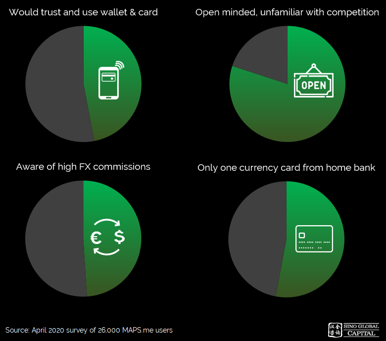

- حتى أغسطس/ آب 2020، كان لدى تطبيق Maps.me أكثر من 140 مليون عملية تثبيت، و1.4 مليون مستخدم نشط يوميًا بالإضافة إلى 27.3 مليون مستخدم فريد للهاتف المحمول في الأشهر الستة السابقة وحدها.

    | 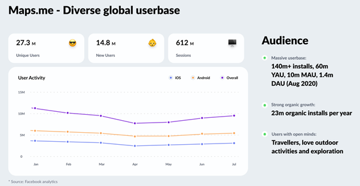 |
    |:--:|
    | ارتفاع عدد المستخدمين المستقرين |

## المخاطر المحتملة

- أوجه الغموض التنظيمية، حيث إن الواجهة الخلفية مدمجة مع شبكة البلوكتشين سولانا ومنصة التداول اللامركزي Serum.
- لا ينتقل المستخدمون الحاليون إلى التمويل اللامركزي إذا تجاهل المسافرون الفرص الاستثمارية بعد تعريفهم بتقنية البلوكتشين.
- شدة المنافسة مع شركات التكنولوجيا المالية الحالية والشركات الناشئة الجديدة في مجال التكنولوجيا المالية مثل Revolut وStarling Bank وRobinhood، وغيرها.

## أفكار بشأن الفرص والمستقبل

مع ظهور محفظة Maps.me، سيكون بإمكان المستخدمين الاستفادة من تطبيق شامل يخدم احتياجات السفر والاحتياجات المالية. ونظرًا لأن Maps.me يخدم حاليًا 140 مليون مستخدم عالمي (أكثر من 58% منهم قادمون من أوروبا، و70% منهم تتراوح أعمارهم بين 18 إلى 40 عامًا)، فهناك إمكانات كبيرة لتطبيق Maps ليكون بمثابة شركة تكنولوجيا مالية لبوابة التمويل اللامركزي. يتمتع فريق MAPS بخبرة معرفة مالية واسعة مكتسبة من بعض أكبر البنوك الاستثمارية في العالم، بما فيها ميريل لينش وغولدمان ساك، فضلاً عن الدعم المالي من منصة FTX ومؤسسها سام بانكمان فرايد.

نعتقد أن MAPS، بوصفها شركة عملاقة في مجال التكنولوجيا المالية، ستكون قادرة على تعزيز نمو التمويل اللامركزي عبر فتح المزيد من المنتجات والخدمات المالية اللامركزية للمستخدمين الذين يتلقون خدمات مصرفية وأولئك الذين لا يحصلون على خدمات مصرفية، على حد سواء.
