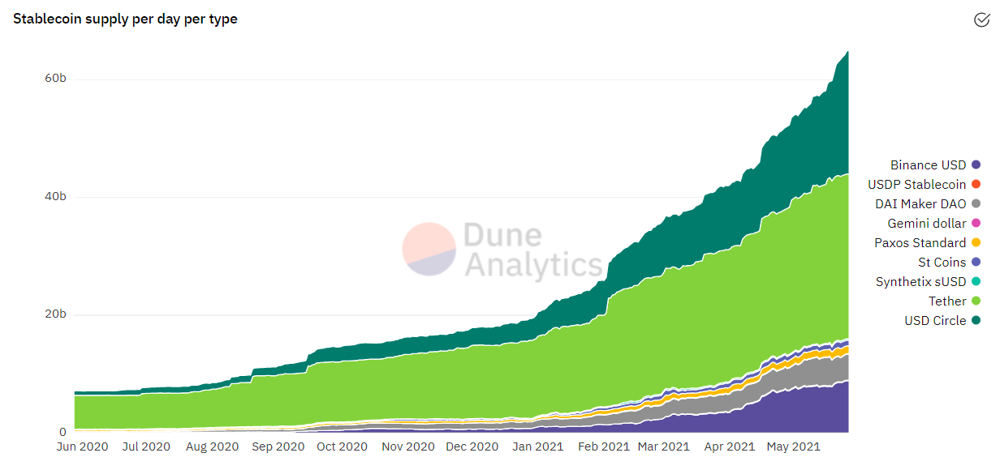
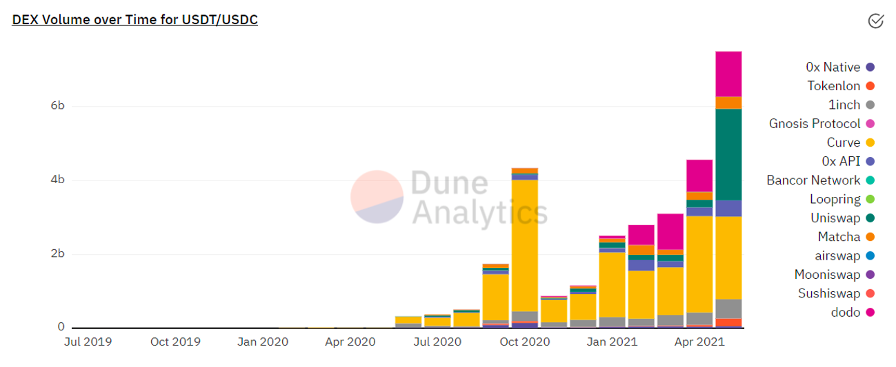
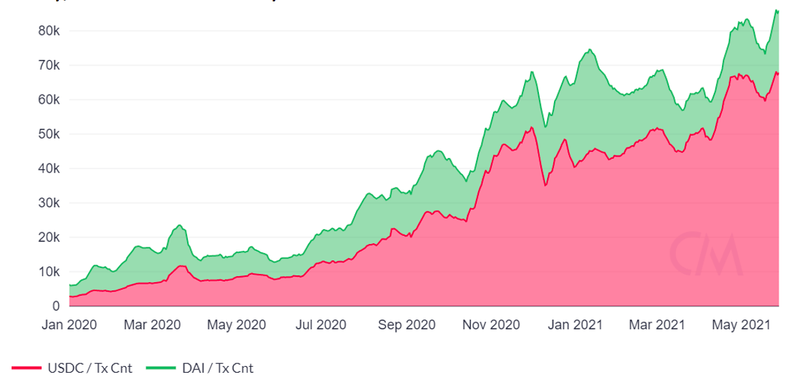
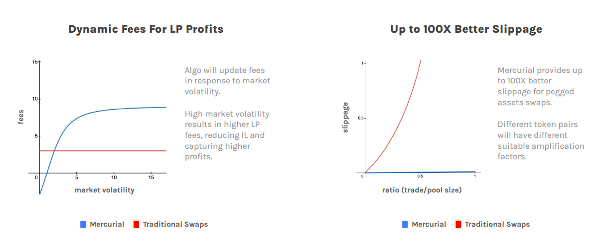
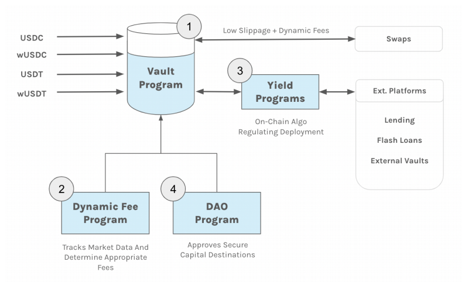
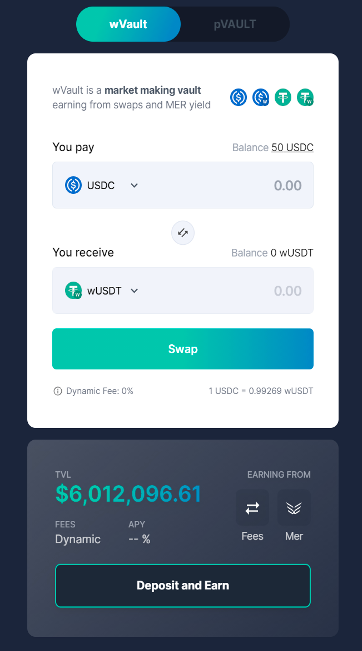

**لماذا استثمرنا في صانع السوق Mercurial Finance؟**

(هذه الأطروحة ليست نصيحة مالية)

**مقدمة**

تعد العملات المستقرة مكونًا أساسيًا لأي منظومة تمويل لامركزي. وتشكل
الزيادة الهائلة في مقتينات العملات المستقرة من 7 مليارات دولار في يونيو/
حزيران 2020 إلى 65 مليار دولار في مايو/ أيار 2021 دليلًا واضحًا على انتشار
استخدامها على نطاق واسع. تعد العملات المستقرة الأصول الأكثر سهولة
بالنسبة للمستثمرين الأفراد للاستثمارات المقوّمة بالدولار، كما تعد وسيط
التبادل المهيمن في عمليات المبادلة بين النقود القانونية والعملات
المشفرة. في منصات التداول المركزي، تعد العملات المستقرة الأصل الأكثر
شيوعًا الذي ترتبط به الرموز الأخرى. فضلًا عن ذلك، يتم استقطاب العديد من
المستثمرين إلى مجال التمويل اللامركزي عن طريق عائدات بيتا المحايدة التي
تقدمها مزارع العملات المستقرة. وقد عززت هذه العوامل مكانة العملات
المستقرة كجزء لا غنى عنه من التمويل اللامركزي.

تزايُد القدر المطروح للتداول من العملات المستقرة. المصدر: Dune Analytics

زاد حجم التداول اللامركزي الشهري لزوج التداول USDT /USDC بأضعاف مضاعفة
خلال العام الماضي، إذ ارتفع من 300 مليون دولار في يونيو/ حزيران 2020 إلى
8 مليارات دولار في مايو/ أيار 2021.

تزايُد حجم التداول اللامركزي. المصدر: Dune Analytics

علاوة على ذلك، تضاعف عدد المعاملات اليومية لعملتي USDC وDAI بمقدار
ثمانية أضعاف منذ يناير/ كانون الثاني 2020. ومن الواضح أن العملات
المستقرة تُستخدم على نطاق واسع في جميع مجالات التمويل اللامركزي.

نمو هائل في معاملات العملات المستقرة. المصدر: Coinmetrics

**المشكلات الحالية**

تتمثل المشكلة المستديمة التي تواجه العديد من العملات المستقرة المختلفة
المتوفرة (مثل USDT وUSDC وDAI) في أن البروتوكولات تستخدم وتنفذ كل عملة
من العملات المستقرة لعدد لا يحصى من حالات الاستخدام المختلفة، وغالبًا ما
تُصدر عملتها المستقرة (مثل LUSD على بروتوكول Liquity، وعملة alUSD على
بروتوكول Alchemix). تتطلب هذه التجزئة من المتداولين تبادل العملة
المستقرة حسبما تتطلب كل حالة استخدام. حاليًا، الطريقتان الرئيسيتان لتبادل
العملات المستقرة على شبكة سولانا هما:

1\. وضع طلب على سجل طلبات الحد المركزي (CLOBs) بمنصة Serum (واجهات منصات
التداول اللامركزي المختلفة).

2\. التبادل على صانع السوق الآلي من منصة Serum (واجهات منصات التداول
اللامركزي المختلفة).

لكنّ المتداولين سيواجهون إما مشكلات تتعلق بانخفاض السيولة على السلسلة
داخل سجل طلبات الحد المركزي، أو حدوث فرق كبير بين سعر الطلب وسعر التنفيذ
من جانب صناع السوق الآليين.

وبالمثل، فإن مجموعة أخرى من مستخدمي العملات المستقرة هم من المقرضين
الذين يرغبون في الحصول على بعض العوائد على احتياطياتهم من العملات
المستقرة. لدى هؤلاء المقرضين خياران محتملان على شبكة سولانا:

1\. إيداع عملتهم المستقرة في سوق المال لكسب الفائدة (لم يُفعّل هذا الخيار
بعد).

2\. توفير السيولة لأزواج العملات المستقرة على صانع السيولة في منصة Serum
لكسب رسوم المبادلة ومكافآت تعدين السيولة إن وجدت (واجهات منصات التداول
اللامركزي المختلفة).

ونظرًا لأن هؤلاء المقرضين سيسعون للحصول على أعلى معدل إقراض، فإن القدر
المطروح للتداول لديهم مرن للغاية وسيخصص للمنصة التي تقدم أعلى معدل عائد
سنوي (APR).

على وجه التحديد، بالنسبة إلى صناع السوق الآليين، ترتبط العائدات ارتباطًا
مباشرًا بحجم تداول زوج العملات المستقرة. وكما هو موضح أعلاه، سيوجّه
المتداولون المقدار بحوزتهم نحو صانع السوق الآلي الذي يقدم سيولة أعمق
وفرقًا أقل في السعر بين الطلب والتنفيذ. وبالتالي، ثمة علاقة تكافلية بين
الطرفين؛ إذ يحتاج المتداولون إلى السيولة التي يوفرها المقرضون، ويحتاج
المقرضون إلى المتداولين لكسب الرسوم.

ومع نمو التمويل اللامركزي باستمرار، يجب على هؤلاء المقرضين أيضًا مواكبة
المزارع أو الاستراتيجيات الجديدة من أجل زيادة عائداتهم. ويمكن ألا يكون
هذا ميسورًا للمستثمرين السلبيين الذين قد لا يملكون الوقت أو الخبرة لتنفيذ
مثل هذه الاستراتيجيات بكفاءة.

**صانع السوق Mercurial Finance**

بُني صانع السوق Mercurial Finance ((<https://www.mercurial.finance/> على
شبكة سولانا، وهي شبكة بلوكشين قابلة للتوسع بدرجة عالية وغير مركزية
بالكامل. تعد سولانا أفضل شبكة بلوكتشين لصانع السوق Mercurial لريادتها في
القطاع بإمكانية إجراء 65 ألف معاملة في الثانية، وأوقات إنشاء الكتلة التي
تبلغ 400 مِلّي ثانية، ورسوم التشغيل المنخفضة للغاية. فضلًا عن ذلك، سيُدمج
صانع السوق Mercurial مع منصة التداول اللامركزي Serum، بما يتيح الاستفادة
من تدفقات سجل الطلبات والسيولة لتقليل فروق السعر بين الطلب والتنفيذ
وتعزيز المعاملات على كلا النظامين.

ومع توسع منظومة التمويل اللامركزي على سولانا بسرعة، سيزداد الطلب على
إصدار العملات المستقرة والمبادلات والزراعة. سنشرح أسباب اعتقادنا أن صانع
السوق Mercurial Finance في وضع يتيح لها بقوة الاستحواذ على الحصة الأكبر
من هذا الطلب، عن طريق مزيجها الناجح المكوّن من التكنولوجيا المبتكرة
والرؤية والعلامة التجارية والشركاء الاستراتيجيين.

**الحل**

تسعى Mercurial Finance إلى تقديم حل شامل لكلا الطرفين في منظومة سولانا.
وذلك باستحداث مفهوم الخزائن الديناميكية. ستضم هذه الخزائن الديناميكية
ابتكارين مهمين:

1\. منحنى السعر المضخّم APC: يركز السيولة حول النطاق المطلوب.

2\. الرسوم الديناميكية: تعمل الخوارزمية على ضبط الرسوم وفقًا لحجم السوق
وتقلباته:

• ارتفاع التقلبات في السوق: رسوم أعلى وتقليل الخسائر المؤقتة وتحقيق
أرباح أعلى.

• انخفاض تقلبات السوق: رسوم أقل لتشجيع التداول.

**مزايا للمتداولين**

فيما يتعلق بالمتداولين، تعمل هذه الابتكارات على حل مشكلاتهم المذكورة
أعلاه بشكل فعال عبر تحسين الاستفادة من السيولة المتاحة، بينما تقدم في
الوقت نفسه للمتداولين ميزة أفضل بشأن فروق السعر بين الطلب والتنفيذ
بمقدار 100 ضِعف عند مبادلة العملات المستقرة مقابل عمليات المبادلة
التقليدية. وعلى أساس كل من السيولة العميقة وانخفاض فروق السعر بين الطلب
والتنفيذ، من المرجح أن يستخدم المتداولون منصة Mercurial بوصفها منصة
المبادلة المفضلة لديهم، وبالتالي تعزيز الرسوم التي يكسبها موفرو السيولة.

عمليات مبادلة فعالة لرأس المال برسوم ديناميكية. المصدر: Mercurial
Finance

**مزايا للمقرضين**

من ناحية أخرى، تجذب هذه الخزائن الديناميكية السيولة من المقرضين عن طريق
تعظيم العائد على رأس المال المستثمر. يتحقق ذلك عبر خوارزميات متخصصة على
السلسلة تقوم بصورة آلية بتوزيع السيولة على الآلية ذات العائد الأعلى، بما
فيها منصات الإقراض والقروض السريعة والخزائن الخارجية والخزائن فيما بين
شبكات البلوكتشين.

يتم تعزيز السيولة بدرجة أكبر عن طريق السماح للمستخدمين بإيداع الرموز
الأخرى (مثلSOL وSRM) لإصدار العملات المستقرة المؤلفة مثل mUSD، والتي
يمكن إيداعها في الخزائن الديناميكية. يستفيد هؤلاء المستخدمون من الاحتفاظ
بأصولهم المودعة متاحة للاستخدام، مع كسب عائد مزدوج من:

1\. الفوائد المدفوعة من الخزائن الديناميكية.

2\. العائد من مكافآت التخزين الأصلية.

بعد إيداع أصولهم، سيحصل المقرضون على رموز موفر السيولة والتي يمكن
استخدامها لزيادة كفاءة رأس المال عن طريق:

• رموز التخزين لموفري السيولة لتعدين السيولة لعملة MER.

• إعادة الاستثمار في خزائن أخرى لعملة MER.

• استخدمها كضمان لمنصات الإقراض الأخرى.

الجوانب الرئيسية في خزائن Mercurial. المصدر:
<https://www.mercurial.finance/Mercurial-Lite-Paper-v1.pdf>

**تجربة وواجهة سلسة للمستخدم**

تدرك Mercurial Finance أن الواجهة سهلة الاستخدام تعد أمرًا بالغ الأهمية
لتحفيز الانتقال من المنصات المركزية إلى المنصات اللامركزية. من هذا
المنطلق، يعد توفير واجهة سهلة الاستخدام وتجربة مستخدم مريحة من الأولويات
الرئيسية لمنصة Mercurial. يعمل الفريق باستمرار على تحسين تجربة المستخدم/
واجهة المستخدم وتطوير أنماط تصميم تقلل الاحتكاك.

واجهة المستخدم بمنصة Mercurial

**رمز MER**

صُمم رمز MER الأصلي بحيث يتمتع بمجموعة واسعة من الآليات التي ستحقق قيمة
لحاملي الرمز:

1\. رسوم استخدام عمليات المبادلة.

2\. العمولات من عوائد الفوائد والعائد الذي تتحصل عليه الخزينة.

3\. الضمان للعملات المستقرة المؤلفة.

فضلًا عن ذلك، سيرتبط رمز MER ارتباطًا محكمًا بحوكمة منظومة Mercurial.
سيتمكن حاملو رمز MER من التصويت على المقاييس الرئيسية مثل رسوم المبادلة
وعمولات الخزنة واستراتيجيات العائد.

**المخاطر والتهديدات**

**المنافسة**: توجد العديد من بروتوكولات مبادلة العملات المستقرة التي يتم
تطويرها على منظومة سولانا. سيختار كل من المقترضين والمقرضين في نهاية
المطاف المنصة التي توفر لهم أكبر فائدة، سواء كان ذلك من حيث الخصائص
الوظيفية أو العائد أو الرسوم أو فروق السعر بين الطلب والتنفيذ. لذا،
يتعيّن على Mercurial Finance تقديم أفضل الحلول في جميع الجوانب من أجل
ترسيخ مكانتها باعتبارها المنصة المفضلة.

**الفرص المستقبلية**

**عمليات التكامل مع البروتوكولات الأخرى:** نظرًا لتطوير المزيد من الركائز
الأساسية للتمويل اللامركزي على منظومة سولانا، نتوقع أن تستفيد تطبيقات
التمويل اللامركزي الأخرى من خزائن Mercurial الذكية لمجموعة متنوعة من
حالات الاستخدام. على سبيل المثال، يمكن لبروتوكول إقراض العملات ذي
الرافعة المالية اقتراض كمية كبيرة من عملة مستقرة ذات فائدة منخفضة
واستخدام مقايضات Mercurial منخفضة الفروق في السعر بين الطلب والتنفيذ
لمبادلتها بكفاءة بأي عملة مستقرة ضرورية لتحقيق نسبة 50-50. بالنسبة إلى
التطبيقات اللامركزية التي تُصدر عملاتها المستقرة الخاصة بها، سيكون
التكامل مع Mercurial ضروريًا لزيادة قابلية الربط والسيولة لعملتها
المستقرة المصدَرة.

**خدمات أخرى غير العملات المستقرة:** تهدف Mercurial إلى توسيع خزائنها
الديناميكية لدمج أي زوج من الرموز. إذ يعتزم فريق المنصة تنفيذ نماذج
تسعير جديدة لتحسين مجموعات الرموز التي لا تتم مبادلتها بنظام 1:1. سيؤدي
هذا إلى توسيع عرض Mercurial إلى سوق شاملة أوسع بكثير يمكن التعامل معها.

**خاتمة**

تشكل العملات المستقرة حجر الأساس لتعزيز توسع نطاق الاستخدام والسيولة في
أي منظومة لامركزية. ونعتقد أن منصة Mercurial Finance هي ركيزة مهمة في
زيادة تعزيز كفاءة منظومة شبكة سولانا، وإطلاق العنان لخلق قيمة أكبر وفرص
للمستثمرين والمتداولين على حد سواء. ونتطلع إلى الشراكة مع فريق Mercurial
ومجتمعه ودعمه في المستقبل.
