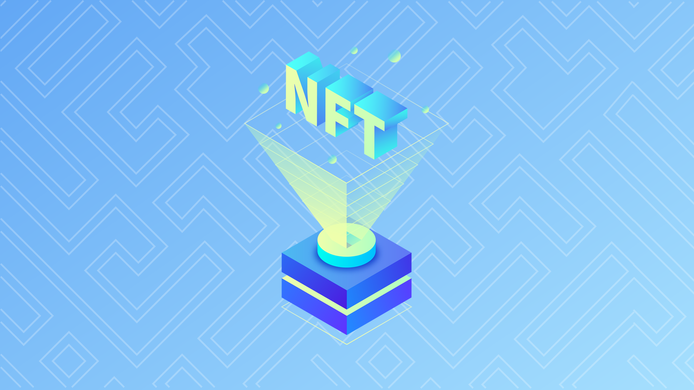
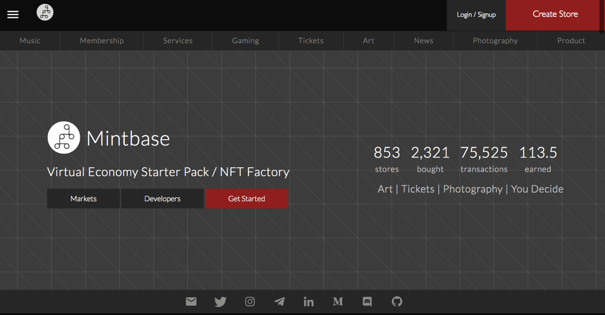
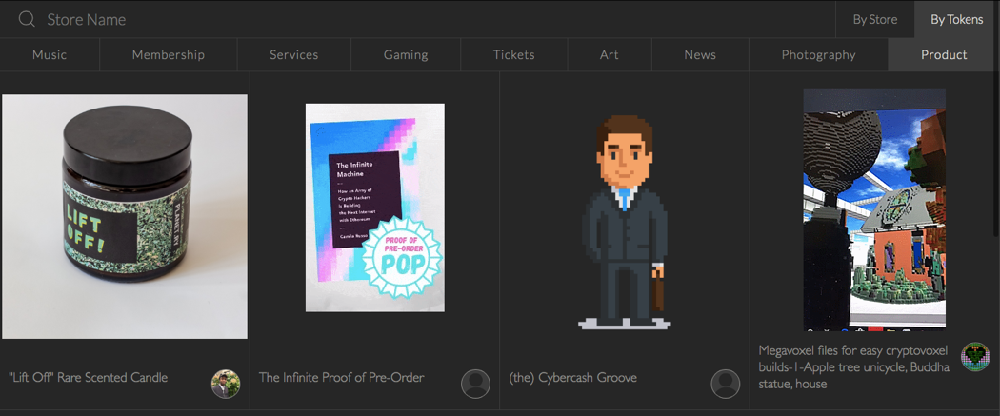

**لماذا استثمرنا في منصة Mintbase؟**

**مقدمة**

يتمثل أحد المبادئ الأساسية لرسالة Sino Global Capital في الاستثمار في
الركائز الأساسية للاقتصاد الرقمي. إذ إننا نعمل على مواكبة أحدث التطورات
في مجال تكنولوجيا البلوكتشين والجيل الثالث لشبكة الويب (Web 3.0) كي
نتمكن من دعم وبناء وصياغة مستقبل القطاع.

عندما برزت الرموز غير القابلة للاستبدال في المشهد، فقد أثارت فضولنا
وحماسنا ورأينا فيها الكثير من الإمكانات الكامنة للتكنولوجيا في المستقبل.
فهي تشكل ركيزة أساسية مثيرة للاهتمام وسريعة النمو بفضل تعدد مجالات
استخدامها التي لم تُستكشف بالكامل بعد. وقد أدركنا أنه توجد العديد من
المداخل الجاذبة للقطاع.

**الرموز غير القابلة للاستبدال**

****

الرموز غير القابلة للاستبدال. مصدر الصورة:
[Decrypt](https://decrypt.co/resources/non-fungible-tokens-nfts-explained-guide-learn-blockchain)

تُعزى قوة الرموز غير القابلة للاستبدال إلى قدرتها على ترميز أصل مادي
وإنشاء شكل رقمي للأصل الأساسي. وتُعد هذه الخاصية مفيدة بوجهٍ خاص للأصول
غير السائلة أو الأصول التي لا تمثل قيمة خارج \"بيئتها\". وتمثل العقارات
أحد الأمثلة الواضحة على الأصول غير السائلة.

بعد ظهور الرموز غير القابلة للاستبدال، أصبح من الممكن بسهولة تحويل هذه
الأصول غير السائلة إلى أصول رقمية ونقلها من مكان إلى آخر، ما يساعد في
خلق فرص مبتكرة.

وبالنظر إلى أن الرموز غير القابلة للاستبدال تُعد أصولًا، يمكن اقتراضها أو
إقراضها بصوفها ضمانًا، وهو ما ينتج عنه المزيد من التدفقات النقدية.

تشكل الألعاب مثالًا آخر على سبب قوة الرموز غير القابلة للاستبدال. إذ إنه
لا يمكن تداول الجلود أو تبادلها في لعبة \"فورتنايت\" (Fortnite) أو لعبة
\"ليغ أوف ليجيندز\" (League of Legends) خارج اللعبة. لكن عند استخدام
الرموز غير القابلة للاستبدال وأسواقها، يمكن استبدال هذه \"الأصول\" بقيمة
خارج لعبتها الأصلية. حيث يصبح توحيد المقاييس، باستخدام الرموز غير
القابلة للاستبدال، أكثر وضوحًا لأنها تتيح للأصول الرقمية حرية التنقل عبر
منصات مختلفة، وهو ما يحقق قابلية التشغيل المتبادل والربط الشبكي مع إعطاء
حزمة الملكية للمستخدم.

حذاء Jordan X في لعبة \"فورتنايت\". مصدر الصورة:
[Youtube](https://www.youtube.com/watch?v=IdmurblgyRI)

انصبّ التركيز مؤخرًا في مجال الرموز غير القابلة للاستبدال على ترميز
المقتنيات مثل الموسيقى والفن، ولكنّ هناك فرصة هائلة في العناصر المادية
المرتبطة بالرموز غير القابلة للاستبدال (منها تذاكر الفعاليات، على سبيل
المثال). علاوة على ذلك، تعد الرموز غير القابلة للاستبدال امتدادًا طبيعيًا
للتمويل اللامركزي.

**تطوُّر استخدامات الرموز غير القابلة للاستبدال**

لا تتوقف استخدامات الرموز غير القابلة للاستبدال عند هذا الحد. إذ إنها
تتيح قدرًا أكبر من التطبيقات الإبداعية والمبتكرة. ومع التطور الذي يطرأ
عليها بمرور الوقت، يمكن تصميمها لتزويد المستخدم النهائي بتجربة ذات طابع
شخصي بدرجة أكبر وربما توفير امتيازات معينة. على سبيل المثال، يمكن للرموز
غير القابلة للاستبدال النادرة والحصرية التي تمثل تذاكر محددة أن تمنح
حامليها إمكانية وصول محدودة إلى مجموعة خاصة أو مجتمع يمكنهم من خلاله
التفاعل مع منشئ الرمز. كما يمكن أيضًا للرموز غير القابلة للاستبدال أن
تتيح للأفراد إنشاء هويات معينة، والتي يمكن الاستفادة منها لإنشاء شبكات
أو مجتمعات اجتماعية.

من الناحية الجوهرية، تتيح الرموز غير القابلة للاستبدال، بصفتها تجربة،
بناء هويّات وسُمعة رقمية جديدة. ويمكنها أن تفتح آفاقًا جديدة بشأن
المستخدمين أو المجتمع، مع إدماج هواياتهم وتفضيلاتهم وأهدافهم. وهي
المعلومات التي تسيطر عليها في الوقت الحالي شركات التكنولوجيا الكبرى، مثل
أمازون وغوغل وفيسبوك.

وكي يتمحور تركيزنا على الركائز الأساسية للاقتصاد الرقمي، لم يكن لدينا
اهتمام بالاستثمار في قطعة واحدة من العقارات الرقمية أو مقتنيات عالم
الألعاب. بل كان هدفنا الأسمى أن نجد فريقًا يخلق المساحة نفسها بدلاً من
البناء داخلها. فلم يكن اهتمامنا متركزًا على اقتناء عدد قليل من الرموز غير
القابلة للاستبدال لتداولها، بل أردنا دعم التكنولوجيا والمنظومة الكاملة
للقطاع في جوهرها.

**منصة Mintbase**

عملنا على البحث عن أفضل فريق في مجال الرموز غير القابلة للاستبدال، يتّسم
برؤية بعيدة المدى تتوافق مع أفقنا الاستثماري طويل الأجل. وعثرنا على منصة
Mintbase (الموقع الإلكتروني: <https://mintbase.io/>)، وهي سوق توفر
للمستخدمين الأدوات اللازمة لتبادل الرموز غير القابلة للاستبدال. تتميّز
منصة Mintbase عن المنافسين الآخرين بأنّها تتيح للمستخدمين والمشاركين أيضًا
إصدار الرموز غير القابلة للاستبدال وعرضها للبيع، وهي ميّزة لا تتوفر كثيرًا
على المنصات الأخرى. بل إنه يمكن للمستخدمين أيضًا إنشاء متجارهم الخاصة.

صفحة الهبوط بمنصة Mintbase. مصدر الصورة: Mintbase.io

علاوة على ذلك، تعمل منصة Mintbase على ربط منشئي المحتوى والفنانين وغيرهم
بالمشترين الذين يقدّرون أعمالهم ويثمّنونها. تغطي منصة Mintbase حاليًا فئات
الرموز غير القابلة للاستبدال مثل الموسيقى والفن والخدمات والتذاكر
والتصوير الفوتوغرافي وغيرها.

متاجر منصة Mintbase. مصدر الصورة: Mintbase.io

رغم ذلك، فنحن لا نزال في البداية فحسب فيما يتعلق بتطبيقات الرموز غير
القابلة للاستبدال. إذ إنّ الاتجاه الجديد هو إضفاء الطابع المالي على
الرموز غير القابلة للاستبدال، حيث أستُخدمت الرموز لتشكّل وثائق تأمين.

وأيًا يكن ما يحمله المستقبل القريب من تطور في مجال الرموز غير القابلة،
فإننا على ثقة بأن منصة Mintbase ستكون في طليعة ركب الابتكار. إذ يتمتع
المؤسسان، نايت جير (@nategeier) وكارولين ويند (@CarolinWend) برؤية
مُبهرة، ويمتلكان فريقًا رائعًا، وقد أثارت الطريقة التي أسّسا بها منصة
Mintbase، بميزانية محدودة، إعجابنا.

من وجهة نظرة نايت وكارولين، فإن الرموز غير القابلة للاستبدال تعمل مثل
واجهات برمجة التطبيقات؛ فهي تعزّز الابتكار وتعمل على إحداث تحوّل في
الاقتصادات بصفة أساسية.

ومع اكتساب المجال قدرًا أكبر من النضج، ستلعب الرموز غير القابلة للاستبدال
دورًا رئيسيًا في الطريقة التي نتفاعل بها مع بعضنا البعض عبر الإنترنت وفي
العوالم والبيئات الافتراضية.

وبعد تفهّمنا لتصوّرهما، قررنا الاستثمار في المنصة لدعم رؤيتهما ونأمل أيضًا
في دعم المنصة عبر شبكتنا المتمركزة في الصين.

فيما يلي أبرز الجوانب المهمة في منصة Mintbase التي تُظهِر نتائجها حتى
الآن:

• عدد المتاجر التي أنشئت على المنصة حتى الآن: 850 متجرًا.

• إجمالي الرموز التي أصدِرت على المنصة: 43 ألف رمز.

• عدد الرموز غير القابلة للاستبدال التي بيعت على المنصة: 2300 رمز.

• إجمالي عدد مستخدمي المنصة: 14 ألف.

• إجمالي عمليات تحويل الرموز: 76 ألف تحويل.
