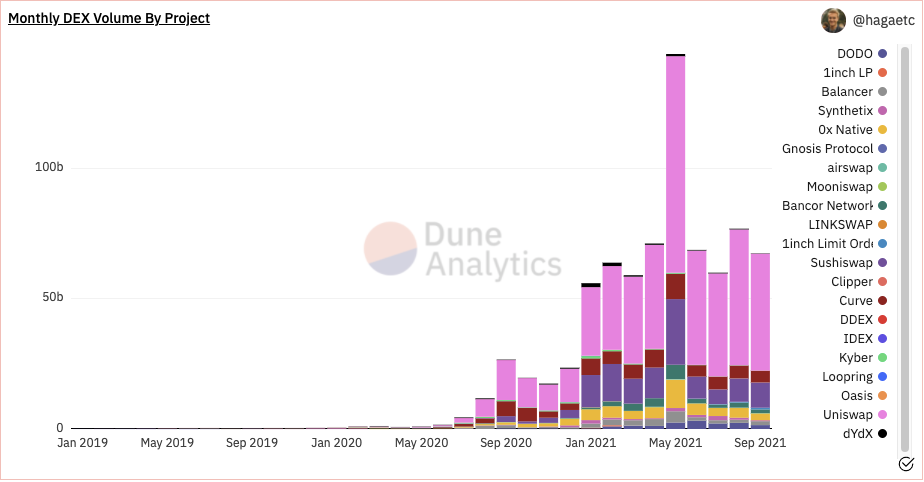
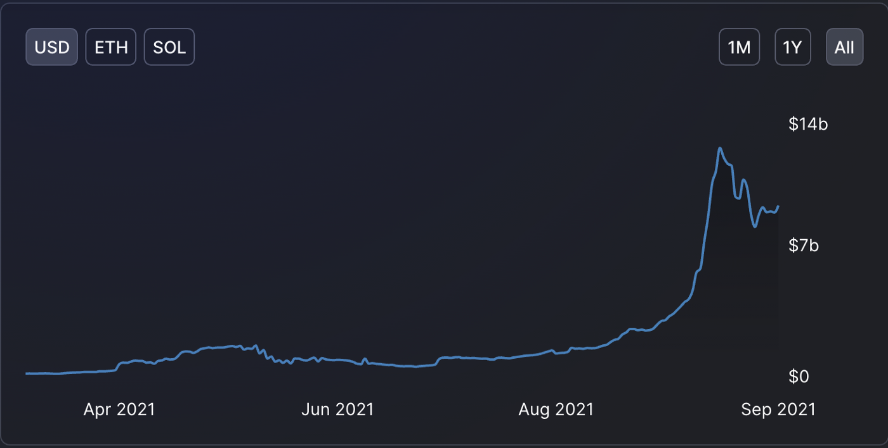
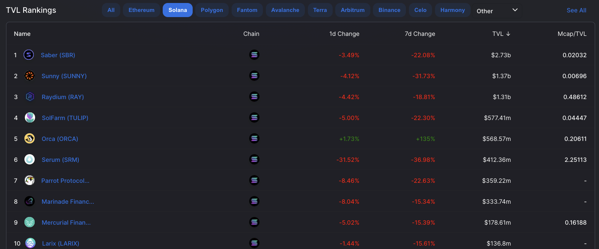
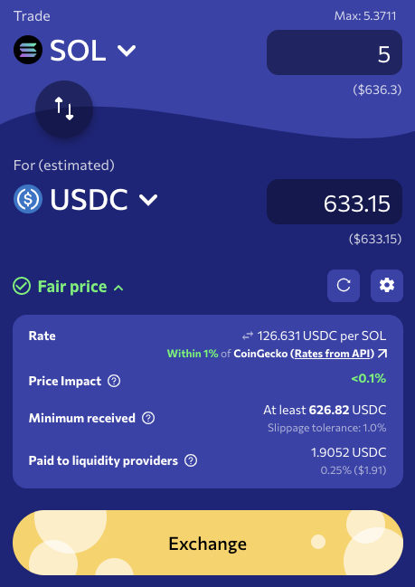
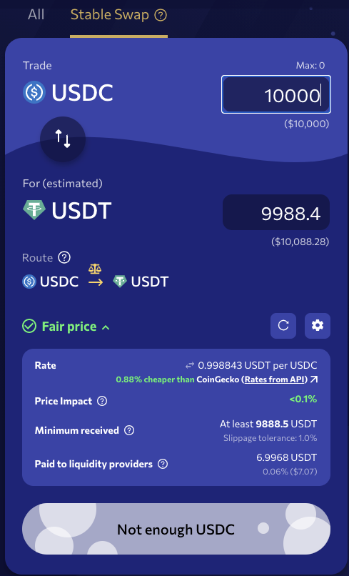
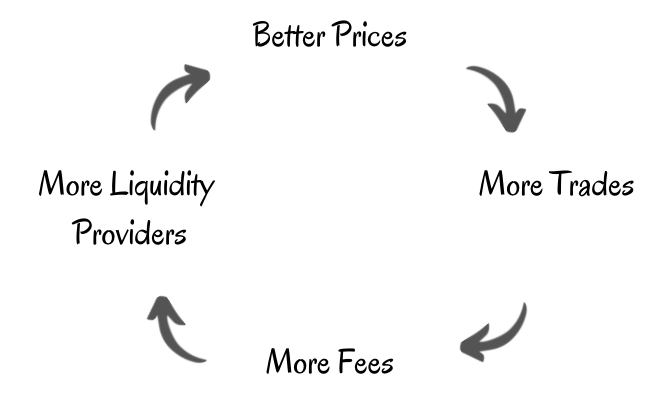
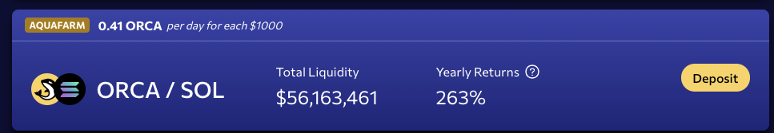
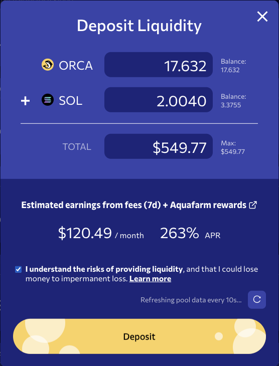
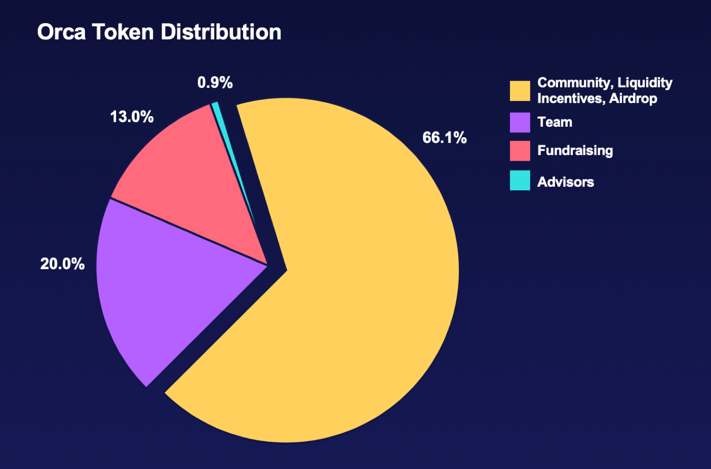

# لماذا استثمرنا في صانع السوق Orca؟

(هذه الأطروحة ليست نصيحة مالية)

###مقدمة

تعد منصات التداول اللامركزي/ صناع السوق الآليون جزءًا أساسيًا من أي نظام
تمويل لامركزي؛ يعتمد العديد من المستخدمين على منصات التداول اللامركزي/
صناع السوق الآليين للتداول في الوقت الحاضر وهذا الاتجاه آخذ في التزايد
كما هو موضح أدناه.

|  |
|:--:|
| *المصدر: https://dune.xyz/hagaetc/dex-metrics* |

زاد حجم التداول اللامركزي الشهري منذ استحداث صناع السوق الآليين في
الأسواق. في الآونة الأخيرة، دفعت مطالبات منصات التداول المركزي المتزايدة
باستمرار لمعايير \"اعرف عميلك\" KYC بعض المستخدمين لاستكشاف خيارات أخرى
تقودهم إلى منصات التداول اللامركزي. على هذا النحو، نتوقع أن تستمر أحجام
التداول على في منصات التداول اللامركزي في النمو بشكل مطرد، وما يصاحب ذلك
من استمرار الرسوم التي تتقاضاها منصات التداول اللامركزي أيضًا في
الازدياد.

في ضوء ذلك، يسعدنا Sino أن نعلن عن استثمارنا في منصة Orca، صانع السوق
اللامركزي في منظومة سولانا. من خلال أطروحتنا الاستثمارية هذه، سنطلعكم
على وجهات نظرنا حول مستقبل منصات التداول اللامركزي/ صناع السوق الآليين
وكيف ستتعامل منصة Orca مع العديد من المنافسين وترتقي إلى القمة بوصفها
منافسًا رئيسيًا.

###لماذا Orca؟

تركز Orca على نهج محوره الإنسان، ما يجعل عالم التمويل اللامركزي المتنامي
والمعقد بسيطًا بما يكفي بحيث يمكن لأي مستخدم الدخول فيه والتفاعل معه.
تجعل تجربة المستخدم الرائعة من السهل ضم مستخدمين جدد وإعادتهم مرارًا
وتكرارًا. وكما قال أينشتاين، \"لابد أن يكون كل شيء بسيطا قدر الإمكان،
ولكن ليس الأكثر بساطة\". هذه هي الروح الكامنة وراء Orca، فهي منصة تداول
لامركزي تركز على الإنسان؛ إذ تأخذ التجربة الأساسية لصناع السوق الآليين
وتجعلها أبسط وأفضل لكل متداول. إلى جانب ذلك، تركز Orca أيضًا على أن تكون
قابلة للربط وعلى كفاءة رأس المال؛ وهي النقاط الرئيسية لأي صانع سوق آلي
في السوق.

اختارت Orca البناء على سولانا، إذ توفر سولانا، من وجهة نظرهم، أفضل تجربة
للمستخدم من خلال رسومها المنخفضة بطبيعتها والمعاملات شبه الفورية
بالإضافة إلى فريق قوي جدًا لديه القدرة على تعزيز نظام مطوِّر مزدهر. يتضح
نمو سولانا كمنظومة في الزيادة الأخيرة في القيمة الإجمالية المقفلة (TVL).

|  |
|:--:|
| *المصدر: https://defillama.com/chain/Solana* |

## عوامل التميز الرئيسية

يتوفر في منظومة سولانا العديد من صناع السوق الآليون والمنافسة عليها
محتدمة.

|  |
|:--:|
| *المصدر: https://defillama.com/chain/Solana* |

تتنافس Orca مع صناع السوق الآليين الآخرين من خلال تجربة المستخدم التي
تركز على الإنسان. فيما يلي لقطة شاشة لعملية المبادلة على المنصة. حيث
سترى الكثير من المعلومات الدقيقة والمهمة التي ستطمئنك عند التداول.

• عرض القيمة التقريبية للرموز التي تتداولها قبل وبعد عملية المبادلة.

• يوضح مؤشر السعر العادل الفرق بين السعر الذي تعرضه Orca مقابل متتبعات
الأسعار مثل Coingecko وغيرها في المستقبل. يساعد هذا المستخدمين على تحديد
ما إذا كانت الأسعار تقع ضمن النطاق المتوقع أثناء تداولاتهم.

• مؤشر تأثير السعر الذي يوضح فرق السعر بين الطلب والتنفيذ الذي سيحدث مع
التداول.

• عندما تكون كل هذه المؤشرات مقبولة، تعرض Orca علامة خضراء كبيرة
للاختيار في الأعلى لإعلامك بأن التداول جيد. بخلاف ذلك، يتم عرض **تحذير
بشأن السعر** أو **تحذير من فرق السعر بين الطلب والتنفيذ** للمستخدمين حتى
يتمكنوا من اتخاذ قرارهم بأنفسهم فيما إذا كانوا سيستمرون في متابعة
التداول أم لا. عندما تكون الأسعار أفضل، فإنها تُظهر أن **السعر رائع**.

• يتم عرض جميع المعلومات الأخرى ذات الصلة بشفافية هنا، حيث يمكن
للمستخدمين رؤية نسبة الرسوم بالإضافة إلى المبلغ الإجمالي للرسوم التي يتم
دفعها لمزودي السيولة، وذلك على العكس تمامًا مع بعض صناع السوق الآليين
الذين لا يعرضون مثل هذه المعلومات.

إلى جانب عملية مبادلة صانع السوق الآلي الأساسية، استحدثت Orca أيضًا أداة
StableSwaps برسوم أقل بكثير لمجمعات السيولة (0.06%) وفرق أقل بين سعر
الطلب والتنفيذ، ما يجعلها قادرة على المنافسة مع بقية صناع السوق الآليين
في المجال.

تشكل السيولة جزءًا أساسيًا من آليات إدارة الأموال. ونظرًا لأن صانع السوق
الآلي يحصل على دعم قوي من مزودي السيولة، فإنه يخلق عمليات مبادلة ذات
أسعار أفضل بسبب قلة الفرق بين سعر الطلب والتنفيذ. ومع تحسّن الأسعار، تأتي
المزيد من الصفقات حيث يبحث المتداولون عن أفضل الأسعار في المنظومة. ومع
حدوث المزيد من الصفقات، يكسب موفرو السيولة المزيد من الرسوم وبالتالي
الحصول على عائد أفضل وهذا بدوره يغري المزيد من مزودي السيولة للدخول في
صفقات. ويترتب على ذلك إنشاء حلقة إيجابية من المعاملات.

لكنّ جميع صناع السوق الآليين لديهم المفهوم نفسه لإنشاء هذه الحلقة
الإيجابية.

تبرُز Orca هنا من خلال تجربة المستخدم المميزة. إذ إنه من السهل للغاية أن
تكون مزودًا للسيولة في Orca؛ فكل ما تحتاجه هو أجزاء متساوية من الرموز
لمجمع السيولة الذي ترغب به، ثم النقر على \"إيداع\" لتكتمل العملية.

تتخلص طريقة الإيداع المبسطة هذه من عدة خطوات من العملية العادية بين صانع
السوق الآلي ومجمع السيولة. فعلى سبيل المقارنة، تتطلب منك العملية العادية
الأخرى بين صانع السوق الآلي ومجمع السيولة إضافة رموزك أولاً إلى مجمع
سيولة والحصول على رمز مجمع السيولة الذي يمثل حصتك، ثم مشاركة رمز مجمع
السيولة هذا في مزرعة من أجل تحقيق العائد. وقد استغنت Orca عن ذلك
واستبدلته بخطوة واحدة وتسمح لك بالإيداع والبدء في تحقيق العائد على
الفور. تعمل هذه الميزة المفيدة على تقليل الوقت المستغرق وتسهيل التجربة
للمستخدمين الجدد على وجه الخصوص.

يوجد جانب آخر مدهش في Orca وهو قابلية الربط. إذ أصدرت Orca أداة Orca SDK
v1.1.5 لتسهّل على المشاريع استخدام Orca كعنصر أساسي في التمويل اللامركزي.
لطالما كانت القابلية للربط سمة أساسية للتمويل اللامركزي، إذ تتيح
للمشاريع أن تكون طبقة أساسية يمكن للآخرين البناء عليها. وكما يقول المثل،
\"إذا كنت تريد المشي بسرعة، عليك السير بمفردك. وإذا كنت تريد أن تذهب
مسافة أبعد، عليك السير مع أحد\". ونظرًا لأن منصة Orca تعمل على بناء
وإصدار المزيد من الميزات إلى أدوت تطوير البرمجيات SDK الخاصة بها، يمكن
لمشاريع أخرى الاستفادة من Orca لبناء جيل جديد من المنتجات التي تعود ببعض
القيمة إلى Orca ومستخدميها، ما يخلق موقفًا مربحًا للجانبين.

في الأيام الأولى، ساعدت Orca في التمهيد لنشأة مجتمعها من خلال الأعمال
الفنية، وهي الرموز غير القابلة للاستبدال الرائعة التي تُقدم للمجتمع
بوصفها رموزًا تذكارية لكونهم مشاركين مبكرين في منصة Orca. وثمة خطط
لمواصلة مكافأة أعضاء المجتمع على الولاء والمشاركة في منصة Orca من خلال
مشروع الرموز غير القابلة للاستبدال القادم، فترقبوا ذلك.

## الفريق

يترأس منصة Orca [أوري](https://twitter.com/oritheorca)
و[يوتارو](https://twitter.com/rawfalafel). درست أوري علوم الكمبيوتر في
جامعة ستانفورد قبل أن تعمل في العديد من الشركات الناشئة، ومن ثم في شركة
تصميم قبل التحاقها بمنصة Orca. أثبتت مهاراتها العديدة أنها لا تقدّر بثمن
إذ إنها تتنقل بين كونها مهندسة ومصممة والأهم من ذلك أنها شريكة مؤسسة في
Orca. أما يوتارو فهو خبير متمرّس في مجال العملات المشفرة، ويكرّس بالفعل
وقته بالكامل لمجال العملات المشفرة منذ عام 2017. من المساهمة في النسخة
المحدّثة من شبكة إيثريوم Eth2.0 إلى بناء عقود ذكية لبروتوكول UMA، أصبح
يوتارو الآن مهندسًا أساسيًا وشريكًا مؤسسًا في Orca. لدى Orca فريق أساسي مكون
من 10 أشخاص حتى وقت كتابة هذا التقرير، من بينهم مهندسين ومطوري أعمال
وعمليات كانوا يعملون بشركات مثل غوغل وأمازون وIDEO وماكنزي.

## اقتصاد الرموز على منصة Orca

يمكن الاطلاع على التفاصيل الكاملة لاقتصاد الرموز على منصة Orca من
[هنا](https://learn.orca.so/token).

ثمة بعض النقاط الرئيسية التي تجعل Orca تبرُز من منظور اقتصاد الرموز والتي
نعتقد أنها تساعد في سرد قصة مُحكمة بشأن علامة Orca التجارية.

يتم تنظيم الرسوم من عمليات المبادلة على النحو التالي:

• 0.25% - مجمّعات السيولة.

• 0.04% - خزانة Orca.

• 0.01% - صندوق التأثير الإيجابي Orca Impact Fund.

من النادر أن ترى مشروعًا يخصص نسبة من إيراداته للمساعدة في إحداث تغيير
إيجابي على أرض الواقع. صندوق Orca Impact Fund هو تكريس لجهود الفريق
وسيتم التبرع به على أساس ربع سنوي للمساعدة في جهود التصدي لتغيّر المناخ.
يمكن أن يشعر المستخدمون بالرضا بشأن استخدام Orca عند علمهم أن جزءًا من
الرسوم سيخصص للمساعدة في إحداث تغيير إيجابي في العالم.

تعد Orca أيضًا أحد البروتوكولات القليلة الأولى التي تمّ إطلاقها بالتمويل
الجماعي النزيه سولانا. وعن طريقها طرحها المقصود، تمكنت المجتمعات من
الحصول على مكافآت بأثر رجعي وأن تكون أول من يصل إلى رموز Orca بأسعار
عادلة. وكانت تلك إشارة رائعة نحو بناء والحفاظ على مجتمع قوي يبشّر بالخير
لمستقبل Orca.

من الجوانب الأخرى لمنصة Orca التزامها بتوزيع رمزها على المجتمع

تم تصميم رمز الحوكمة ORCA لدعم السلامة على المدى الطويل لبروتوكول Orca.
ومن هذا المنطلق، صُممت معظم الرموز لتوزيعها على المجتمع الأوسع ومؤيدي
البروتوكول للمساعدة في تشكيل Orca وتطويرها إلى قوة هائلة. عادةً ما يكون
للمشروعات ذات التوزيع الواسع للرموز مشاركة أفضل في برامج الحوكمة حيث
يعتقد المستخدمون أن أصواتهم مهمة ولا تعتمد فقط على أصوات كبار مُقتنيّ
الرموز.

## خاتمة

نعتقد أن Orca ستكون صانع سوق آلي رئيسي وستساهم على نحو كبير في نمو
منظومة سولانا، وحتى في مكافحة تغير المناخ. وبينما تواصل Orca نهجها
المبتكر الذي يركز على الإنسان في تطوير ميزاتها، نعتقد أن قاعدة
المستخدمين القوية لمنصة Orca ستستمر في النمو. وتتطلع Sino إلى تطوير
كليهما وستقف بدعمها الكامل خلف Orca.

### إخلاء المسؤولية:

هذا المحتوى للأغراض الإعلامية فقط، ولا يجب تفسير
أي من هذه المعلومات أو المواد الأخرى على أنها مشورة قانونية أو ضريبية أو
استثمارية أو مالية أو غيرها. لا شيء ممّا وردَ في هذه الأطروحة يشكل التماسًا
أو توصية أو عرضًا من قبل Sino أو أي مزوّد خدمة تابع لجهة خارجية لشراء أو
بيع أي أوراق مالية أو أدوات مالية أخرى في أي دولة يكون فيها هذا الالتماس
أو العرض غير قانوني بموجب قوانين الأوراق المالية لهذه الدولة.*
