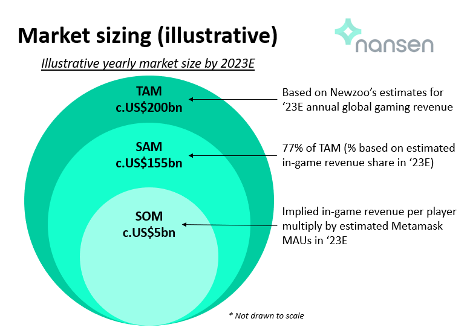
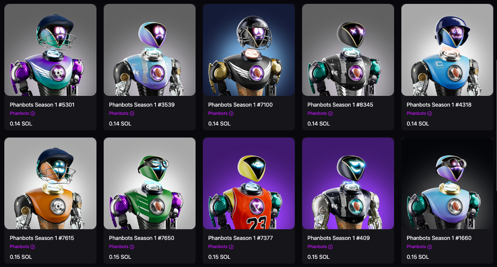
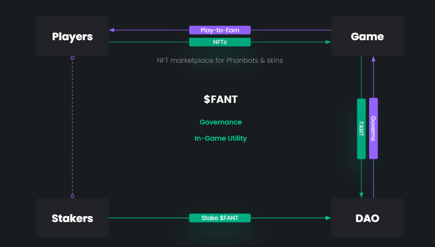

# لماذا استثمرنا في منصة الرياضات التخيّلية Phantasia؟

(هذه الأطروحة ليست نصيحة مالية)

## مقدمة

عندما أخذت لعبة Axie Infinity \"إكس إنفنيتي\" في الرواج لأول مرة في وقت
سابق من هذا العام، فوجئ عالم العملات المشفرة بالنمو السريع الذي حققته. إذ إنها أحدثت تغييرًا كبيرًا في مفهوم الألعاب والرموز غير القابلة للاستبدال. فقد كان الجميع يدرك إلى حد ما الإمكانات التي تنطوي عليها الرموز غير القابلة للاستبدال والألعاب، لكن نجاح لعبة Axie Infinity أثبت أنه من الممكن في الواقع العثور على لعبة تعمل جنبًا إلى جنب مع العملات المشفرة وتفتح مجالًا جديدًا للعملات المشفرة، يتمثل في ألعاب البلوكتشين (GameFi) واللعب من أجل الربح (P2E).

يشير مصطلح (GameFi) إلى عملية إضفاء الطابع المالي على الألعاب. إذ يتم إدخال جوانب مالية في اللعبة وإنشاء اقتصاد كامل مع إمكانية بيع الأصول داخل اللعبة أو العملات مقابل أموال حقيقية. أطلِق على هذه الآليات التي تسمح للاعبين في اللعبة بكسب المكافآت والمال عن طريق لعب الألعاب؛ اللعب من أجل الربح Play to Earn (P2E).

أعيد التركيز على العديد من أفكار مشاريع GameFi التي كان يُنظر إليها سابقًا على أنها مستحيلة أو تمّ تجاهلها نظرًا لأنها كانت في مرحلة مبكرة للغاية. عن طريق إيجاد السوق الملائمة لمنتج لعبة Axie Infinity، خاض خبراء العملات المشفرة والمستثمرون والمطورون على حد سواء عملية إعادة إنشاء لمشاريع ألعاب البلوكتشين GameFi. يمثل نجاح لعبة Axie Infinity نقلة نوعية للألعاب في مجال العملات المشفرة، فقد أطلق العنان للإمكانيات الإبداعية للعبة أحدثت تغييرًا جذريًا وتتضمن جميع المزايا التي يمكن أن يقدمها الجيل الثالث لشبكة الإنترنت web3 ليتم دمجها بسلاسة داخل اللعبة.

بلغ [حجم سوق الألعاب العالمي](https://www.fortunebusinessinsights.com/gaming-market-105730) 203.12 مليار دولار في عام 2020، ومن المتوقع أن ينمو أكثر على أساس سنوي. في الوقت الحالي، نرى عددًا كبيرًا من الألعاب في مجال العملات المشفرة التي تم تمويلها ويعمل على تطويرها بعض ألمع العقول في المجال، ونتوقع أن يستمر هذا الرقم في النمو إذ يتم توسيع نطاق دمج الألعاب مع العملات المشفرة إلى أبعد من ذلك. بالنسبة لنمو ألعاب البلوكتشين GameFi، يقدم الباحث [@0xyuffie](https://twitter.com/0xyuffie) من منصة تحليلات البلوكتشين Nansen بعض التقديرات لـ (1) إجمالي السوق المتاحة (TAM)؛ (2) السوق المتاح خدمتها (SAM)؛ و(3) السوق التي يمكن خدمتهت (SOM):

|  |
|:--:|
| المصدر: https://www.nansen.ai/research/the-compelling-case-for-nft-gaming |

تستند هذه التقديرات إلى محفظات Ethereum Metamask فقط، لذلك عندما تفكر في فرص النمو الهائلة في ألعاب البلوكتشين GameFi القائمة على سولانا، تصبح الأرقام أكثر إثارة للإعجاب.

وعلى هذا الأساس، يسعدنا في Sino Global Capital أن نعلن عن استثمارنا في Phantasia، وهي منصة للرياضات التخيّلية (Fantasy) مبنية على شبكة سولانا.

في أطروحة الاستثمار هذه، سنُطلعكم على أفكارنا بشأن الكيفية التي توسّع بها Phantasia نطاق ألعاب البلوكتشين وإنشاء منصة قصوى للرياضات التخيّلية.

لغير العارفين بهذا المجال، تعد الرياضات التخيّلية ألعابًا للتنبؤ عبر الإنترنت حيث يُنشئ المستخدم فريقًا افتراضيًا من لاعبي الرياضة الحقيقيين والمشاركة بهم في دوري/ موسم رياضي/ منافسة. يمكنك تسجيل نقاط بناءً على النتائج الحقيقية التي يحققها هؤلاء اللاعبون على أرض الواقع عبر أدائهم في المباريات الحقيقية خلال الفترة. يخلق ذلك بيئة يكون فيها الأشخاص قادرين على استخدام معرفتهم وحدسهم في رياضتهم المفضلة وإجراء تنبؤات للتحقق من صحة النتائج. يصبح عشاق الرياضات التخيّلية أكثر اهتمامًا عند مشاهدة المباريات وينتابهم شعور خاص جدًا عندما تأتي قائمتهم التخيلية على نحو ما توقعوا، وهو شعور لا يستطيع فهمه إلا من جرّبه من قبل.

عندما تقترن هذه اللعبة التي يُدمن عليها كل من يلعبها بملكية في الويب 3، فسيكون لديك لعبة ممتعة للغاية لعشاق الرياضة تكافئ المهارة والخبرة على المشاركة في شيء تحبه، تتوفر في هيئة منصة Phantasia. سنستكشف فيما يلي ميزات وآليات منصة Phantasia وما يجعلها مستوى أكثر تطورًا من الرياضات التخيلية التقليدية.

## تحليل قطاع الرياضات التخيلية

من المتوقع أن ينمو سوق الألعاب الرياضية التخيلية العالمية من 20.36 مليار دولار في عام 2020 إلى 22.31 مليار دولار في عام 2021 بمعدل نمو سنوي مركب يبلغ 9.5%، وفقًا لمنصةResearch & Markets. وأضاف تقرير منصة أبحاث السوق وخدمة البيانات أن سوق الألعاب الرياضية التخيلية سيصل إلى 38.6 مليار دولار في عام 2025 بمعدل نمو سنوي مركب نسبته 14.7%. يُعزى هذا الارتفاع بصفة أساسية إلى زيادة عدد السكان من فئة الشباب، ونمو البنية التحتية الرقمية، وتوافر الهواتف الذكية بأسعار معقولة، وزيادة شعبية اللاعبين في مختلف الألعاب الرياضية، والاستثمار المتزايد في البنية التحتية للإنترنت، وإطلاق تطبيقات الرياضات التخيلية.

المصدر:
- https://www.sportspromedia.com/news/fantasy-sports-global-market-value-2021-nfl-mlb-nba
- https://www.researchandmarkets.com/reports/5411782/fantasy-sports-global-market-report-2021-covid

## المشكلات الحالية

لفهم المشكلات التي تواجهها الشركات الرائدة في سوق الألعاب الرياضية التخيلية، يجب علينا استعراض وفهم نموذج أعمالها وعملياتها.

تواجه **الشركات الرائدة** حاليًا تكاليف معاملات مرتفعة، ناتجة عن استخدام خدمات إجراء المدفوعات التي تتقاضى عادةً رسومًا تتراوح من 0.3% إلى أكثر من 3% (رسوم ثابتة + رسوم متغيرة) استنادًا إلى نوع المعاملة التي أجريت. تعد هذه الرسوم خصمًا على الإيرادات ويتحملها المستخدمون في نهاية المطاف من خلال الرسوم المرتفعة في البطولات. وفيما يتعلق بالرسوم التي تتقاضاها هذه المنصات، نجد أنها تتراوح من 6% إلى 15% لأنواع البطولات المختلفة التي يشارك فيها المستخدمون. وتعد الرسوم البالغة 15% نسبة مرتفعة للغاية تقلل من المكاسب التي يحصل عليها أي لاعب في الفوز بالبطولة على مدى فترة طويلة من الزمن. عادة ما تكون هذه الرسوم غير شفافة وغالبًا ما تكون خفية ما لم يذهب العميل ويحسبها بنفسه.

**انعدام ولاء العملاء** -- كانت كل من DraftKings وFanduel منصتين ثوريتين للغاية، إلا أنهما واجهتا صعوبة في البروز وخلق \"ارتباط\" داخل منصتيهما. وسعيًا لتعزيز ولاء العملاء وتقليل الاضطراب، قدمتا نقود ألعاب مجانية ومسابقات حصرية، من بين عروض ترويجية وشراكات أخرى. لكنها حتى مع هذه العروض الترويجية، دائمًا ما بدا أنهما تفتقدان روح المشاركة الحقيقية.

## رؤية منصة Phantasia

تقدم Phantasia فرصة متفردة للاستحواذ على جزء من سوق الألعاب الرياضية التخيلية وتطويرها، إذ إنها تتيح مزايا الويب 3 على منصتها وتعمل على إعادة تصميم بعض المفاهيم والألعاب في مجال الرياضات التخيلية.

تحظى سوق الألعاب الرياضية التخيلية بالرواج والشعبية، إذ إن الكثير من مستخدميها هم من عشاقها الحقيقيين، وقد ثبت ذلك في نمو القطاع على الرغم من الرسوم المرتفعة المفروضة عليهم. تتمثل الرؤية في استقطاب ملايين المستخدمين إلى شبكات البلوكتشين بالاستفادة من حُب الرياضة والجاذبية التي تتسم بها الرياضات التخيلية التي يمكن لأي شخص لعبها من أجل المتعة أو لعبها من أجل الربح.

سيتم على نحو تدريجي تقديم جميع الألعاب الرياضية العامة على منصة Phantasia ويمكن لأي شخص التنافس والتمتع بإثارة الرياضة مع أصدقائه وعائلته على مستوى العالم دون أي قيود. تعتقد Phantasia أن اللامركزية والهوية الحقيقية داخل اللعبة ستحدد مستقبل الرياضات التخيلية وتتحول في نهاية المطاف إلى منظمة مستقلة لامركزية (DAO) ستنقل الرياضات التخيلية إلى المستوى التالي.

## لمزايا/ الميزات الرئيسية

تعد Phantasia مهيأة على النحو الأمثل لاستخدام ميزات الويب 3 لتنشيط وتشجيع مجتمع يتمحور حول الرياضات التخيلية اليومية بميزات رئيسية وآليات جديدة. يقلل هذا الابتكار من مواضع الشكوى في الرياضات التخيلية على شبكة الويب 2 الحالية ويعزز تجربة المجتمع وشعوره العام.

توجد العديد من المزايا الرئيسية التي يمكن استكشافها، وجميعها تعمل على توفير مجتمع من لاعبي الرياضات التخيلية اليومية ذات المشاركة المتزايدة.

## التكاليف المنخفضة للمعاملات

الميزة الأكثر وضوحًا هي استخدام سولانا كوسيلة للدفع وطبقة للمعاملات لمنصة Phantasia. وكما هو معلوم فإن سولانا هي شبكة بلوكتشين فائقة السرعة وتتمتع بقلة زمن الوصول إلى الشبكة وقوة الأداء مع الخصائص الوظيفية للعقود الذكية. ولمزيد من المعلومات حول سولانا، يمكنكم الاطلاع على أطروحتنا للاستثمار في سولانا من [هنا](https://github.com/sinoglobalcap/investment-theses/blob/main/english/solana.md). 

يمكن لسولانا حل مشكلة الرسوم الباهظة التي تتقاضاها خدمات إجراء المدفوعات، إذ إن رسوم سولانا تكاد أن تكون معدومة إذ تبلغ أقل من 0.00001 من عملة SOL لكل معاملة ما يجعلها في غاية الفاعلية لإجراء المعاملات التي يمكن التحقق منها. تستطيع Phantasia، عبر استخدام سولانا نفسها، اكتساب ميزة تنافسية هائلة مقارنة بالشركات الحالية الرائدة في السوق. إذ يمكن تحويل وفورات التكلفة هذه إلى المستخدمين، ما يؤدي إلى خفض الرسوم على منصتها. وفي وقت كتابة هذا التقرير، كانت Phantasia تعمل بشكل مباشر على الشبكة الرئيسية Mainnet ولكن ليس لديها بطولات دخول برسوم حتى الآن.

تمتلك Phantasia أيضًا اقتصاد رموز قوي للغاية مخطط له يتمحور حول رمزها FANT. ويعد استخدام الرموز لتشجيع جميع أصحاب المصلحة للتنسيق نحو اتجاه مشترك أمرًا مهمًا للغاية لنجاح المشروع.

## مسابقات اللعب من أجل الربح

لتمهيد الطريق لقاعدة المستخدمين الأولية لمنصة Phantasia، صممت المنصة مسابقات اللعب من أجل الربح.

تعد رموز FANT هي جائزة المسابقة في مسابقات Phantasia للرياضات التخيلية اليومية. ونظرًا لأن هذا نموذج للّعب من أجل الربح، فإن الانضمام إلى المسابقة مجانيّ تمامًا، ورغم ذلك فإنه يوفر لك فرصة الحصول على مكافأة. يتم تحديد كمية رموز FANT التي تُمنح للفائزين في المسابقة استنادًا على عاملين أساسيين: عدد المشاركين في المسابقة وثروة خزانة Phantasia.

## المشاركون في المسابقة

عندما يشارك عدد أكبر من المستخدمين في مسابقة، سيكون من الصعب على مستخدم واحد الفوز، ولكن مع تفاعل المزيد من المستخدمين مع البروتوكول عن طريق الدخول في مسابقة، تزداد جائزة رموز FANT المرصودة للفائزين. يشجع هذا المستخدمين على المشاركة في مسابقات أكبر ودعوة أصدقائهم لزيادة احتمالية الجوائز. باتباع النموذج نفسه، فإن أي مسابقة بأقل من 10 مستخدمين لن تدفع فيها جائزة من رموز FANT، نظرًا لعدم تفاعل عدد كافٍ من المستخدمين مع البروتوكول لتوليد جائزة للمسابقة.

## ثروة الخزانة

منذ اليوم الأول، عملت Phantasia على منح المستخدمين الفرصة لأداء دور كل من اللاعب والمستضيف - أو بعبارة أخرى - يستفيد المستخدمون عندما تزدهر Phantasia ويستمر نموها. لهذا السبب، ستكون جوائز رموز FANT الممنوحة للفائزين في المسابقة أكبر عندما يزداد المبلغ في الخزانة عن طريق تدفقات إيرادات منفصلة (الرموز غير القابلة للاستبدال، على سبيل المثال).

## تكامل الرموز غير القابلة للاستبدال وفائدتها

تستفيد Phantasia من تقنية الرموز غير القابلة للاستبدال لتوفير فائدة حقيقية لمنظومتها. إذ تتيح مجموعة الرموز غير القابلة للاستبدال Phanbots، الخاصة بمنصة Phantasia خاصية إضفاء الطابع الشخصي على الملف الشخصي وإمكانية الاطلاع على المحتوى الحصري والميزات داخل اللعبة.

|  |
|:--:|
| المصدر: https://magiceden.io/marketplace/phanbots |

على وجه التحديد، يمكن لحامل البطاقة تخصيص هوية بطاقة \" Fan Card\" الخاصة به في اللعبة للعرض على لوحات التسجيل وغرف الدردشة وغيرها، والأمر المميز بصفة خاصة هو أن هذه البطاقات توفر مكانية استخدام ميزات رائعة مثل أدوات إنشاء قوائم الذكاء الاصطناعي وأدوات التحليل ومعرفة المدونات للمساعدة في صقل مهارات المستخدم والارتقاء باستراتيجيته. يتفهم فريق Phantasia أيضًا مدى أهمية الألعاب الاجتماعية للرياضات التخيلية ويتيح للمستخدمين الذين يحملون مجموعة الرموز غير القابلة للاستبدال Phanbots بإمكانية استخدام إحدى مجموعات منصة التواصل الاجتماعي discord المغلقة حيث يمكنهم الحصول على معلومات حصرية من خبراء الرياضة التخيلية.

## الإنجازات

لحسن الحظ بالنسبة للمستخدمين الجدد في الرياضات التخيلية، فإن الفوز بالمسابقات ليس هو السبيل الوحيد للحصول على رموز FANT في محفظتهم. تقدم Phantasia أيضًا مكافآت من رموز FANT لإنجازات أو مهام صغيرة من أجل مساعدة اللاعبين الجدد على التعرف على رمز FANT وتنويع سبل توزيع الرمز. قد تكون الأمثلة البسيطة على ذلك هي تلقي مبلغ صغير من رمز FANT لصياغة فريقك الأول أو إنشاء مسابقة خاصة وحشد المستخدمين إليها.

أثبتت مسارات الإنجاز أنها حوافز مهمة للمستخدمين لإكمال أهداف معينة وتعلم اللعبة. سيساعد هذا في خلق الارتباط وإشراك المستخدمين بطريقة ممتعة. بمرور الوقت، يمكن للمستخدمين تجميع رموز FANT والمشاركة في بطولات أكبر ليضعوا أنفسهم في مواجهة أفضل اللاعبين ويشعرون بالدافع إلى الفوز بالإنجازات التي يتوق الجميع إلى عرضها على ملفهم الشخصي.

## تخزين رمزFANT (خطط مستقبلية)

بناءً على اللامركزية التدرّجية الكافية للمنصة، تعتزم Phantasia تقديم تخزين رموز FANT كوسيلة لمكافأة أعضاء المجتمع على حجز رموزهم FANT بخطط طويلة الأجل مع تحديد التفاصيل الدقيقة.

نموذج رفيع المستوى للخصائص الوظيفية الأساسية وحالات الاستخدام لرمزFANT:

يمكن للمستخدمين المشاركة في مسابقات تخيّلية، وكسب رموز FANT على النجاح الذي يحققونه، ومشاركة مكاسبهم من رموز FANT والحصول على مكافآت مع نمو الخزانة.

## الرموز غير القابلة للاستبدال والأندية

تدرس Phantasia أيضًا دمج الرموز غير القابلة للاستبدال والأندية داخل منصتها وبناء ميزات مجتمع للمساعدة في توسيع نطاق وسلامة قاعدة مستخدميها. يتيح ذلك الكثير من مساحات التصميم وقد أبقى الفريق هذا الأمر طي الكتمان في الوقت الحالي، ولكنه سيكشف عنه في الوقت المناسب. نحن متحمسون بصفة خاصة لرؤية المنصة تستكتشف مجال الرموز غير القابلة للاستبدال بقدر أكبر ونعتقد أن بناء مجتمع أكبر عن طريق الأندية سيساعد في تسريع نمو منصة Phantasia. من الطبيعي أن يؤدي إنشاء الأندية والمشاركة فيها إلى الشعور بالاندماج وسيساعد في نمو Phantasia عن طريق الترويج الشخصي وتناقل الكلام بشأنها.

## المخاطر

المخاطر التنظيمية - تفرض [العديد من الدول](https://velawoodlaw.com/tracker/fantasy-sports-legislation-tracker/) متطلبات التسجيل والترخيص على شركات الرياضات التخيّلية، وهي رسوم ليس بالضرورة أنها باهظة التكلفة ولكنها مرهقة إداريًا للتعامل مع المشروع. من الآن فصاعدًا، قد تواجه Phantasia بعض المشكلات التنظيمية في المستقبل لأنها توسع أعمالها وتوسع قاعدة مستخدميها في بلدان مختلفة.

## الفريق

يشكل كل من دانيال، وبن، وجيك، وساشين الفريق الأساسي لمنصة Phantasia. ويعد جميع الأعضاء الأساسيين في فريق Phantasia مستخدمين متعطشين لمنصات الألعاب الرياضية التخيلية وقد أمضوا الكثير من الوقت في اللعب وفهم كيفية عملها. ليس من المستغرب أنهم عندما اتخذوا القرار بشأن ما يجب إنشاؤه في مجال العملات المشفرة، كان أول ما فكروا في إنشائه هو منصة أفضل للرياضات التخيلية سعت بكل مثابرة إلى حل أوجه القصور ومواضع الشكوى التي يعاني منها المستخدم ودمجت عناصر الويب 3 لإنشاء تجربة مستخدم أفضل بكثير.

عمل دانيال مستشارًا إداريًا وكان يركز على تحقيق تأثير إيجابي عن طريق مشاريع التحول الرقمي، وكانت خبراته في إدارة المنتجات بمثابة ركيزة لتنظيم الفريق وأداء دور ريادي في إنجاز كل شيء في الوقت المحدد.

بن هو مهندس خبير عمل في عدة مشاريع إلى جانب دانيال ويقود فريق التكنولوجيا.

فيما عمل جيك سابقًا محللًا في شركة استشارية ودرس هندسة البرمجيات. وهو حاليًا مدير التصميم الذي يعمل على ميزات الواجهة الأمامية.

يعمل ساشين قائدًا لتقنية البلوكتشين وكان يعمل سابقًا مطوّر خلفي في سوق التجارة الإلكترونية في الهند. وقد اختار سابقًا لغة البرمجة Rust وبدأ العمل في مشاريع سولانا قبل أن يجد دوره الوظيفي في Phantasia.

الفريق موهوب للغاية في جانب التطوير التكنولوجي وتكمّل مهاراتهم بعضها البعض لاختبار الأفكار والميزات بسرعة وتطبيقها، مع الاستمرار في توسيع نطاق الفريق للمساعدة في تطوير Phantasia.

## خاتمة

نعتقد أن Phantasia ستحقق تجربة جديدة تمامًا وتبتكر نماذج الأعمال الحالية عن طريق استخدام المدفوعات الرخيصة وعمليات التكامل مع الويب 3. بينما تبني Phantasia مجموعة منتجاتها ومنظومتها، فإنها ستحل المشكلات الرئيسية في قطاع الألعاب الرياضية التخيلية. نتطلع إلى نمو Phantasia ودعم المشروع والمجتمع في المستقبل.

**إخلاء المسؤولية:** *هذا المحتوى للأغراض الإعلامية فقط، ولا يجب تفسير أي من هذه المعلومات أو المواد الأخرى على أنها مشورة قانونية أو ضريبية أو استثمارية أو مالية أو غيرها. لا شيء ممّا وردَ في هذه الأطروحة يشكل التماسًا أو توصية أو عرضًا من قبل Sino أو أي مزوّد خدمة تابع لجهة خارجية لشراء أو بيع أي أوراق مالية أو أدوات مالية أخرى في أي دولة يكون فيها هذا الالتماس أو العرض غير قانوني بموجب قوانين الأوراق المالية لهذه الدولة.*
