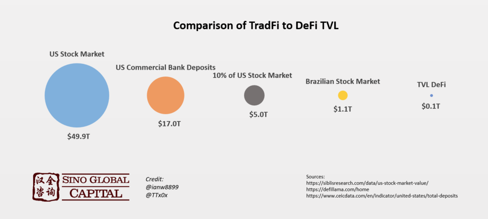
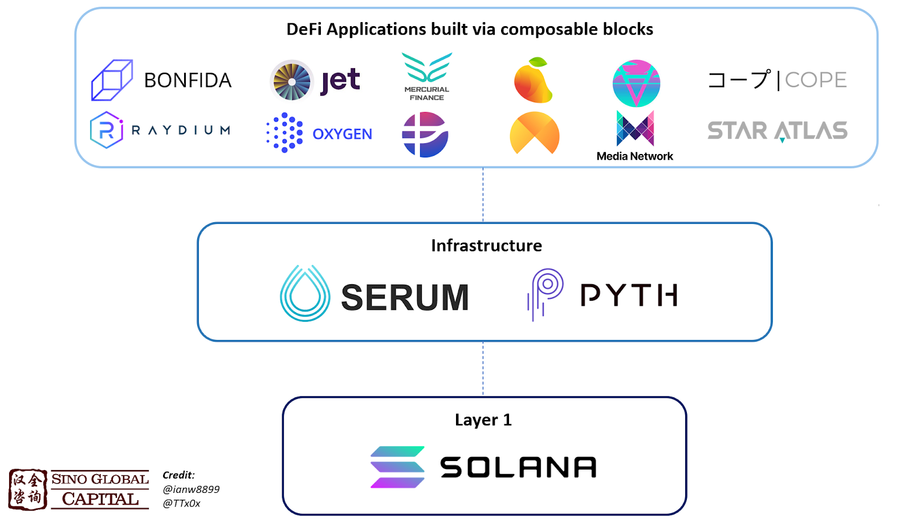
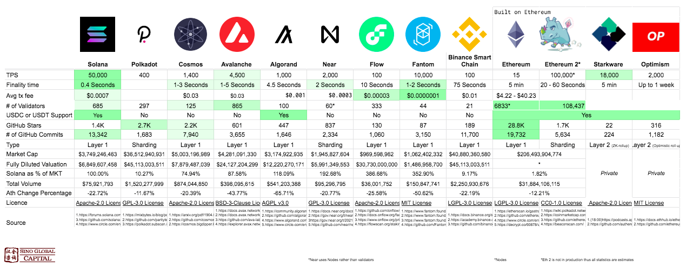
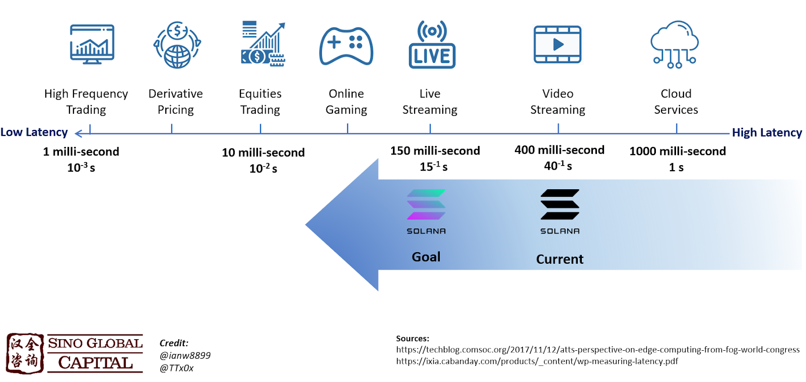
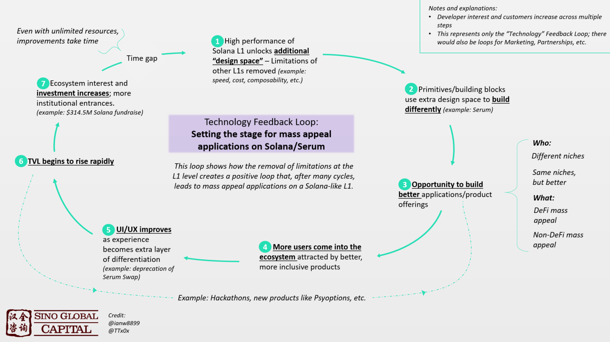
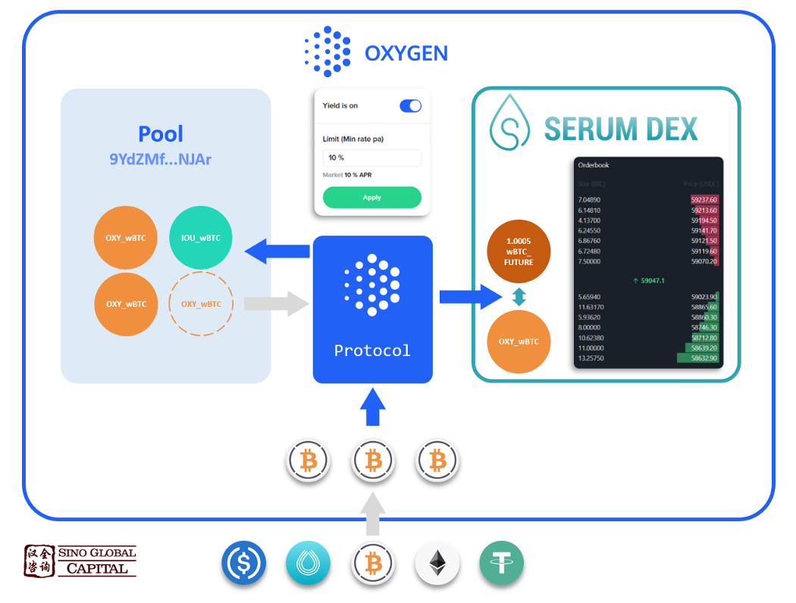
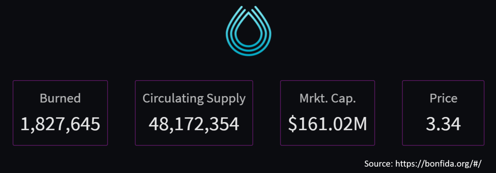
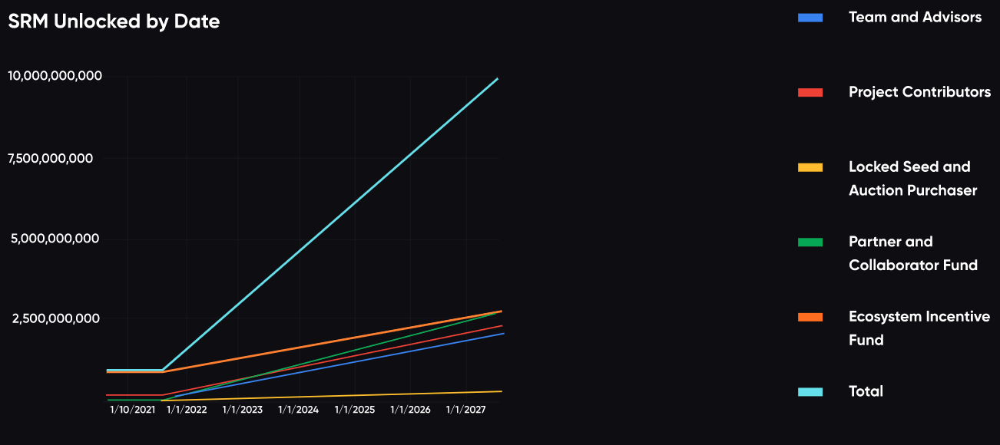
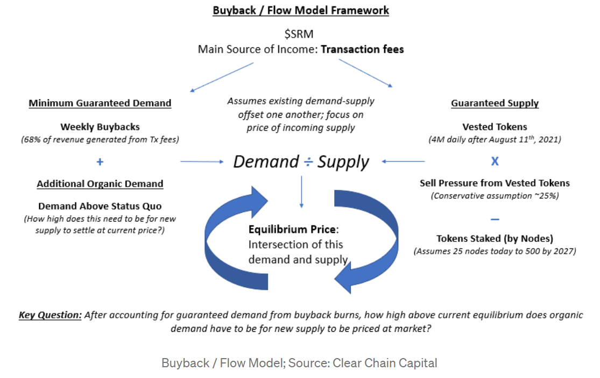

# لماذا استثمرنا في منصة Project Serum؟

(هذه الأطروحة ليست نصيحة مالية)

## الرؤية: مليار مستخدم لشبكات البلوكتشين

لتوضيح أطروحتنا بشأن منصة Serum على نحو صحيح، يجب علينا أولاً تحديد إطار حول كيفية تطور رؤية منتجات \"جذب الاهتمام الشامل\" التي تدعمها تقنية البلوكتشين.

في دورة السوق الصاعدة السابقة لعامَي 2017 و2018، تمحورَ التركيز على إثبات أن العديد من الأشياء يمكن فعلها على تقنية البلوكتشين. ليس بالضرورة فعلها على نحو جيد، أو سريع، أو على نطاق واسع، فقط أنه يمكن فعلها.

في السنتين الانتقاليتين لعامي 2018 و2019 (وبعض السنوات السابقة أيضًا)، وسّعت الفِرق المجتهدة نطاق هذه الرؤية، إذ عملت على حل المشكلات المتعلقة بقابلية الربط وتوسيع النطاق والذي من شأنه أن يسمح ببناء مشاريع معقدة على نحو متزايد عن طريق تجميع الركائز الأساسية المختلفة والقابلة للربط معًا.

في عام 2020، وضعت فِرق سام بانكمان فرايد وSerum وسولانا رؤية بشأن المستوى الذي يمكن أن يبلغه هذا القطاع وحفزونا جميعًا على التفكير على نحو أكثر تطلعًا. تحدد رؤيتهم \"مرحلة نهائية\" يمكن فيها الاستفادة من تقنية البلوكتشين ذات الأداء الفائق والقابلية للتوسع (سولانا)، إلى جانب العناصر الأولية المتمايزة بشكل واضح، لتوفير المنتجات إلى أعداد كبيرة من المستخدمين. ليس منتجات التمويل اللامركزي فحسب، بل المنتجات التي تشمل المدفوعات، والشبكات الاجتماعية، والوسائط، غيرها، **لم نعد نستهدف مليون مستخدم فقط، فقد وُسّع نطاق هذه الرؤية إلى مليار مستخدم وقيمة على السلسلة تبلغ 10 تريليونات دولار**.

يعد إجمالي القيمة المقفلة في التمويل اللامركزي TVL صغيرًا مقارنة بالأسواق التقليدية، ولكنه آخذ في الازدياد. إلا أنّ رؤية كل من Serum وسولانا تمتد لتشمل المدفوعات ووسائل التواصل الاجتماعي وتطبيقات "جذب الاهتمام الشامل" الأخرى أيضًا.

## منصة Project Serum

لدعم الرؤية المتمثلة في أن يبلغ عدد المستخدمين مليار شخص على السلسلة، يجب أن تكون \"العناصر الرئيسية\" أو الركائز الأساسية القوية متوفرة. تشمل هذه العناصر الأولية المستودعات الثابتة للقِيم (العملات المستقرة)، وبروتوكولات الاقتراض/ الإقراض، وشبكات أوراكل، ومجمّعات الأصول، وغيرها. تعد منصات التداول اللامركزي أيضًا من العناصر الرئيسية التي تصدّت لها المشاريع من نوع صناع السوق الآليين على شبكة إيثريوم وبروتوكولات الطبقة الأولى الأخرى.

أدى تطوير سولانا بوصفها شبكة بلوكتشين فائقة الأداء إلى فتح آفاق جديدة لم تكن متاحة من قبل. إذ أدت زيادة عدد المعاملات في الثانية (TPS) من 10 معاملات إلى أكثر من 50 ألف وتقليل أوقات إنشاء الكتلفة إلى 400 مِلّي ثانية إلى إيجاد أنواع جديدة من البنية التحتية على السلسلة. من الجدير بالذكر، لإعطاء فكرة عن حجم المعاملات في الثانية المطلوب في الطبقة الأولى، تتطلب معظم التطبيقات والشركات الكبرى ما بين 100 ألف إلى 10 ملايين معاملة في الثانية لدعم الاستخدام الشامل لتطبيقاتها/ خدماتها. وتضعنا شبكة سولانا على بُعد خطوة واحدة من سدّ هذه الفجوة.

تُعد منصة Serum بالضبط هذا النوع الجديد من البنية التحتية التي أفسحت لها المجال سولانا، ويمكن أن تكون بمثابة عنصر رئيسي لعدة قطاعات تبلغ من القيمة أكثر من تريليون دولار. تشكل Serum منصة تجريبية لاستجلاب تجربة التداول المركزي الكاملة، ذات سجل الطلبات الكامل، والتسوية والتداول السريعين، وتكاليف المعاملات المنخفضة، إلى عالم لامركزي، على نطاق واسع.

في الأقسام التالية، سنسلط الضوء على المزايا الرئيسية التي تتمتع بها منصة Serum، والتي يرتبط الكثير منها بمساحة التصميم التي أطلقتها سولانا، بالإضافة إلى أوجه القصور المحتملة.

### المزايا الرئيسية: يسمح تصميم سجل الطلبات بزيادة كفاءة رأس المال

في الوقت الحالي، تأتي غالبية السيولة المقدمة لمنصات التداول اللامركزي في شكل كيان صانع السوق الآلي (AMM). إلا أنه في معظم الأسواق التقليدية وفي منصات التداول المركزي للعملات المشفرة، يتم توفير السيولة عبر سجل طلبات مركزي يشار إليه غالبًا باسم "السجل المستمر". تعد سجلات الطلبات، مقارنة بصناع السوق الآليين، أكثر كفاءة في التصميم ويمكن أن تسمح بصفقات أكبر مع
مخاطر أقل للفروق بين سعرَي الطلب والتنفيذ.

\*\* صناع السوق الآليون/ منصة التداول اللامركزي Uniswap - تُعد منصةUniswap المثال الأكثر شهرة على صانع السوق اللامركزي. إذ إنّ موفري السيولة على Uniswap لا \"يُعربون عن رأيهم\" في السعر، بل يوفرون السيولة بسعر السوق (أي السيولة لكلا جانبي زوج التداول). ويؤدي هذا إلى مشكلات بشأن الخسارة المؤقتة وعدم كفاءة رأس المال.

لكن، كما رأينا، فإن منصة Uniswap تعمل على نحو جيد (وتتحسّن مع نسخة منصتها المنقّحة V3) وتُجري ما متوسطه نحو 1 مليار دولار من حجم التداول يوميًا. تتمتع هياكل Uniswap وصانع السوق الآلي بمكانة في مستقبل العملات المشفرة، لكننا نرى قيمتها طويلة الأجل على أنها تساعد المشاريع في المرحلة المبكرة في توفير السيولة أو تسهيل عمليات تداول العملات المستقرة. ولتحقيق النمو إلى 1 مليار مستخدم على السلسلة، نحتاج إلى بنية مجرّبة ومختبرة يمكنها توفير سيولة فعالة بهذا الحجم بشكل موثوق - سجلات الطلبات.

|  |
|:--:|
| كان حجم التداول اليومي بمنصات التداول اللامركزي مؤخرًا أقل من 3 مليار دولار، مقابل أعلى مستوى لمنصات التداول المركزي في نطاق 200 مليار دولار، و558 مليار دولار لحجم التدوال بسوق الأسهم الأميركية. المصدر: https://duneanalytics.com/queries/4388/8550 |

### سجلات الطلبات/ منصة *Serum*

- بلغ حجم التداول بسوق الأسهم الأميركية (المتوسط ​​المتحرك لمدة 10 أيام)، المدعوم بصفة أساسية بسجلات الطلبات، نحو 558 مليار دولار مقارنة بمتوسط ​​حجم التداول اليومي الذي يقل عن 3 مليار دولار لمنصات التداول اللامركزي (غالبًا عن طريق هياكل تشبه صناع السوق الآليين). وللقيام بالقفزة لدعم تحقيق مستويات مماثلة من حجم التداول الشبيه بالتمويل التقليدي، ثمّة حاجة إلى بنية تحتية جديدة تتيح سيولة ديناميكية ومركزة وقابلة للتعديل على نحو آني لإطلاق العنان للكفاءة والموثوقية والدقة اللازمة.

تجعل سجلات الطلبات أوجه التطوير هذه ممكنة للأسباب التالية:

- بدلاً من سيولة صانع السوق الآلي \"الخاملة\"، تكون سيولة سجل الطلبات \"نشطة\" لأن الطلبات تمثل رغبة في التنفيذ بسعر معين.
- تستقطب الطبيعة \"النشطة\" لسجل الطلبات مجموعة أكبر من المستخدمين (مثل صناع السوق).
- استحداث طلبات محدودة في سجل الطلبات يزيل احتمالات \"الخسارة المؤقتة\" التي تعد نتيجة للتداول على جانبي السوق بشكل سلبي.
- يؤدي التحول من صانع سوق آلي إلى سجل الطلبات إلى سوق تتمتع بسيولة أعمق وقدرة على التعامل مع صفقات أكبر مع تقليل الفرق بين سعري الطلب والتنفيذ، وتسمح للمشاركين بالتحكم الفعال في المراكز عن طريق التحوط.

كان صناع السوق الآليون أفضل وسيلة لتوفير السيولة التي يمكن دعمها في ظل القيود الحالية على الطبقات الأولى المستخدمة على نطاق واسع. إذ تتيح الآن سولانا ومساحة التصميم الجديدة التي أنشأتها عن طريق أدائها الفائق، لسجلات الطلبات ذات الحدود المركزية العمل بوصفها عنصرًا أساسيًأ يمكن أن يساعد في تحرير السيولة اللازمة لاستيعاب حجم المعاملات التي نراها في الأسواق التقليدية.

### المزايا الرئيسية: تسمح قابلية للربط للبروتوكولات بالبدء في البناء ببنية تحتية مالية كاملة

القابلية للربط هي مبدأ من مبادئ تصميم النظام يشير إلى قدرة الأنظمة المختلفة على العمل معًا والتجميع في مجموعات متعددة ومختلفة. في منظومة التمويل اللامركزي/ تقنية البلوكتشين، يعني هذا أن أي تطبيق معين مبنيّ على البلوكتشين يمكن أن يتكامل مع أي تطبيق آخر في تلك السلسلة كما لو كان الاثنان مرتبطين أصلاً.

قارِن هذا مع صوامع البيانات والبنية التحتية لتكنولوجيا المعلومات القديمة في التمويل التقليدي التي جعلت من الصعب التواصل بين الأنظمة في الشركات الأخرى وأحيانًا داخل الشركة نفسها. أدى الافتقار إلى القابلية للربط بين أنظمة التمويل التقليدي إلى إنشاء سوق رائجة لاستشارات \"إدارة التغيير\" الخاصة بتحقيق التكامل بين الأنظمة التقليدية المفككة بين الشركات المشاركة في سيناريوهات عمليات الاندماج والاستحواذ.

لا يُهدر الوقت في تكرار ما تمّ بناؤه بالفعل. يمكن للمؤسسين التركيز على ابتكار وتطوير تطبيقاتهم المحددة.

منصة Serum تعد ركيزة أساسية تستفيد من الطبقة الأولى على شبكة سولانا، وتعمل على تشغيل العديد من التطبيقات التي يتم إنشاؤها باستخدام سجل طلبات الحد المركزي على السلسلة CLOB لمنصة Serum.

في هذا الصدد، تعد Serum طبقة البنية التحتية الأساسية المهمة للغاية، التي تمكّن التطبيقات الأخرى من بدء تطويرها عن طريق الاستفادة من بنية Serum الحالية. على سبيل المثال، يتكامل صانع السوق الآلي Raydium مباشرةً مع سجل طلبات الحد المركزي على السلسلة لمنصة Serum لإنشاء نموذج تداول جديد تمامًا مع توفير السيولة على غرار صانع السوق الآلي إلى جانب السيولة العميقة وقلة فرق السعر على غرار سجل طلبات الحد المركزي على السلسل. ويمكن لسوق المال استخدام منصة Serum بوصفها نظام للمطابقة بين المقترضين والمقرضين، وزيادة الاستفادة منه عبر سجل طلبات Serum. ولن تكون هذه الحلول \"الأفضل من كلا المجالين\" ممكنة بدون ميزة القابلية للربط التي توفرها منصة Serum.

علاوة على ذلك، فإن نهج سولانا أحادي السلسلة يعني أن منصة Serum لا تواجه أي تعقيدات محتملة تتعلق بالقابلية للربط من جانب شبكات البلوكتشين متعددة الطبقات أو متعددة الأجزاء. إذ لا يوجد تعقيد غير ضروري أو شوك فيما يتعلق بأوقات إنشاء الكتلة أو الاتصال أو السيولة بين الطبقات/ الأجزاء. فضلًا عن ذلك، مقارنة بنهج الأجزاء/ الطبقات المتعددة، تسمح الطبقة الواحدة بزيادة كفاءة رأس المال، وذلك لأن رأس المال الفائض ليس ضروريًا لتأمين أجزاء/ طبقات متعددة أو لضمان السيولة بين الأجزاء/ الطبقات. توجد منصة Serum على طبقة واحدة توفر الثقة للمطورين، وتضمن تعظيم كفاءة رأس المال.

بالنظر إلى المستقبل، يمكننا تخيّل التطبيقات المبنية على منصة Serum والتي لن تتمكن الكيانات المركزية المنعزلة من تحقيقها.

تخيّل عالمًا يمكن فيه الحصول على جميع احتياجاتك المالية وتحقيقها مباشرة تحت سقف واحد؛ كل حساب ادخار، استثمار، رهن عقاري، فاتورة مرافق، تأمين، قرض شخصي، بطاقة ائتمان، إلخ. الآن وسّع نطاق هذه الرؤية لتشمل كل جانب من جوانب حياتك، فضلًا عن الخدمات المالية لاحتياجاتك اليومية، فكّر في المستندات والموسيقى والبيانات وكلمات المرور والمدونات الصوتية والصور مقاطع الفيديو. تخيّل أنّ جميع هذه التطبيقات والخدمات تتكامل بسلاسة فوق بعضها البعض، على نحو مشفر ولا مركزي تمامًا. تتمثل أقصى حالة من التفاؤل هنا في أن البنية التحتية لمنصة Serum يمكن أن تلعب دورًا في كل مجال من هذه المجالات وستفعل ذلك.

تفتح ميزة قابلية الربط بمنصة Serum المجال لعالم من الفرص، ما يوسّع بشكل فعال نطاق الفرص لجميع جوانب التمويل وغيرها. يسمح هذا للبروتوكولات بالتركيز على تخصيص عروضها للسوق المتخصصة وإنشاء أفضل منتج ممكن، بينما تتكفل منصة Serum بالأعمال الشاقة في الخلفية.

### المزايا الرئيسية: أداء سولانا

توفر شبكة البلوكتشين سولانا البنية التحتية اللازمة لدعم منصة Serum
وإفساح المجال لمزاياها الرئيسية. تتمتع سولانا بما يلي: قابلية التوسع (50
ألف معاملة في الثانية/ إصدار الصيغة النهائية في جزء من الثانية)،
والتكاليف المنخفضة (متوسط ​​رسوم المعاملات هو 0.0007 دولار)، والقابلية
للربط (أداء عالٍ بدون بروتوكولات الطبقة الثانية/ التجزئة)، وأفضل الشركاء
في المنظومة، واللامركزية والأمان.

|  |
|:--:|
| أداء شبكة سولانا الفائق يجعلها طبقة أولى طبيعية لدعم تطبيقات الاستخدام الشامل |

اقرأ أطروحة الاستثمار الكاملة حول Solana هنا:
<https://sinoglobalcap.medium.com/why-we-are-bullish-on-solana-c2be784cfdf>.

## أوجه القصور الرئيسية

**المنصة في مرحلة مبكرة** -- أختُبرت منظومة سولانا/ Serum عمليًا، لكنها لا
تزال في أيامها الأولى. لا تزال سولانا، على سبيل المثال، تعمل في نظام
\"Mainnet Beta\" التجريبي بينما تعمل على تحقيق أقصى قدر من الاستقرار.
وفي بعض الأحيان يتم العثور على أوجُه خلل وإصلاحها على الفور
(<https://medium.com/solana-labs/mainnet-beta-stall-postmortem-ba0c6064e3>)،
ما يجعل المنتج أقوى وأكثر مرونة في المستقبل. لا تزال منصة Serum تحرز
تقدمًا في خارطة طريقها لتعزيز الخصائص الوظيفية وتحسين الكفاءة.

**ميزة القابلية للربط غير متوافقة مع جهاز إيثريوم الافتراضي** - نظرًا لأن سولانا غير متوافقة مع جهاز إيثريوم الافتراضي EVM، لا يمكن للمطورين ببساطة نقل شفرة بلغة Solidity الحالية الخاص بهم، بل يجب عليهم إعادة كتابة عقودهم الذكية بلغة Rust. حاليًا، يعد النقص في مطوري لغة Rust ذوي الخبرة في العملات المشفرة عائقًا رئيسيًا أمام منظومة بروتوكولات جهاز إيثريوم الافتراضي الأصلية التي تنتقل إلى سولانا. لكن، بشكل عام، يوجد عدد أكبر من مبرمجي لغة Rust في العالم أكثر من مبرمجي لغة Solidity على جهاز إيثريوم الافتراضي الذين يوفرون مجموعة مواهب للمدى الطويل أكبر مع انضمام المزيد من المبرمجين إلى مجال العملات المشفرة.

بالإضافة إلى ذلك، توفر لغة Rust للمطورين مزيجًا ناجحًا من القوة وبيئة العمل، ما يؤدي عادةً إلى سرعات أعلى وأمان للذاكرة، واستخدام أقل للموارد وغيرها. علاوة على ذلك، يضطر المطورون الذين ينتقلون من جهاز إيثريوم الافتراضي إلى لغة Rust إلى تبنّي المبادئ الأولية في التفكير في إعادة تعريف وإعادة هندسة العقود، ما قد يؤدي إلى مزيد من التحسينات.

في حين أن حاجز لغة Rust قد يقيد النمو على المدى القصير، فإننا نعتقد على المدى الطويل أن لغة Rust ستكون سمة جذابة مميزة لمنظومة سولانا.

**السرعة** - تعد منصة Serum حاليًا واحدًا من أسرع منصات التداول اللامركزي بسرعات للمعاملة تبلغ 400 مِلي ثانية، مع خطط مستقبلية لخفض هذا الرقم إلى أكثر من النصف إلى 150 ملي ثانية في السنوات المقبلة مع التحسين الذي يطرأ على شبكة سولانا. وبالنسبة إلى شبكة بلوكتشين عامة لامركزية، تعد هذه السرعة هائلة. إلا أنها، مقارنة بنظيراتها المركزية في مجال التمويل التقليدي في تطبيقات مثل التداول عالي التردد، فإن منظومة Serum/ سولانا أبطأ نظرًا للقيود المادية الناتجة عن أنها شبكة من العُقد موزعة عالميًا. وعلى هذا الأساس، ستبقى بعض تطبيقات التمويل التقليدي مركزية بينما تخدم منظومة Serum/ سولانا قاعدة مستخدمين كبيرة تجتذبها مقاييس اللامركزية والذين لا يحتاجون إلى المستوى الأعلى من السرعة.

عند قياسها بمدى السرعة فحسب، فإنّ لدى منصة Serum زمن وصول مرتفع جدًا إلى الشبكة لدعم بعض حالات الاستخدام المؤسسي للتمويل التقليدي. لكنها تعد مثالية للتطبيقات التي تتطلب سرعة أقل أو تلك التي تعمل على نحو أفضل مع تسوية فورية تقريبًا. فضلًا عن ذلك، من المهم الإشارة إلى أنه حتى بعض تداول الأسهم والمشتقات (على سبيل المثال، منصات على شاكلة Robinhood) ليست حساسة جدًا لزمن الوصول إلى الشبكة.

## خارطة الطريق

منصة Serum حاليًا في المرحلة الثالثة من خارطة الطريق. تركز المرحلة الثالثة على دفع عجلة منظومة Serum مع إضافة البنية التحتية الضرورية لتوسيع نطاق السوق الذي يمكن الوصول إليه، مثل المزيد من الجسور فيما بين شبكات البلوكتشين. ويمكن الاطلاع على مزيد من المعلومات على هذا الرابط: https://projectserum.com/#/roadmap.

## الحوكمة والفريق

تُعد الحوكمة جزءًا أساسيًا من منظومة Serum، والتي تعتمد نموذجًا للحوكمة قائمًا على التخزين للسماح لمخزّني رمز SRM بالحصول على صوت رئيسي في تحديد اتجاه مستقبل منصة Serum.

يتم تنظيم مخزّني رمز SRM حول العُقد، وهذه العُقد بدورها لها حقوق التصويت على الرسوم والأسواق الجديدة واستخدام الإيرادات والشراء/ الحرق ومِنح المنظومة. يتطلب التصويت أكثر من 60% من إجمالي تصويت برموز SRM في العالم لصالح تمرير القرار (يمكن تعديل هذا المعيار عن طريق اقتراح، ضمن حدود محددة).

في الآونة الأخيرة، أطلقت منصة Serum أيضًا برنامج التصويت على الحوكمة، وهو برنامج قابل للترقية يحكمه نظام التواقيع المتعددة يمكنه ترقية نفسه. هذه هي الخطوة الأولى في جعل حوكمة Serum ذات طابع لامركزي بدرجة أكبر وأكثر شفافية وأمانًا. يمكن الاطلاع على مزيد من المعلومات على هذا الرابط: https://github.com/project-serum/multisig.

|  |
|:--:|
| قائمة عُقد منصة *Serum*. المصدر: https://twitter.com/ProjectSerum/status/1312176559185301504 |

## تطوير المنظومة

يتيح الأداء الفائق لشبكة البلوكتشين سولانا "مساحة تصميم" إضافية تسمح ببناء عناصر أساسية أفضل، مثل منصة Serum. يبدأ هذا الأداء حلقة تفاعل وردود أفعال إيجابية يمكن أن تؤدي إلى تجمعي تطبيقات جذب الاستخدام الجماعي حول منظومة /Serum سولانا.

عندما استثمرنا في البداية في منصة Serum في منتصف عام 2020، كنا نؤمن بالرؤية وأنّ /Serum سولانا هي الركيزة الأساسية لمنظومة فاعلة ونشطة. وبعد نحو 10 أشهر، فإننا نرى، على وجه اليقين، أن هذه المنظومة تتحرك في الاتجاه الصحيح.

لقد أثبتت منظومة /Serum سولانا، بكل المقاييس، أنها سليمة ومتنامية وجاذبة لمجموعات جديدة من المستخدمين. وتتضمن بعض الأمثلة على ذلك ما يلي:

• حتى 1 يوليو/ تموز، حققت منصة Serum ما قيمته 5.14 مليار دولار في حجم التداول التراكمي مع حرق أسبوعي قدره 66.5 ألف دولار لرموز SRM.

• أكملت مؤسسة سولانا Solana Foundation جمع تمويل قدره 314 مليون دولار شملت شركتي Andreessen Horowitz و Jump Trading بالإضافة إلى شركة Sino Global Capital. (<https://solana.com/news/solana-labs-completes-a-314-15m-private-token-sale-led-by-andreessen-horowitz-and-polychain-capital/>)

• أختُتمت فعالية Solana Hackathon، وخرجت بالعديد من المشاريع التي تتكامل مع منصة Serum، وبمشاركة "أكثر من 13 ألف منشئ ومصمم ومسوق ومشغّل..." (<https://twitter.com/solana/status/1403512084495806468>)
• أكثر من 25 تفرّع من التفرّعات الكبيرة لمنصات التداول اللامركزي من منصة Serum، العديد منها تتمتع بقدر كبير من الطابع المخصص:
<https://serum-academy.com/en/dex-list/>.
• جسر فيما بين شبكات البلوكتشين؛ شبكة البلوكتشين Wormhole
(<https://twitter.com/solana/status/1357539833980153859>)
• يجري إطلاق (أو اكتمل إطلاق) عناصر أساسية رئيسية وبنية تحتية محاذية على
شبكة سولانا.

|  |
|:--:|
| في فترة زمنية قصيرة، تنامت منظومة/Serum سولانا؛ وبينما لا تتفاعل جميع المشاريع المدرجة بشكل مباشر مع منصة Serum، فإن معظمها يتفاعل معها. المصدر: https://twitter.com/solanians_/status/1402843464841064451 |

ننصح أيضًا بالاطلاع على الرابط: <https://pentacle.ai/solana> للحصول على تصوّر وصفي رائع عن منظومة سولانا.

## المنظومة - بناء المشاريع والربط بينها باستخدام منصة Serum

في ما يلي نستكشف بعض المشاريع التي دُمِجت أو تمّ البناء عليها لإنشاء تجربة فريدة ومنتج مميز لم يكن من الممكن تحقيقهما في السابق:

تعد منصة [Bonfida](https://bonfida.org/) مثالًا مباشرًا ونموذجيًا لتكامل منصة Serum. تصف Bonfida نفسها بأنها واجهة مستخدم رسومية رئيسية علىSerum \"، وذلك لسبب وجيه. فعلاوة على تقديم واجهة مستخدم رسومية مبسطة للغاية لمنصة تداول لامركزي للتداول من خلال Serum، تتميز لوحة معلومات Bonfida أيضًا بميزات تكميلية قوية لتجربة تداول ثرية تشمل: أنواع طلبات متطورة على السلسلة، وأسواق وقوائم حصرية، وأنماط تداول مختلفة للمستخدمين ذوي المهارات المختلفة. كما طورت Bonfida أيضًا روبوتات Bonfida Bots للسماح للمستخدمين بأتمتة استراتيجيات التداول على منصة Serum، بما فيها استراتيجيات TradingView وتداول النسخ.

توجد [العديد](https://docs.projectserum.com/serum-ecosystem/built-on-serum) من واجهات المستخدم الرسومية لمنصات التداول اللامركزي على منصةSerum بعروض ميزات إضافية متنوعة وخبرات تداول مخصصة. يتم تحفيز مضيفي واجهة المستخدم الرسومية عن طريق إتاحة الفرصة لكسب جزء من رسوم منصة التداول اللامركزي الناتجة. وفي المقابل، تستفيد منصة Serum من القنوات المختلفة للسيولة الجديدة.

اقرأ أطروحتنا بشأن الاستثمار في منصة Bonfida هنا: https://sinoglobalcap.medium.com/why-we-invested-in-bonfida-49216b5a0425.

تسعى [Mango Markets](https://mango.markets/) إلى إنشاء منصة تداول لامركزي صديقة للمتداولين وصانعي السوق، بدءًا من التداول بالهامش على السلسلة (على سجلات الطلبات ذات الحد المركزي من Serum) بالإضافة إلى العقود الآجلة الدائمة.

تقدم منصة Mango Markets في البداية رافعة مالية فيما بين هوامش الحسابات تصل إلى 5 أضعاف لصانعي السوق والمقترضين على منصة Serum. يمكن للمتداولين على منصة Mango التوفير في رسوم التداول اللامركزي علىSerum حيث يحدد هيكل طبقة Serum معدلات الرسوم بناءً على رموز SRM التي يحتفظ بها المتداول.

تمثل الألعاب سوقًا غير مستغلة على نطاق واسع بوجود مجتمع ضخم من اللاعبين الذين لم يختبروا بعد قوة اللامركزية. سيكون اللاعبون المتحمسون على دراية بالقواعد واللوائح الصارمة المتعلقة بشراء وبيع العناصر داخل اللعبة مقابل النقود الورقية.

غالبًا ما يلجأ هؤلاء اللاعبون إلى إجراء المعاملات في أسواق الطرف الثالث، دون معرفة ما إذا كانوا سيحصلون بالفعل على العنصر الذي يدفعون مقابله. تعد منصة Serum الرابط المفقود الذي سيمكّن الألعاب من الاستفادة من اللامركزية عن طريق إنشاء أسواق المال داخل اللعبة بحيث يمكن شراء أدوات مثل العملات أو العناصر داخل اللعبة وبيعها وتداولها. ستقدم Serum أيضًا تجربة في كامل السلاسة لهؤلاء اللاعبين، ما يخلق اقتصادًا رفيع الأداء داخل اللعبة بمعاملات سريعة ورسوم منخفضة إلى جانب المزايا التي تنطوي عليها اللامركزية.

منصة [Oxygen](https://www.oxygen.org/) هي شركة وساطة رئيسية لا مركزية تركز على الإقراض/ الاقتراض بضمانات. لطالما كانت بروتوكولات الإقراض عنصرًا أساسيًا في التمويل اللامركزي لسنوات بمستخدميها من متداولي العملات المشفرة المتخصصين، لكنّ منصة Oxygen لديها استراتيجية للتوسع إلى مئات الملايين من المستخدمين الأفراد عن طريق التكامل المباشر مع منصة Maps.me (أكثر من 100 مليون مستخدم). سيتمكن المستخدمون من كسب فائدة سلبية \"دون عناء أو نشاط\" على محفظتهم الاستثمارية أو اقتراض أموال مقابل مراكزهم الحالية. صُممت منصة Oxygen وفق نهج الأداء أولاً، ولديها مجموعة من الميزات الاحترافية للرافعة المالية والبيع على المكشوف وكتابة خيارات العقود والمنتجات المهيكلة.

ستستخدمOxygen منصة Serum بوصفها ركيزة أساسية لتحقيق رؤيتهما في أن تكون وسيطًا رئيسيًا على السلسلة مع الاقتراض/ الإقراض، وتحقيق العوائد، وإنتاج المنتجات المهيكلة.

اقرأ أطروحتنا بشأن الاستثمار في منصة Oxygen هنا: https://sinoglobalcap.medium.com/why-we-invested-in-oxygen-a17a17722e12.

تستخدم منصة [Mercurial Finance](https://mercurial.finance/) خزائن ديناميكية لصنع السوق لتوفير عمليات مبادلة للعملات المستقرة ذات فروق أقل في السعر، مع تحسين عوائد مزودي السيولة عن طريق تحسين عوائد رأس المال عبر استراتيجيات مختلفة. ستندمج Mercurial بعمق مع منصة Serum، وتستفيد من تدفقات سجل الطلبات والسيولة لتقليل فروق السعر بين الطلب والتنفيذ وتعزيز المعاملات على كلا البروتوكولين.

اقرأ أطروحتنا بشأن استثمار في منصة Mercurial Finance هنا:

https://sinoglobalcap.medium.com/why-we-invested-in-mercurial-finance-76550a47c269

يتم تمثيل الخيارات التي يتم إصدارها على منصة [Psyoptions](https://psyoptions.io/) بصفتها رموز مكتبة برنامج سولانا SPL للسماح بإمكانية الربط مثل خيارات التداول في سجلات طلبات Serum. سيتمكن المستخدمون من كتابة خيارات العقود وتداولها على التطبيق اللامركزي الخاص بهم، والتي ستُمج مباشرة مع سجلات طلبات Serum.

تستفيد منصة [Raydium](https://raydium.io/)، وهي صانع سوق آلي هجين لديها أكثر من 275 مليون دولار من إجمالي القيمة المقفلة في وقت كتابة هذا التقرير ومبنية على بلوكتشين سولانا، من سجل الطلبات المركزي لمنصةSerum لإتاحة إمكانية إجراء الصفقات السريعة، والسيولة المشتركة والميزات الجديدة لكسب العائد (https://raydium.io/Raydium-Litepaper.pdf).

تتّسم كل من منصتي Raydium وSerum بالتآزر من عدة نواحٍ، فمثلًا:

• تعد منصة Raydium فريدة من نوعها لأنها تضع الطلبات على سجل طلبات Serum باستخدام السيولة من مجمعات السيولة الخاصة به. ويعني هذا أن منصة Raydium هي صانع سوق \"بحت\" يأخذ الرموز \"لإنشاء سلسلة من الطلبات بنقاط وأحجام أسعار مختلفة لتوفير السيولة\".

• يمكن الوصول إلى هذه السيولة، المخصصة لمنصة Serum، من قبل أي شخص يستخدم سجلات طلبات Serum. ومن الناحية العملية، انتهى المطاف بـ \"نحو 50% من عمليات المبادلة\" من عملاء منصة Raydium في سجلات طلبات Serum مع إرسال نسبة 50% الأخرى من المعاملات الصغيرة إلى المجمعات الداخلية (<https://twitter.com/burglol/status/1386218173851004929>).

• استندت الكثير من عملات المبادلة هذه على قرار منصة Serum بالحد من واجهة المستخدم الأمامية في عملية المبادلة (<https://twitter.com/projectserum/status/1385488823656742912>)، ولكنّ هذا كان تطورًا صحيًا لمنصة Serum وقد أصبح ممكنًا بفضل البناء القوي لمشاريع مثل Raydium. إذ يتيح لكلا المشروعين التركيز على نقاط قوتهما؛ حيث تركز Serum على تحسين بنيتها التحتية، بينما تركز Raydium على توفير تجربة قوية ومتميزة لعملائها، كل ذلك بينما تزيد عمليت حرق رمز SRM.

• يجب أن تعزز عمليات تكامل Raydium المستقبلية مع أفضل المشاريع مثل SushiSwap تجربة العملاء مع تعميق سجلات طلباتSerum (https://raydium.medium.com/100-days-of-raydium-453863c684f6).

هل تريد المساهمة في منظومة Serum؟ يمكنك الاطلاع على بعض أفكار المشروع من مستندات Serum: https://docs.projectserum.com/serum-ecosystem/building-on-our-vision/ideas-for-projects.

## اقتصاد الرموز

يوجد نوعان من الرموز في منظومة Project Serum: رمز Serum (SRM) ورمز MegaSerum (MSRM)، وكلاهما يستمد قيمة من خلال الخدمات والحوكمة.

يحتوي رمز SRM على الخدمات التالية:
• رسوم مخفضة - خصم يصل إلى 50%.
• المشاركة في \"الشراء وعمليات الحرق\" الأسبوعية.
• الحوكمة \"المتخصصة\" (مثل الرسوم المستقبلية)
• التخزين.
• دفع رسوم المنصة.

يتمتع رمز MSRM، الذي يمكن استبداله مقابل مليون دولار أميركي، بميزات وفوائد خاصة تتجاوز رمز SRM. ولا يوجد سوى ألف رمز من رموز MSRM. وبصفة خاصة:

• يستلزم رمز MSRM واحد لتشغيل العقدة.
• يؤدي امتلاك رمز من رموز MSRM إلى زيادة تخفيض الرسوم إلى 60%.

سنتعمق أكثر في الرموز عن طريق النظر في القوى الرئيسية المحركة للطلب والعرض.

**الشراء والحرق -** الآلية الرئيسية لزيادة قيمة رمز SRM هي آلية إعادة الشراء، إذ يتم شراء الرموز وحرقها بما يعادل نسبة مئوية من رسوم المنصة. وتذهب 68% من الرسوم مباشرة إلى هذه الآلية. يمكن الاطلاع على التفاصيل الكاملة هنا: https://projectserum.com/#/staking-and-voting.

علاوة على ذلك، بخلاف الشراء والحرق، نرى أن خدمات رمز SRM تحفز قدرًا كبيرًا من الطلب: تخفيض الرسوم، والتخزين، ودفع رسوم المنصة، والحوكمة.

|  |
|:--:|
| مقاييس حرق رمز SRM في وقت كتابة هذا التقرير |

تمت حاليًا إتاحة نحو 50 مليونًا من أصل 10 مليارات من الرموز ويتم تداولها مع أول عملية كبيرة لإتاحتها في أغسطس/ آب 2021. وتجدر الإشارة إلى أن نسبة كبيرة من عمليات إتاحة هذه الرموز مرتبطة بالمنظومة والشراكة ذات الصلة بالرموز.

|  |
|:--:|
| يعمل الجدول الزمني لعملية إتاحة الرموز لمدة 7 سنوات على منصة Serum على زيادة الحوافز طويلة الأجل لأصحاب المصلحة. المصدر: https://projectserum.com/#/srm-token-summary |

من المعروف أن نمذجة ديناميكيات العرض والطلب باستخدام العملات المشفرة أمر صعب للغاية. أنشأت منصة Coinmonks "نموذج إعادة الشراء/ التدفق" المصمم لـ "تقييم تأثير السعر المحتمل لبرامج الحرق - إعادة الشراء، بناءً على القدر الوشيك الذي سيُطرح من الرموز".

ملاحظة: نحن نسلط الضوء على هذا النموذج لأننا نعتقد أنه مساهمة قيّمة في المنظومة، لكننا لا ندعم أي افتراضات للنموذج (ونحثّك على تحديث الافتراضات) وتنبؤات الأسعار وننصحك بإجراء البحث بنفسك.

|  |
|:--:|
| نموذج Coinmonks لإعادة الشراء/ التدفق. المصدر: https://medium.com/coinmonks/buyback-flow-model-a-way-to-model-crypto-buybacks-through-the-srm-case-study-cf8ca92a0e2 |

باستخدام نموذج Coinmonks بمتوسط ​​سعرها الضمني لعام 2027 لكل رمز مقابل سعر SRM البالغ 4، يمكننا تقدير معدل نمو سنوي مركب تقريبًا 49% = ((43.2/4)\^(1/6)-1). ونكرر مجددًا بأنّ الأرقام تعتمد إلى حدٍّ كبير على الافتراضات الموضوعة (وتستخدم فترات زمنية مقرّبة) ولكنها توضح بجلاء أن نموذج إعادة الشراء والحرق هو آلية قوية لتعزيز استحقاق القيمة للرمز الأصلي.

بمرور الوقت، وبعد أن تصبح منصة Serum ركيزة أساسية لمليار مستخدم عبر العديد من المنتجات القائمة على السلسلة، نتوقع زيادة ضغوط الشراء على نحو كبير أثناء ركود المعروض بعد إتاحة الرموز بشكل كامل.

## خاتمة

تتّسم منصة Serum بقدر هائل من الطموح. وفي حين أن الكثيرين ينظرون إلى Serum من الناحية المالية فقط، فإننا نعتبرها "عنصرًا أساسيًا " رئيسيًا للعديد من القطاعات والأنظمة التي تبلغ قيمتها مجتمعة تريليونات الدولارات. تتيح مزايا الاستخدام المفتوح والقابلية للربط وتصميم المبدأ الأولي تقليل الاحتكاك وتعزيز التجربة التي لا مثيل لها.

ولن يمرّ وقت طويل قبل أن ينتشر على شبكة سولانا عدد متزايد من الأسهم المستندة إلى الرموز وهيكل مماثل لبورصة نيويورك. فيما تخضع الركائز الأساسية لوسائل التواصل الاجتماعي وتقديم المحتوى للتطوير كل يوم.

نحن نؤمن بأن كل شيء يعمل على النحو المطلوب "من منصة التداول اللامركزي إلى سجل الطلبات" ونتشوّق لدعم النمو المستقبلي لمنظومة Serum.

أجرى البحوث لغرض هذه الأطروحة كل من: [@dermotmcg](http://twitter.com/dermotmcg) و[@ianw888](http://twitter.com/ianw888) و[@TTx0x](http://twitter.com/TTx0x).

نتوجّه بشكرنا أيضًا إلى فريق Serum و سام بانكمان فرايد [@SBF](http://twitter.com/SBF) لإتاحة الموارد الأساسية للمساعدة في البحث والمراجعة.

**إخلاء المسؤولية:** *هذا المحتوى للأغراض الإعلامية فقط، ولا يجب تفسير أي من هذه المعلومات أو المواد الأخرى على أنها مشورة قانونية أو ضريبية أو استثمارية أو مالية أو غيرها. لا شيء ممّا وردَ في هذه الأطروحة يشكل التماسًا أو توصية أو عرضًا من قبل Sino أو أي مزوّد خدمة تابع لجهة خارجية لشراء أو بيع أي أوراق مالية أو أدوات مالية أخرى في أي دولة يكون فيها هذا الالتماس أو العرض غير قانوني بموجب قوانين الأوراق المالية لهذه الدولة.*
