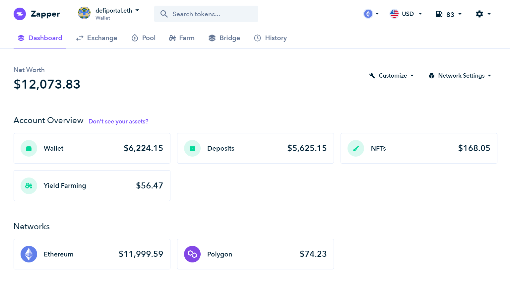
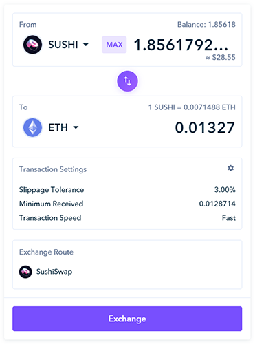
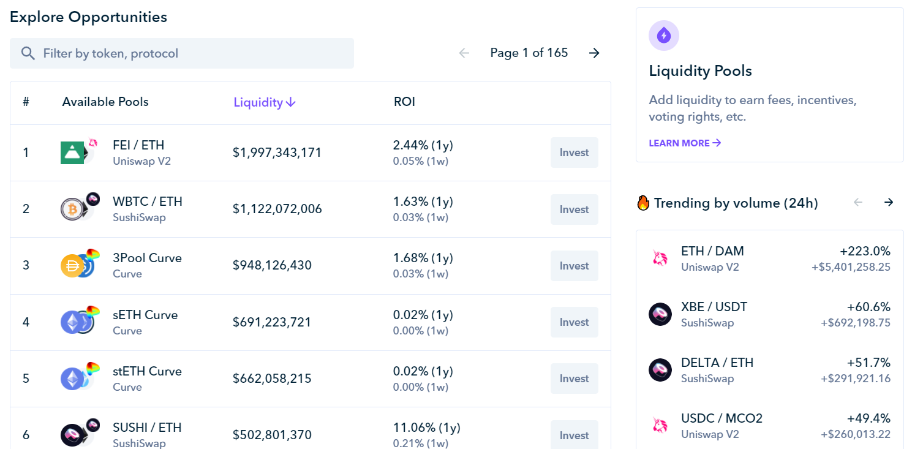
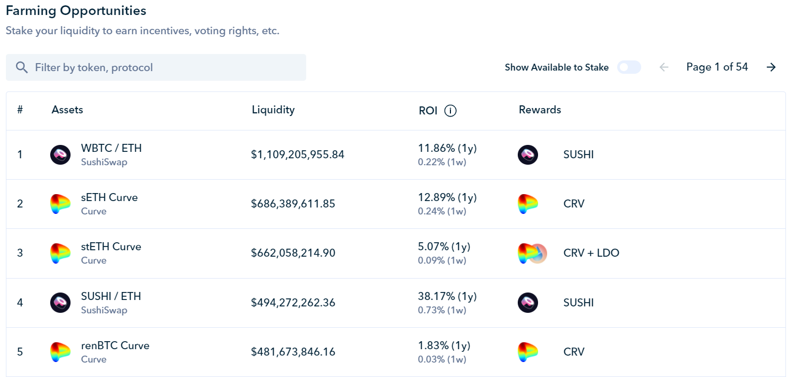
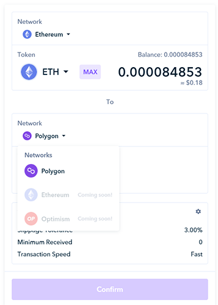
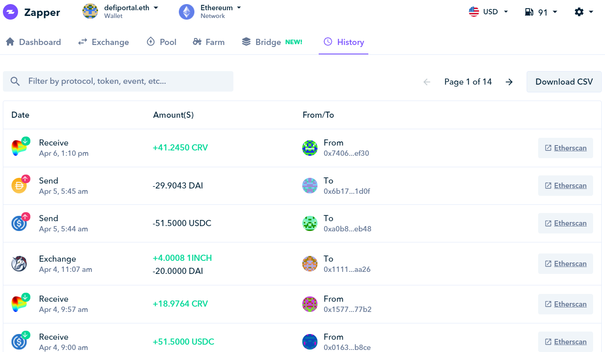
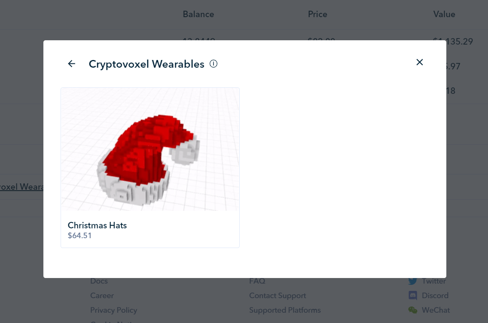
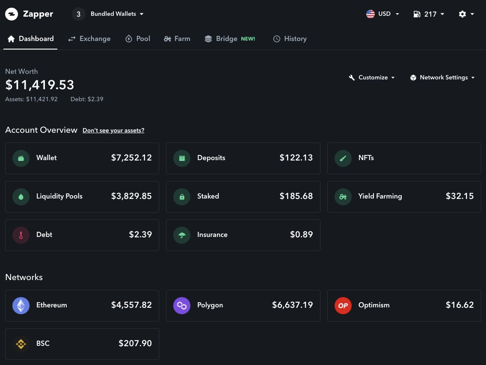
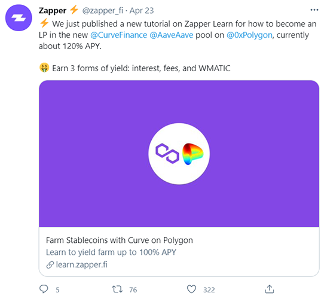

# لماذا استثمرنا في منصة Zapper؟

(هذه الأطروحة ليست نصيحة مالية)

يسعدنا الإعلان عن استثمارنا في منصة Zapper. في هذه الأطروحة، سنقدم نظرة عامة على المنصة لمن ليس لديه معرفة بهذه الركيزة الأساسية في القطاع، ونُطلعكم على أسباب قناعتنا بأن منصة Zapper ستستمر في أداء دور محوري في تطوير التمويل اللامركزي.

## مقدمة

منصة Zapper هي متجر شامل لنشر وإدارة مراكز التمويل اللامركزي. تعد المنصة إحدى أكثر الأدوات شهرة واستخدامًا في القطاع بأكمله. وعلى عكس البنوك وشركات الوساطة التقليدية التي تقدم خدمات كاملة في مجال التمويل التقليدي، شهد التمويل اللامركزي، وهو قطاع لا يزال في طور النشوء نسبيًا، ظهور العديد من المنصات المختلفة التي تقدم مجموعة واسعة من الخدمات للمستخدمين مثل: الإقراض/ الاقتراض على بروتوكول Compound، والفائدة على بروتوكول Aave، والتداول على منصة التداول اللامركزي dYdX.

في حين أن الخدمات المتخصصة مفيدة وضرورية في قطاع جديد، فقد أدت إلى توزيع الأصول بمعزل عن بعضها وتجزئة القطاع وهو أمر يشكل عقبة لمستخدمي التمويل اللامركزي من منظور إدارة الأصول. كما يعلم معظم مستخدمي التمويل
اللامركزي، حلت منصة Zapper هذه المشكلة، ومن نواحٍ عديدة، فقد فعلت ذلك بشكل أفضل من التمويل التقليدي.

|  |
|:--:|
| لوحة المتابعة بمنصة Zapper، واجهة مستخدم مصنفة وملائمة |

|  |
|:--:|
| لوحة المتابعة في مجال التمويل التقليدي. المصدر: https://www.wellsfargo.com/online-banking/tour/online-brokerage |

## خلفية

أُسست منصة Zapper في عام 2020 بعد اندماج منتجين شعبويين شهيرين بهدف حل المشكلة المذكورة أعلاه. كان هذان المشروعان هما DeFiSnap (لوحة معلومات تتبّع المنظومة) وDeFiZaps (بوابة دخول إلى تلك المنظومة عبر \"Zaps\"). كما أوضحت Zapper: \"لوحة معلومات DeFiSnap سهلة الاستخدام لتتبع المراكز بسهولة مقترنة بنظام DeFiZap للعقود الذكية لنشر رأس المال عبر بروتوكولات التمويل اللامركزي المتعددة في معاملة واحدة، وإنشاء تجربة مستخدم شاملة [للاستفادة من منظومة التمويل اللامركزي ككل ومراقبتها](https://twitter.com/zapper_fi/status/1256170281695162368).

تعد منصة Zapper، بصفة أساسية، لوحة معلومات غير مقيدة لحرية التداول، تعرض وتنشر وتنتقل بسلاسة بين الفرص التي تتسم بأعلى مستويات الدخل في التمويل اللامركزي.

## آليات تسلسل العمل الآلية Zaps

نحن من كبار داعمي المنصات التي تهدف إلى تقليل الطابع المعقد في التمويل اللامركزي وتجعل من السهل على الشخص العادي التعامل مع خدمات التمويل اللامركزي. النشر السريع لهذه الفرص ممكن عن طريق آليات تسلسل العمل الآلية Zaps التي تتيح للمستخدمين توزيع رأس المال من خلال العقود الذكية المخصصة، وبالتالي تقليل التكلفة، مع تحويل الرموز بسلاسة إلى المراكز الضرورية لأي منصة معينة.

## موجز عن آليات تسلسل العمل الآلية Zapper:

- تزيل تعقيدات البحث عن بروتوكولات لتوزيع رأس المال.
- تضع مئات من خيارات السيولة في لوحة متابعة واحدة.
- تلخص الأصول التي وُزّعت حسب الفئة، على سبيل المثال مجمعات السيولة والمحافظ والديون وما إلى ذلك بدلاً من البروتوكول.

- تقسم السيولة لديك تلقائيًا إلى أي نسبة يتطلبها المجمع، على سبيل المثال 50/50 في منصة التداول اللامركزي Uniswap، أو 80/20 في منصة Balancer.

- تعيد موازنة المحفظة عن طريق تحويل رأس المال إلى منصات أخرى.
- التجميع المتعدد للسيولة يسمح بالتنويع في توزيع الأصول عبر مختلف مجمعات السيولة.

قبل ظهور منصات مثل Zapper، كانت عملية توفير السيولة، على سبيل المثال، لمجمّع السيولة ETH-DAI على منصة Uniswap تستغرق 4 معاملات أو أكثر (والكثير من رسوم التشغيل). وباستخدام آلية تسلسل العمل الآلية Zaps، أصبح الأمر يتطلب نقرة واحدة فقط وتوفير رسوم التشغيل على إيثريوم عن طريق تجميع معاملات متعددة في معاملة واحدة.

|  |
|:--:|
| السيولة بنقرة واحدة على منصة التداول اللامركزي PancakeSwap. المصدر: https://twitter.com/zapper_fi/status/1380270186163535873 |

## الطابع اللامركزي للتمويل

أدى الإنترنت إلى إضفاء الطابع الديمقراطي على المعلومات وإحداث ثورة من الابتكارات في العديد من القطاعات من السفر والبث التلفزيوني إلى الوسائط والموسيقى. لكن التغيير في القطاع المصرفي كان أبطأ نظرًا لعدم وجود طبقة مالية ديمقراطية مماثلة على الإنترنت، كي تتيح لأي شخص إنشاء القيمة وتبادلها بحرية. وقد تغير كل هذا مع عملة البيتكوين والعملات المشفرة الأخرى.

حدث بعض التغيير قبل العملات المشفرة، حيث قدمت تطبيقات التكنولوجيا المالية مثل Paypal و Revolut تجربة مصرفية وتجربة مدفوعات أكثر سلاسة، كل ذلك على الهاتف المحمول وعبر الإنترنت. وقد أجبر هذا البنوك التقليدية على إطلاق تطبيقاتها المحمولة، والتي عادة ما تكون أقل جودة. فيما جذب مجال العملات المشفرة، كخطوة متقدمة بدرجة أكبر في إضفاء الطابع الديمقراطي على التمويل، اهتمام الشركات في مجال التكنولوجيا المالية والتمويل التقليدي، إذ أصبحت الأسماء البارزة مثل Paypal وRevolut وVenmo وRobinhood وVisa تدعم الآن العملات المشفرة. وبعد أن اضطرت البنوك التقليدية إلى الابتكار لمواكبة التطور في التكنولوجيا المالية، يبدو أن التكنولوجيا المالية بدأت تدرك حقيقة أن العملات المشفرة أصبحت واقعًا لا مفرّ منه، وبدأت العمل الاحتفاظ بأهميتها وجدواها للمستخدمين.

تُحدث السرعة التي يتسم بها مجال العملات المشفرة والأمان الذي يتميز به وقابليته الكبيرة للبرمجة تغييرًا كبيرًا في التمويل ومن المرجح أن يستمر اندماجها في مجالَي التكنولوجيا المالية والتمويل التقليدي. وفي الواقع، نرى أنه من المرجح أن يتم التعامل مع معظم العمليات المهمة (التحويل والتسوية والأمان) في معاملات التكنولوجيا المالية بواسطة طبقة أساسية من البلوكتشين، وهو أمر يشير إليه فريق منصة Bankless باسم ([DeFi mullet](https://newsletter.banklesshq.com/p/the-defi-mullet-market-monday-lite))، إذ \"ستؤدي تجربة المستخدم في مجال التكنولوجيا المالية والبنية التحتية المالية المفتوحة للعملات المشفرة إلى تطبيقات أفضل بمائة مرة من
بدائلها.

|  |
|:--:|
| المصدر: https://newsletter.banklesshq.com/p/the-defi-mullet-market-monday-lite |

ومع اندماج عدد متزايد من منصات التكنولوجيا المالية وشركات إدارة الثروات والبنوك التقليدية في مجال العملات المشفرة للاحتفاظ بجدواها للمستخدمين وتحسين العروض المقدمة لعملائها، فإنها تواجها تحديات من بينها التنفيذ الفني ومنافسة شركات العملات المشفرة الراسخة والمعرفة الفنية بالقطاع. لن ترغب غالبية الشركات في \"البدء من الصفر\" (بافتراض أنها تتمتع بالخبرة الفنية والمهارة في التنفيذ لفعل بذلك)، بل ستسعى لإقامة شراكات مع أفضل المنصات الموثوقة. وفي هذا الصدد، ستكون منصة Zapper، بعقودها الذكية المخصصة، والمهيأة للنشر السريع برسوم منخفضة، وسجلها المثبت من الأمان وجاهزيتها لاستخدام واجهة برمجة التطبيقات، شريكًا ملائمًا للتكامل معه. يمكن أن يشهد مستقبل التمويل اللامركزي منصة Zapper تلعب دورًا رئيسيًا كطبقة نشر وتتبع رئيسية.

## ميزات منصة Zapper

تطورت منصة Zapper من لوحة متابعة بسيطة إلى منصة متعددة الوظائف لإدارة أصول التمويل اللامركزي. تجمع Zapper أفضل الفرص وتسمح بالتصفية والترتيب حسب البروتوكول وعائد الاستثمار والسيولة وما إلى ذلك.

### التبادل

|  |
|:--:|
| تتيح وظيفة "Exchange" في Zapper عمليات مبادلة الرموز دون مغادرة لوحة المتابعة، ما يمنح المستخدم أفضل سعر من قائمة مجمعة من أفضل بروتوكولات المبادلة |

### مجمعات السيولة

|  |
|:--:|
| فرص مجمع السيولة |

تجمع Zapper جميع فرص مجمع السيولة الكبرى وتسمح بالتصفية حسب الرمز والبروتوكول وكذلك الفرز حسب السيولة المقفلة وعائد الاستثمار، ما يوفر على المستخدمين ساعات أو أكثر من البحث ومقارنة الفرص وإعطاء رؤية وتحكم كاملين للمستخدم. يتيح ذلك للمستخدمين الاستثمار في مجموعات مختلفة اعتمادًا على العائد المطلوب ومدى رغبتهم في المخاطرة.

### الإقراض والتخزين

|  |
|:--:|
| فرص الإقراض والتخزين. |

تتيح ميزات الإقراض والتخزين في منصة Zapper عمليتي تصفية وفرز متشابهتين كما هو الحال مع المجمعات، لكن العوائد تأخذ في الاعتبار رموز المكافآت المكتسبة عن طريق الاستراتيجيات المختلفة. تساعد هذه الرؤية الشاملة لمجموعة واسعة من البروتوكولات والمكافآت في استغلال قوة التمويل اللامركزي للمستخدمين بصورة يومية.

### جسر الرموز

كانت منصة Zapper متوافقة مع جهاز إيثريوم الافتراضي EVM انطلاقًا من البداية وتدعم جسرًا مع منصة Polygon فضلًا عن جسر آخر يربطها بمنصة Optimism عما قريب.

### السجل ومستعرض الرموز غير القابلة للاستبدال

أخيرًا، تتمتع منصة Zapper بسجل يمكن البحث عليه يسمح للمستخدمين بتتبع معاملاتهم بسهولة بالإضافة إلى مستعرض للرموز غير القابلة للاستبدال لتتبع الفن الرقمي ومقتنيات العملات المشفرة وغيرها.

|  |
|:--:|
| سجل يمكن البحث عليه للاطلاع على المعاملات السابقة وتصدير البيانات. |

|  |
|:--:|
| الاطلاع بسهولة على الرموز غير القابلة للاستبدال وقيمتها الحالية. |

## السلاسل المتعددة وبروتوكولات الطبقة الثانية والسلاسل الجانبية

بالنسبة لأية منصة لإدارة الأصول، فالتغطية هي أهم ما في الأمر. تعد منصة Zapper الأفضل في مجال الشراكات والتكامل. وتشكل منصة التداول اللامركزي Polygon إحدى الإضافات الرئيسية الحديثة إلى منظومة التتبع علىZapper ، وهي شبكة بلوكتشين جانبية كإطار عمل شهير من إيثريوم لبناء وتوصيل سلاسل متوافقة مع إيثريوم. هذا التكامل بين المنصتين مفيد للغاية لمستخدمي QuickswapDEX، صانع السوق الرائد على منصة Polygon.

وقد كان لتوافق منصة Zapper مع جهاز إيثريوم الافتراضي منذ البداية أهمية بالغة وكذلك دعمها بشكل كامل لمنصة Optimism في ضوء أنّ Synthetix هو أول بروتوكول يتم تتبعه. كما تدعم المنصة تتبع المحفظة لرموز سلسلة بينانس الذكية.

الاطلاع على شبكات متعددة/ محافظ مجمعة:

|  |
|:--:|
| المصدر: https://twitter.com/zapper_fi/status/1372286711523336194 |

استحدثت منصة Zapper أيضًا خيار جسر إلى بروتوكولات الطبقة الثانية والسلاسل الجانبية على شبكة إيثريوم كما هو موضح أعلاه. وستتم إضافة المزيد من البروتوكولات في المستقبل القريب. يشكل هذا التركيز على \"التحوّط للمستقبل\" ومنح المستخدمين حرية الاختيار دون فرض التفضيلات القوة الرئيسية لمنصة Zapper.

## جوانب التميّز لدى Zapper

### مرونة على المدى الطويل

بفضل عقود آليات التسلسل الآلي للعمل "Zaps" المخصصة على منصة Zapper، فإن المنصة مهيأة تمامًا لإجراء عمليات تكامل ونشر مخصصة عبر منصات متعددة بدون لوحة المتابعة على منصة Zapper. أحد الأمثلة على ذلك هو الإعلان الأخير عن أن منصة Zapper \"قريبة جدًا من إطلاق ميزة تتيح للمستخدمين إضافة وإزالة السيولة على منصتي التداول اللامركزي Quickswap وPancakeSwap\" مع قدر أكبر من التكامل مع منصتي Optimum وArbitrum قيد التنفيذ. أصبحت هذه السرعة في مواكبة أحدث الاتجاهات والتقنيات علامة مميزة لمنصة Zapper وهي أحد الأسباب التي تجعلنا متفائلين للغاية بشأن مستقبل المنصة.

### تجربة المستخدم

تحقق منصة Zapper التوازن السليم بين البساطة والتحكم، مع الحرص على عدم التخلص من الكثير من التعقيدات للمستخدمين الذين يرغبون في تجريب وتعلم التمويل اللامركزي بشكل كامل، بينما لا تزال تمثل أداة أولى سهلة
للمستخدمين الجدد في العملات المشفرة.

### تهيئة المستخدمين الجدد

فضلًا عن الخصائص الوظيفية المذكورة أعلاه، والتي تسهل على الوافدين الجدد نشر الاستراتيجيات، تستثمر منصة Zapper أيضًا الكثير من الوقت في تثقيف المجتمع حول اتجاهات التمويل اللامركزي المختلفة.

|  |
|:--:|
| المصدر: https://learn.zapper.fi/articles/farm-stablecoins-with-curve-on-polygon |

### بوابة التعلّم learn.zapper.fi

يدرك فريق Zapper أنه لتطوير قاعدة المستخدمين وكذلك القطاع ككل، فإن إزالة الغموض عن عالم التمويل اللامركزي وتثقيف الجمهور يعد أمرًا أساسيًا. تحتوي بوابة التعلم من منصة Zapper على مجموعة من المقالات لتثقيف المستخدمين بدءًا من الموضوعات التمهيدية مثل \"ما هو الرمز المميز؟\" إلى استعراضات عامة عن استراتيجيات الإقراض والتخزين المتقدمة وكيفية تنفيذ هذه
الاستراتيجيات على منصة Zapper.

|  |
|:--:|
| مجموعة متنوعة من المقالات كتبها فريق Zapper. |

بوصفها قاعدة معرفية رئيسية، فإن بوابة learn.zapper.fi تعد بوابة مفيدة في مجال التمويل اللامركزي وطريقة رائعة لجذب مستخدمين جدد إلى منصة Zapper.

### مشهد المنافسة

المنصات الأخرى المنافِسة في مجال منصات تجميع معلومات التمويل اللامركزي هي Zerion وDeBank.

- لا تمتلك Zerion عمليات تكامل شاملة في سوق نوعية واحدة، ولكنها تسمح لمستخدميها بالتفاعل مع عدد قليل من البروتوكولات في كل تخصص فرعي؛ فهارس التمويل اللامركزي، وتوسيع نطاق رموز بروتوكولات الطبقة الثانية، ورموز منصة Aave المُدرّة للفائدة، ومجموعات الرموز، وغير ذلك، وقد وسعت نطاق عروضها عبر قطاعات نوعية متعددة ولكنها لا تدعم جميع البروتوكولات في هذه القطاعات. لدى منصة Zerion أيضًا تطبيق للهواتف المحمولة يعمل على نظامَي التشغيل Android وiOS، والذي قد يكون مفيدًا في تهيئة المستخدمين الجدد القادمين من التمويل التقليدي إلى التمويل اللامركزي.

- تحتوي منصة DeBank على واجهة سلسة ولكنها تدعم حاليًا فقط منصة Metamask وتقتصر على عمليات مبادلة الرموز الأساسية.

- تعد منصة Zapper أسهل وسيلة للتفاعل مع مجمعات السيولة، وأتمتة تقسيم رأس المال بين أصول المجمّع. تحتوي المنصة على مجموعة شاملة من مجمعات السيولة، وحتى الآن لديها عمليات تكامل أقل عبر قطاعات التمويل اللامركزي المختلفة، وكان تتبع في السابق نهج التركيز على سوق متخصصة واحدة وتوفير تغطية شاملة. لكنّ هذا تغيّر هذا مع الجسور الأخيرة التي تربطها مع بروتوكولات الطبقة الثانية Optimism وPolygon مع المزيد من عمليات التكامل المتوقعة في المستقبل. أخيرًا، فالمنصة تدعم مجموعة من المحافظ، من بينها محفظة WalletConnect للهواتف المحمولة، لتعزيز عملية تهيئة المستخدمين الجدد.

## القيمة الاستراتيجية التي تضيفها Sino

هناك عدد من السبل التي يمكن أن تساعد بهاSino منصة Zapper كي تواصل نموها، لا سيما في الصين، من التواصل المجتمعي والإدارة إلى التوطين والشراكات الاستراتيجية. نتطلع إلى العمل بشكل وثيق مع فريق المنصة.

## خاتمة

إنّ تطور Zapper من لوحة تحكم بسيطة لتتبع المحفظة إلى متجر شامل يتضمن النشر عبر السلاسل (جميعها مدعومة بعقود ذكية مخصصة) جعلها منصة رائدة في التمويل اللامركي. وبامتلاك المنصة لفريق ملتزم بالتكامل السريع والتصميم المرتكز على المستخدم والترقيات المستمرة للخصائص الوظيفية بما يتماشى مع تطورات القطاع، نعتقد أن منصة Zapper ستظل ركيزة أساسية في القطاع في المستقبل المنظور.

**إخلاء المسؤولية:** *هذا المحتوى للأغراض الإعلامية فقط، ولا يجب تفسير أي من هذه المعلومات أو المواد الأخرى على أنها مشورة قانونية أو ضريبية أو استثمارية أو مالية أو غيرها. لا شيء ممّا وردَ في هذه الأطروحة يشكل التماسًا أو توصية أو عرضًا من قبل Sino أو أي مزوّد خدمة تابع لجهة خارجية لشراء أو بيع أي أوراق مالية أو أدوات مالية أخرى في أي دولة يكون فيها هذا الالتماس أو العرض غير قانوني بموجب قوانين الأوراق المالية لهذه الدولة.*
