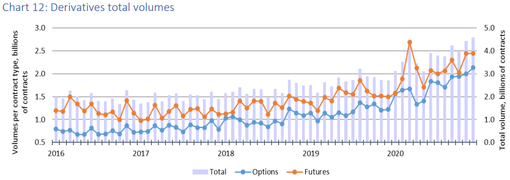
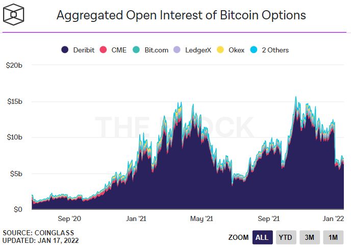
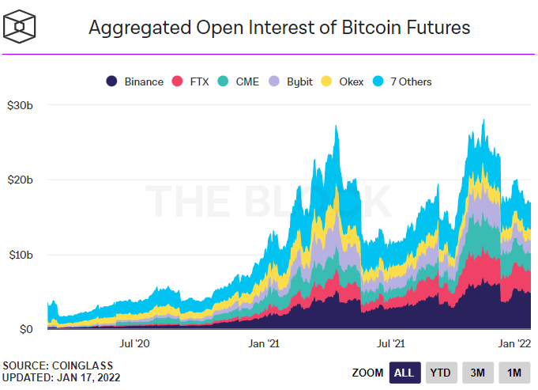
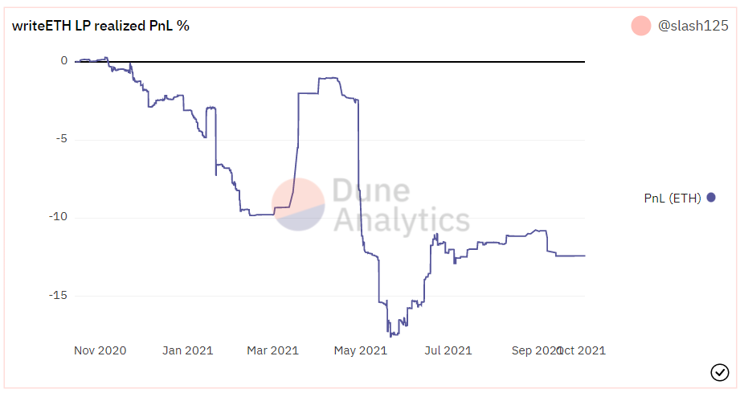
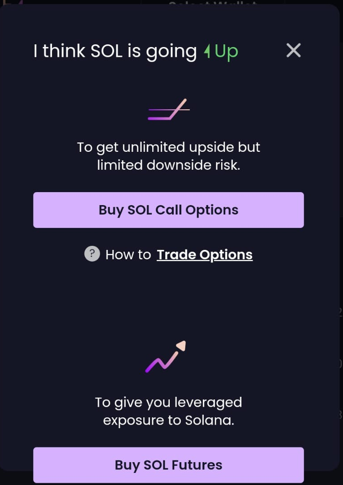

# لماذا استثمرنا في منصة Zeta Markets؟

(هذه الأطروحة ليست نصيحة مالية)

كتبها [@ianw888](https://twitter.com/ianw888)و [@TTx0x](https://twitter.com/TTx0x)و [@dermotmcg](https://twitter.com/dermotmcg)

## مقدمة

منصة Zeta Markets هي أفضل منصة لتداول مشتقات التمويل اللامركزي وتتميز
بانخفاض الضمانات والتخصص في الخيارات والعقود الآجلة. ومن أجل تأطير فرصة
السوق السانحة لمنصة Zeta وغيرها من منصات المشتقات على شبكات البلوكتشين،
من المهم أن نفهم:

• نشاط الخيارات والعقود الآجلة في الأسواق المالية التقليدية.

• الخيارات والنشاط المستقبلي في منصات التداول المركزي للعملات المشفرة.

• نشاط الخيارات على منصات التمويل اللامركزي.

## أسواق التمويل التقليدي: نشاط الخيارات والعقود الآجلة

ارتفع تداول خيارات التمويل التقليدي لدرجة أنه في [سبتمبر/ أيلول 2021
تجاوزت القيمة الاسمية لعقود خيارات الأسهم الفردية (البالغة 6.9 تريليون
دولار) قيمة الأسهم المتداولة البالغة 5.8 تريليون
دولار](https://www.wsj.com/articles/individuals-embrace-options-trading-turbocharging-stock-markets-11632661201).
وفضلًا عن حجم الخيارات، فقد ارتفع حجم العقود الآجلة أيضًا، مدفوعًا بمنتجات
العقود الآجلة للأسهم الفردية والمشاركين الجدد، مثل المتداولين الأفراد.

|  |
|:--:|
| الاتحاد العالمي لمنصات التداول - أبرز معالم السوق لعام 2020 ([https://www.world-exchanges.org/storage/app/media/FH.FY٪202020٪20Market٪20Highlights٪20v9.pdf](https://www.world-exchanges.org/storage/app/media/FH.FY%D9%AA202020%D9%AA20Market%D9%AA20Highlights%D9%AA20v9.pdf)) |

## منصات التداول المركزي للعملات المشفرة: نشاط الخيارات والعقود الآجلة

ازداد الاهتمام بالعقود الآجلة للعملات المشفرة وخياراتها أيضًا في عام
2021.

**الخيارات** - في الوقت الحالي، تشكل منصات التداول المركزي النصيب الأكبر
من تداول الخيارات، إذ بلغت خيارات بيتكوين المركزية ذروتها عند 15.65
مليار دولار في أكتوبر/ تشرين الأول 2021.

تقدم أسواق المشتقات التقليدية مثل CME وICE عقود خيارات مع عقودها الآجلة،
ولكنها لا تشكل سوى جزء صغير من الحجم الإجمالي. فيما لا تزال Deribit، وهي
منصة تركز على العملات الرقمية، هي منصة التداول المهيمنة، إذ تستضيف 90%
من حجم الخيارات والعقود المفتوحة.

توفر منصات التداول المركزي هذه للكيانات المؤسسية وكبار المتداولين إطارًا
متوافقًا مع الضوابط التنظيمية ومنصة تنفيذ مألوفة وذات كفاءة فيما يتعلق
برأس المال. كما تتمتع بالاطمئنان بأنها تتداول مع الأطراف المقابلة
المعتمدة وفق معايير \"اعرف عميلك\" وتتسم بالقدرة على استخدام أنظمة
الهوامش فيما بين الحسابات لتعظيم عائداتها.

إلى جانب الاهتمام من جانب المؤسسات، زاد الاهتمام بالخيارات أيضًا بسرعة
بين جمهور المتداولين الأفراد مع التحدي الذي فرضته منصة Delta Exchange
على منصة Deribit عن طريق التركيز على الخيارات قصيرة الأجل المتوافقة مع
البيع للأفراد على عملات بيتكوين وإيثر وسولانا وبينانس وAVAX بدلاً من
خيارات بيتكوين/ إيثر فقط.

|  |
|:--:|
| يمكن الاطلاع عليها على الرابط: https://www.theblockcrypto.com/data/crypto-markets/options |

**العقود الآجلة** - ارتفع حجم عقود البيتكوين الآجلة أيضًا في عام 2021
ليصل إلى 2.42 تريليون في مايو/ أيار 2021. وعلاوة على ذلك، تجاوزت أحجام
عقود البيتكوين الآجلة أحجام العقود الفورية.

|  |
|:--:|
| يمكن الاطلاع عليها على الرابط: https://www.theblockcrypto.com/data/crypto-markets/options |

ثمة حاجة وطلب متزايد للبدائل من منصات التداول اللامركزي المفتوحة. يعطي
الارتفاع الهائل في حجم كل من التداول اللامركزي الفوري والدائم لمحة عن
مستقبل خيارات العقود اللامركزية. وقد شهدت البنية التحتية اللازمة لمنافسة
منصات التداول المركزي القائمة نموًا ملموسًا مع إطلاق عدد كبير من
بروتوكولات خيارات العقود المختلفة خلال الأشهر الـ 12 الماضية.

## نشاط خيارات العقود في التمويل اللامركزي

نقسم منصات خيارات العقود اللامركزية الحالية إلى فئتين، مع التركيز على
الخيارات بدلاً من العقود الآجلة:

### 1. سجل الطلبات للإصدار والتداال

تعد سجلات الطلبات مطابقة للطريقة التقليدية لإدارة أسواق الخيارات. تشمل
البروتوكولات التي تعمل بنموذج سجل الطلبات ما يلي:

• بروتوكول PsyOptions v1 على شبكة سولانا، مع خيارات أميركية معززة
بالضمانات بالكامل وذات تسوية بالأصول. ستشمل التحديثات المستقبلية
لبروتوكول PsyOptions خيارات أوروبية غير معززة بالضمانات بالكامل، وذات
تسوية نقدية.

• بروتوكول Opyn v2 على شبكة إيثريوم باستخدام سجلات الطلب لبروتوكول 0x،
والتي تتميز بخيارات أوروبية تتمتع بضمان جزئي وتسوية نقدية.

إلا أنّ التحدي الرئيسي في سجلات الطلبات هو أنها تتطلب من صانعي السوق
توفير السيولة، مع تشديد فروق الأسعار عند زيادة عدد المشاركين في السوق.
ونظرًا لأن خيارات العقود على شبكة البلوكتشين هي في طور النشوء الآن، فمن
المرجح أن تستمر تجزئة السيولة في ضوء انتشار المتداولين بين مجموعة متنوعة
من منصات التداول المحددة. فضلًا عن ذلك، قد لا تكون سجلات الطلبات مُجدية
لبعض المستخدمين أو التطبيقات على شبكات البلوكتشين ذات الإنتاجية المنخفضة
والتكلفة العالية.

### 2. السيولة المجمعة أو نموذج صانع السوق الآلي

أُستخدمت مجمعات السيولة في كل من التداول الفوري والدائم لتعزيز السيولة
بكفاءة؛ ويمكن تطبيقها بالمثل ضمن منتجات الخيارات للتغلب على مشكلة
السيولة. إذ يقوم مزودي السيولة بإيداع أصولهم لأداء دور الطرف المقابل،
وبيع الخيارات عبر جميع أسعار تنفيذ العقود وتواريخ الاستحقاق مقابل الضمان
في مجمع السيولة. يمكن تحديد السعر بشكل لوغاريتمي عبر نماذج تسعير
الخيارات مثل Black-Scholes (BS) التي تقدّر التكلفة بناءً على العديد من
المدخلات.

تشمل البروتوكولات التي تستخدم مجمعات السيولة وصناع السوق الآليين ما يلي:

• بروتوكول Hegic v8888 على طبقة إيثريوم الأولى Ethereum L1، نموذج تسعير
مخصص، تقلب الأسعار الضمني IV إما يُحدد يدويًا أو عبر شبكات أوراكل، ولكن
عُدّلَ لخفض أسعار خيارات الشراء مقارنة بمنصات التداول المركزي، والمراكز
التي أخذت طابع الرموز بوصفها معايير ERC721s قابلة للتداول، ومجمعات
السيولة المغطاة لعدم الخسارة.

• بروتوكول Siren v2 على منصة Polygon، وتسعير صانع السوق الآلي المخصص عبر
منحنى الترابط لضبط فروق السعر بين الطلب والتنفيذ، وضبط التقلبات الضمنية
IV يدويًا، وتقسيم الضمانات بعملة bToken للمشترين ومنصة wToken يتم تجميعها
في صانع السوق الآلي لمجمعات السيولة.

• بروتوكول Lyra على منصة Optimism، والتسعير عبر رسم ديناميكي على أساس
vega لمجمع السيولة، وناقل التهيئة IV الأساسي المعدل بنسبة تقلب أسعار
التنفيذ، وتحوطات دلتا مجمعات السيولة عبر بروتوكول Synthetix.

تسعير الخيارات هو عملية حسابية معقدة مع مدخلات متعددة تتغير باستمرار. كل
تصميم من تصميمات صانع السوق الآلي المذكورة أعلاه قد عززت نماذج التسعير
التقليدية مع ابتكاراتها المخصصة لتكييفها مع ربحية مجمعات السيولة وقيود
التقلب، أو حماية بروتوكولها ضد ناقلات الهجوم المحتملة.

سيقدم كل خيار عملية مبادلة خاصة به، ما يؤدي إلى تغيير العائد الذي يحصل
عليه كل مشارك في السوق. وللتحوط من دلتا مجمع السيولة أو التحوط ضد
الخسارة المؤقتة كلفته، والتي من المرجح أن يتحملها مشتري الخيار من خلال
قسط التأمين، أو يتم استخلاصها من عائدات مجمع السيولة. علاوة على ذلك، فإن
هذه المراكز المجمعة معززة بالضمانات بشكل كامل، ما يقلل من كفاءة رأس
المال التي توفرها الخيارات.

### موجز: مشكلات اعتماد خيارات التمويل اللامركزي على نطاق واسع

الخيارات هي سوق ضخم في عالم التمويل التقليدي ومنتج متزايد النمو في
منظومة منصات التداول اللامركزي للعملات المشفرة. لكن لم تشكل منصات خيارات
التمويل اللامركزي مزودي الخيارات في مصات التداول المركزي بشكل كبير بسبب:

• ارتفاع تكلفة الخيارات.

• انخفاض كفاءة رأس المال (تعزيز الضمانات بالكامل مقابل نقص الضمانات).

• التسعير غير الكامل.

• عدم وجود هوامش معقدة.

• عدم وجود آلية التصفية بسبب محدودية المنصة.

### كيف تتعامل منصة Zeta مع قيود منصات خيارات التمويل اللامركزي الحالية؟

تعالج منصة Zeta العديد من المشكلات التي تمنع التبني الواسع لخيارات
العملات المشفرة في التمويل اللامركزي. تتمتع Zeta بالمزايا التالية:

### المزايا سولانا/ Serum

عن طريق الاستفادة من الأداء الرفيع لسولانا، تستطيع منصة Zeta:

**• تقليل تكلفة اتخاذ مركز الخيارات إلى كمية يمكن التحكم فيها.**

\- على شبكة إيثريوم، ، يمكن أن يكلف الإصدار والتداول في مركز عشرت المئات
من الدولارات كرسوم تشغيل.

• توفير خيارات لا تتمتع بضمانات مع زيادة كفاءة رأس المال.

\- تتطلب الضمانات الناقصة نظام الهامش ويتطلب نظام الهامش الفعال تسعير
وتصفية فعالة.

• **تحديث الأسعار كل 400 مِلي ثانية**

\- بوسع منصة Zeta \"تحديد القيمة حسب السوق\" على فترات زمنية متكررة.
عندما تعرف المنصة \"السعر العادل\" للمركز، فهناك العديد من الفوائد من
بينها التصفية المنظمة/ الجزئية عندما تتدهور المراكز.

• **الوصول إلى شبكة أوراكل Pyth**

\- تعد تدفقات بيانات Pyth مع مجال الثقة مفتاح كل من عمليات التصفية
المنظمة ونظام الهامش.

**• الوصول إلى سجل طلبات Serum الموجودة بالكامل على السلسلة**

\- يقلل هذا من الحاجة إلى سيولة بطريقة صانع السوق الآلي الخامل، والذي
يمكن أن يوفر سيولة بصورة شبه غير محدودة، ولكنه يتصف بتخلف السعر إذ يجب
أن يأخذ صانع السوق الآلي دائمًا سعر المشتري. وهذا يعني أنه يمكن للمشاركين
المطلعين في السوق اختيار التداول عكس صانع السوق الآلي فقط عندما تكون
لديهم ميزة.

**• إدارة الطلبات النشطة**

\- بدون هذا النهج الأكثر نشاطًا لإدارة الطلبات (وأيضًا نظرًا للقدرة
المحدودة على تحديث الأسعار، على سبيل المثال، التقلب الضمني لمدخلات
بروتوكول Hegic يدويًا)، يمكن أن تواجه مجمعات السيولة التي تستخدم بروتوكول
Hegic أو بروتوكولات الخيارات سيولة بطريقة صانع السوق الآلي الأخرى خسائر.

|  |
|:--:|
| لوحة المتابعة ببروتوكول Hegic على منصة البيانات Dune Analytics (https://dune.xyz/slash125/hegic-v2) |

عن طريق الاستفادة من مساحة التصميم الإضافية التي يوفرها الأداء العالي
لشبكة سولانا ومنصة Serum، تستطيع Zeta إنشاء منصة خيارات يمكنها ذات يوم
التنافس مع تجربة التداول المركزي.

من المهم أن نشير إلى أن المزايا التي ذكرناها أعلاه ممكنة فقط إذا كانت
منصة Zeta في \"حالة مستكملة\". وقد أصبح الحفاظ على الحالة مستكملة ممكنًا
عن طريق \"عُقد التدوير\". ولِمن يرغبون في معرفة المزيد حول عُقد التدوير، أو
إدارة إحداها بأنفسهم، ننصح بالاطلاع على هذا المنشور الذي كتبه [@0xPemulis](https://twitter.com/0xPemulis/status/1483115445389508610).

**المزايا -- منظومة التكامل Zeta FuZe والقابلية للربط**

منظومة التكامل Zeta FuZe هي \"مكتبة للاستدعاء فيما بين البرامج\"
(<https://github.com/zetamarkets/fuze> تتيح لأي شخص الاتصال فيما بين
البرامج والتفاعل برمجيًا مع عقود Zeta الذكية. تتمركز Zeta، عبر التركيز
على الأدوات والتكامل، في موضع يسهل على المنصات والبروتوكولات الأخرى
الربط معها. علاوة على ذلك، يمكن للأطراف الخارجية أتمتة التداول باستخدام
الروبوتات ما يخلق تأثيرًا إيجابيًا على المنظومة ككل.

كما رأينا في العديد من الحالات، يمكن أن يؤدي إنشاء أدوات قوية إلى إطلاق
حلقة إيجابية لمنظومة التطبيقات تؤدي إلى مزيد من المشاركة، وتعزيز إجمالي
القيمة المقفلة، وغير ذلك.

**المزايا -- نهج واجهة/ تجربة المستخدم وأولوية الهواتف المحمولة**

تستخدم منظومة العملات المشفرة والبلوكتشين الهندسة بكثافة لدرجة أنه يجب
على الشركات الناشئة في كثير من الأحيان إعطاء الأولوية للتكنولوجيا
الأساسية على حساب واجهة/ تجربة المستخدم الملائمة. إلا أنّ مشاريع مثل منصة
Orca حققت تقدمًا هائلًا في جذب مستخدمي منصات التداول اللامركزي الجدد عن
طريق توفير تجربة مستخدم سلسة.

وقد بذلت منصة Zeta جهودًا كبيرة لتصميم تجربة متوافقة مع الأجهزة المحمولة
بعد اكتشافها أن غالبية مستخدميها يريدون أن يكونوا قادرين على الوصول إلى
Zeta عن بُعد.

### المزايا - صانع سوق خيارات

• عند الإطلاق الأولي، تركز Zeta على نهج سجل طلبات غير معزز بالضمانات
تمامًا ويعتمد بشكل أساسي على توفير السيولة من صانعي السوق، حيث يوجد اثنان
من مزودي السيولة الفورية هما: LedgerPrime وPattern.

• نظرًا لتوحيد سجل طلبات منصة Serum ، يمكن للشركات التي قامت بالربط/
التداول مع Serum أن تنتقل بسهولة إلى منصة Zeta.

• في المستقبل، تخطط Zeta لإضافة صانع سوق خيارات يقوم بتسعير أي طلبات
وتداولها بحيث تكون هناك أسواق سيولة حتى في تواريخ الاستحقاق أو فترات
الدفع التي لا يتم تداولها بشكل عام.

## خارطة الطريق

• يوجد حاليًا أكثر من 40 سوقًا على Zeta (الاتصال/ البيع/ العقود الآجلة
بفترات مختلفة).

• بعد الإطلاق، ستركز Zeta على إضافة أسواق جديدة وأنواع مختلفة من
الخيارات.

• خيارات بيتكوين/ إيثر في أعلى القائمة بالإضافة إلى Luna / AVAX.

• مع نمو السوق ووجود طلب على فترات انتهاء الصلاحية الشهرية والربعية،
ستتم إضافتها أيضًا.

• فضلًا عن ذلك، فإن العمل على [خيارات
دائمة](https://www.paradigm.xyz/2021/05/everlasting-options/) يمكن أن
يكون مشروعًا محتملاً 👀

## الحوكمة

تشكل الحوكمة جوهر منصة Zeta، فهي تعمل بوصفها آلية مهمة تعمل على تحقيق
التوافق بين مجموعة واسعة من الأطراف المعنية التي تتفاعل مع البروتوكول،
بما فيها المتداولين وصناع السوق والمشاريع القابلة للربط بينها والمطورين
ومقدمي الخدمات الآخرين.

مع نضوج طبقة البنية التحتية للمنظمات اللامركزية المستقلة في شبكة سولانا،
ستبدأ Zeta في تنفيذ نظام الحوكمة اللامركزي للسماح للمجتمع وحاملي الرموز
بالتعبير عن آرائهم والتصويت على الاتجاه المستقبلي للبروتوكول.

## خاتمة

تمثل منصة Zeta خطوة كبيرة إلى الأمام لمنظومة خيارات التمويل اللامركزي
بمعالجتها للعديد من المشكلات التي حالت دون تبنيها حتى الآن.

في سوق خيارات العملات المشفرة الذي يتسم بسرعة النمو، نعتقد أن Zeta
ومنصات الخيارات الأخرى ذات خيارات التصميم المماثلة ستكون مهيأة على النحو
الأمثل للاستحواذ على حصة السوق مقارنة بنظيراتها المركزية، ولا نطيق
الانتظار لدعم Zeta وهي تواصل رحلتها!

### الروابط

• الموقع: <https://zeta.markets/>

• مدونة المنصة على موقع Medium: <https://zetamarkets.medium.com/>

• مجتمع المنصة على منصة التواصل الاجتماعي Discord:
<http://discord.gg/C3VS42PKAJ>

**إخلاء المسؤولية:** *هذا المحتوى للأغراض الإعلامية فقط، ولا يجب تفسير
أي من هذه المعلومات أو المواد الأخرى على أنها مشورة قانونية أو ضريبية أو
استثمارية أو مالية أو غيرها. لا شيء ممّا وردَ في هذه الأطروحة يشكل التماسًا
أو توصية أو عرضًا من قبل Sino أو أي مزوّد خدمة تابع لجهة خارجية لشراء أو
بيع أي أوراق مالية أو أدوات مالية أخرى في أي دولة يكون فيها هذا الالتماس
أو العرض غير قانوني بموجب قوانين الأوراق المالية لهذه الدولة.*
