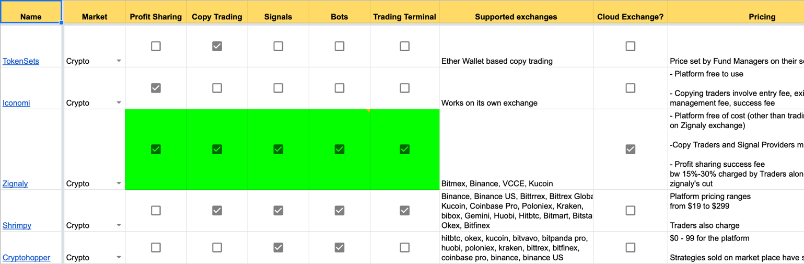
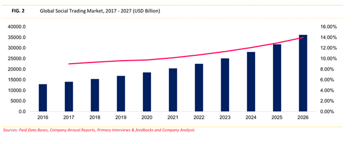
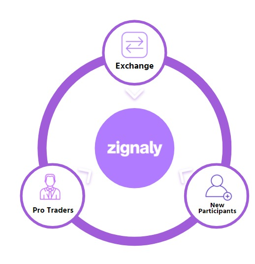
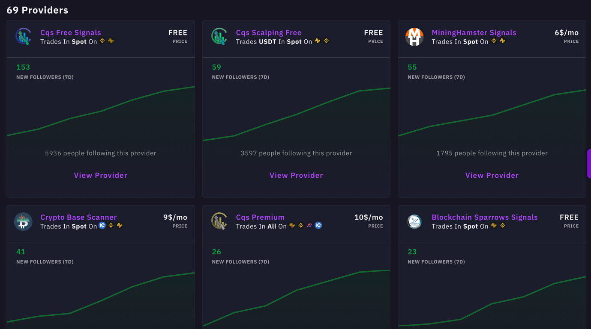
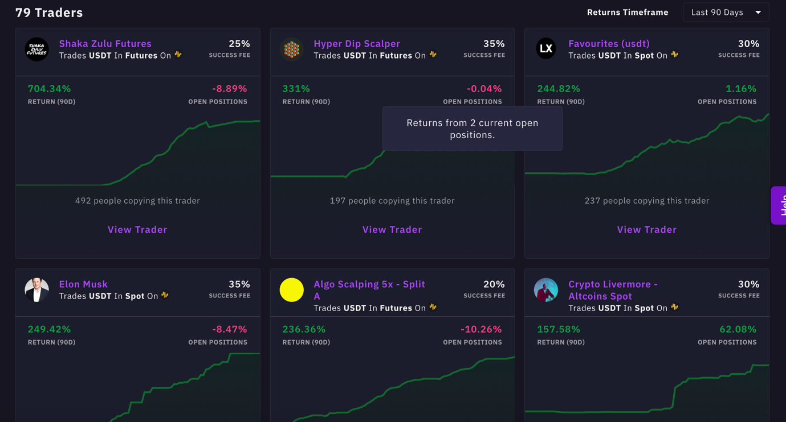
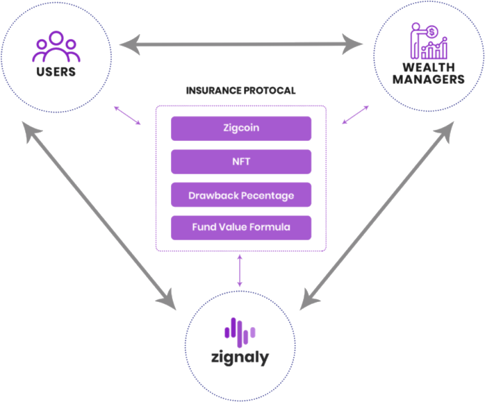
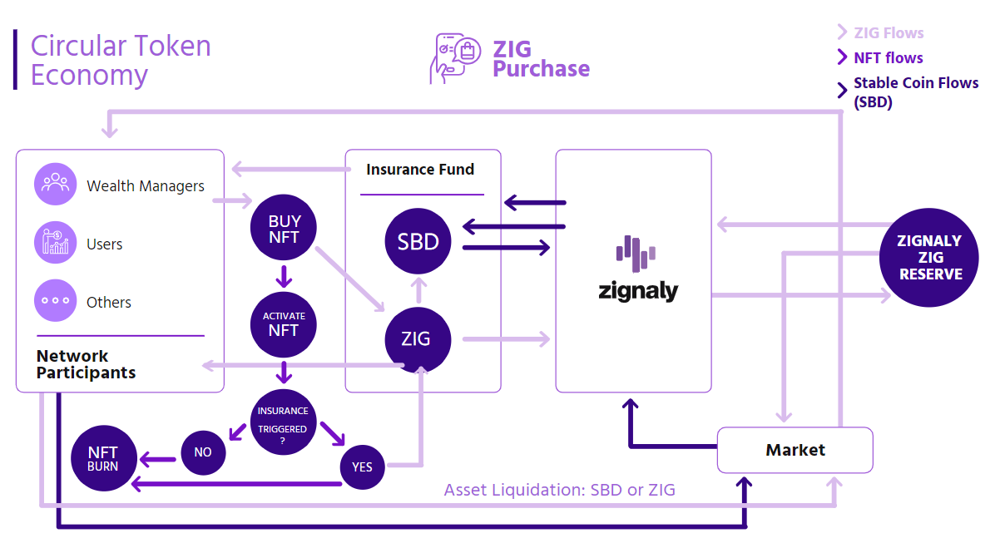

# لماذا استثمرنا في منصة Zignaly؟

(هذه الأطروحة ليست نصيحة مالية)

يسرّ Sino Global Capital أن تعلن عن استثمارها في منصة Zignaly. في هذه
الأطروحة، سنُطلعكم على أفكارنا حول قطاع التداول الاجتماعي ولماذا نعتقد أن
Zignaly يمكن أن تُحدث ثورة في التداول الاجتماعي؛ بتذليل العقبات أمام دخول
المستثمرين الأفراد إلى سوق العملات المشفرة.

## المزايا الرئيسية لمنصة Zignaly:

• استعراض عام مبسط للمستخدمين الأفراد (الجدد). تقدم منصة Zignaly واجهة
سهلة الاستخدام مع واجهة وتجربة مستخدم بسيطة وسهلة الاستخدام ومناسبة
للمستثمرين الأفراد والمبتدئين.

• مشاركة في دعم العملاء. تركز منصة Zignaly على المشاركة النشطة مع
المستثمرين والمتداولين لإنشاء مجتمع نشط وذي ولاء.

• التكامل مع منصات التداول الرائدة. تتكامل Zignaly مع المنصات الرائدة
مثل Binance Kucoin وBitmex وهناك المزيد منها في المستقبل.

• مجموعة واسعة من ميزات التداول الاجتماعي. عن طريق تقديم مجموعة متنوعة
من الخدمات مثل مشاركة الأرباح وتداول النسخ والإشارات والروبوتات، توفر
Zignaly فرصًا لجميع أنواع المستثمرين. فعلى منصة للتداول الاجتماعي
التفاعلي، يمكن للمستخدمين إطلاع الآخرين على أفكارهم ونتائجهم، فضلًا عن
تبادل الأفكار حول الفرص الجديدة.

• آلية تأمين جديدة لحماية المستثمرين. طرح بروتوكول تأمين قائم على الرموز
غير القابلة للاستبدال. وبالاستفادة من نسبة الأموال المستردة وصيغة القيمة
الكاملة، تبسّط Zignaly عملية الاستثمار مع تقليل الخسارة للمستخدمين.

• تجربة تداول مجهّزة ومهيأة. فمع تقنية الجاهزية للتشغيل الأساسية لمنصة
Zignaly، أصبح التعامل مع العملات المشفرة أسهل من أي وقت مضى.

• مساعدة المتداولين على تحويل مهاراتهم إلى أموال على نحو منصف. تساعد
منصة Zignaly المتداولين المهرة في زيادة العوائد على الاستراتيجيات التي
أتقنوها على مرّ السنين. وعن طريق عملية التهيئة والاستيعاب السلسة، تتيح
Zignaly للمتداولين المهرة الاستفادة من قاعدة مستخدميها البالغة أكثر من
70 ألف مستخدم وتحقيق المكاسب على نحو منصف وشفاف.

## مقدمة

لا يمكن التشكيك بتزايد الاهتمام على نحو كبير بالتداول الاجتماعي بين
المستثمرين خلال السنوات القليلة الماضية. إذ يوفر التداول الاجتماعي حلولًا
مبتكرة وفعالة لكل من المستثمرين النشطين وغير النشطين الذين بدأوا رحلاتهم
الاستثمارية في العملات المشفرة. يمكن لمستخدمي منصات التداول الاجتماعي،
بوصفها شبكات اجتماعية للمتداولين والمستثمرين، التعرف على مجموعة واسعة من
فئات الأصول المختلفة بدون المهارات المطلوبة للمستثمر أو المتداول الماهر.
وقد أصبح هذا ممكنًا عبر ميزات تداول النسخ حيث يكون المستخدم قادرًا تلقائيًا
على محاكاة استراتيجيات التداول المتطورة وصفقات المتداولين ذوي الخبرة
باستخدام الأدوات الاجتماعية التي تسمح بالتفاعل المستمر مع هؤلاء
المتداولين. يوفر التداول الاجتماعي العديد من المزايا للمستثمرين:

• الحصول على المعلومات والتعامل في بيئة تداول موثوقة. إذ إنه من شأن
التدفق المستمر للمعلومات والبيانات إرباك الوافدين الجدد إلى التداول
بسهولة. ويمكن أن تقلل منصات التداول الاجتماعي هذا التشويش عن طريق تجميع
كافة الموارد اللازمة لمنظومة واحدة للمستثمرين والمتداولين، وإفساح المجال
للمبتدئين للتفاعل مع المستخدمين المتمرّسين.

• إزالة منحنى التعلم. كي تصبح متداولًا ناجحًا فإن ذلك يتطلب التفاني
والمثابرة. يتيح التداول الاجتماعي للمتداولين فرصة الاستفادة من العائدات
المرتفعة للمتداولين المهرة دون سنوات من الخبرة.

• تقليل الحواجز أمام الدخول إلى المجال، وزيادة الكفاءة. على غرار منصات
التواصل الاجتماعي، فإن الشرط الوحيد لدخول منصات التداول الاجتماعي هو
التسجيل. تتوفر جميع المعلومات ذات الصلة على المنصة بدون أدوات إضافية أو
أجهزة متطورة مطلوبة للبدء.

## مشهد التداول الاجتماعي

اكتسب التداول الاجتماعي أيضًا زخمًا كبيرًا في مجال العملات المشفرة. ويُعزى
ذلك إلى النمو الملحوظ للعملات المشفرة كفئة أصول، ومع المكاسب المحتملة
العالية والحواجز المنخفضة لدخول المجال، استقطب التداول الاجتماعي عددًا
متزايدًا من المستثمرين الأفراد إلى هذا القطاع الذي يتسم بسرعة التطور.
يُنظر إلى التداول الاجتماعي على أنه مجال متكامل الخدمات للاستثمار عبر
الإنترنت في الأسهم والمشتقات والعملات المشفرة، على نحو يبسط عملية
الاستثمار ويزيد من إمكانية الحصول على الفرص.

أعددنا ورقة موجزة أدناه لإعطاء رؤية أوضح لمشهد التداول الاجتماعي الحالي
لكل من التمويل التقليدي ومزودي العملات المشفرة، بالإضافة إلى الميزات
الخاصة بكل مجال.

|  |
|:--:|
| [لمحة عامة عن منصات التداول الاجتماعي](https://docs.google.com/spreadsheets/d/1DSwOiYJmusSV0_fomU-QZZCCx-vRUM8Koi2SbPxP4kY/edit#gid=0) |

يتزايد الطلب على التداول الاجتماعي والاهتمام به على مستوى العالم، ومن
المتوقع أن ينمو حجم التداول على منصات التداول الاجتماعي إلى نحو 35
تريليون دولار بحلول عام 2026.

|  |
| :--: |
| التداول الاجتماعي ينمو على مستوى العالم |

بطبيعة الحال، سيتدفق جزء من حجم التداول هذا إلى مجال العملات المشفرة.
وهنا يأتي دور منصة Zignaly، بتبسيط الانتقال من التمويل التقليدي إلى
العملات المشفرة.

## لمحة عامة عن منصة Zignaly

تعد Zignaly منصة رائدة في مشهد التداول الاجتماعي للعملات الرقمية وتتمتع
بخيارات مخصصة في تداول النسخ وخدمات إدارة الثروات لتلبية احتياجات
مستخدميها بشكل كامل. يمكن للقادمين الجدد الاستفادة من استراتيجيات
التداول المتقدمة المتاحة على منصة Zignaly عن طريق توصيات الإشارات
ومحاكاة تداولات الخبراء أو الاستثمار في الصناديق المتخصصة التي يحتفظ بها
هؤلاء المتداولون المحترفون. يوفر تكامل واجهة برمجة التطبيقات مع منصات
تداول العملات المشفرة البارزة في المجال بيئة استثمار قابلة للتشغيل
المتبادل والتشغيل الفوري للمستخدمين من جميع مستويات المهارة والخبرة.

حتى الآن، بلغ إجمالي حجم التداول على منصة Zignaly 2 مليار دولار مع أكثر
من 70 ألف مستخدم، و110 مليون دولار من الأرصدة المرتبطة.

## الحل الذي تقدمه منصة Zignaly

هناك بعض أوجه القصور في السوق التي تجعل منصات مثل Zignaly جاذبة
للمستثمرين المبتدئين:

• منصات التداول. تستخدم منصات تداول العملات المشفرة الرائدة استراتيجية
المحيط الأحمر (إقصاء المنافسين والتغلب عليهم)، مع التركيز على تقديم
خدمات متطورة يمكن أن تكون صعبة على المستثمرين والمتداولين المبتدئين.
تتكامل Zignaly مع منصات التداول الرائدة بطريقة التوصيل والتشغيل
(plug-and-play)، ما يوفر سيولة منصات التداول للمستثمرين الجدد المستعدين
لاستثمار رؤوس أموالهم على نحو أكثر فعالية وكفاءة.

• الحواجز العالية أمام الدخول، والمخاطر التي تواجه المستثمرين الجدد.
يوجد حاجز معرفي مرتفع للمبتدئين في ضوء التطور المتزايد لبروتوكولات
البلوكتشين. علاوة على ذلك، يمكن أن تؤدي عمليات الاحتيال والأسعار
المتقلبة إلى جانب الافتقار إلى الخبرة إلى زيادة المخاطر للمستثمرين
المبتدئين. يتيح التداول الاجتماعي للمستخدمين من جميع الأنواع الاستثمار
دون القلق بشأن عمليات الإعداد المعقدة والمكلفة. وبتكامل منصات التداول مع
منصة Zignaly، ستكون هناك منصة مركزية واحدة تجعل الاستثمار أكثر سهولة
وشفافية.

• المتداولون الخبراء. أمضى المتداولون المتمرسون سنوات في صقل مهاراتهم،
ولكن لا توجد منصة شاملة متاحة لهؤلاء المتداولين لاستثمار مهاراتهم بما
يتجاوز صفقاتهم المباشرة. أنشأت Zignaly منظومة تربط المستثمرين
والمتداولين من جميع المستويات حيث يمكن للمتداولين استثمار مهاراتهم وبناء
سمعة جديرة بالثقة بناءً على مشاركتهم وأدائهم.

|  |
|:--:|
| منظومة المستخدم بمنصة Zignaly |

تشمل الميزات والخدمات الأساسية لمنصة Zignaly ما يلي:

• روبوتات التداول. تتيح خدمات روبوت التداول من Zignaly للمستخدمين
الاستفادة من التوصيات للتداول بطريقة آلية بالكامل. من خلال ربط Zignaly
بمزود التوصيات الذي يختاره المستخدم، يمكنه التداول مثل المحترفين دون
الحاجة إلى مراقبة الأسواق باستمرار.

• تداول النسخ. من السهل نسخ تداول المتداولين المفضلين لديك. يمكن
للمستثمرين الحفاظ على رصيدهم المطلوب على المنصة وتكرار سلوك التداول
للمتداول الذي يختارونه بصورة آلية.

|  |
|:--:|
| قائمة المتداولين الخبراء. المصدر: https://zignaly.com |

• تقاسُم الأرباح. يتيح نموذج تقاسم الأرباح الخاص من Zignaly للمستخدمين
الاستثمار في المتداولين الأفضل أداءً لتحقيق النتائج نفسها مثل الخبراء عن
طريق دفع نسبة مئوية من الأرباح كرسوم تداول.

|  |
|:--:|
| يعرض المتداولون عائداتهم ويتنافسون على كسب المتابعين. المصدر: https://zignaly.com/ |

## تقاسم الأرباح ونسخ التداول

ما يجعل تقاسم الأرباح فريدًا وأكثر فائدة من نسخ التداول العادي هو أن
المستخدمين مطالبون فقط بدفع رسوم النجاح عندما ترتفع المراكز إلى مستوى
جديد. بهذه الطريقة، يكون لدى كل من المستثمر والمتداول حافز متوافق، ما
يؤدي إلى التنفيذ الأمثل لاستراتيجية التداول من البداية إلى النهاية.

| نسخ التداول العادي | تقاسُم الأرباح |
| -------- | -------- |
| اشتراكات تداول شهرية     | تعتمد رسوم النجاح على نسبة مئوية من المكاسب عند تحقيق أرباح. ففي حال عدم تحقيق أرباح لا يدفع المستخدم رسومًا     |
| ينفذ المتداول الطلب أولًا ثم يعقبه متداول النسخ. ويمكن أن يتسبب ذلك في فرق بين سعرَي الطلب والتنفيذ ما ينتج عنه أن يدفع متداول النسخ سعرًا أعلى     | بدلًا من نسخ مراكز المتداولين، تتيح ميزة تقاسم الأرباح مركزًا أساسيًا برصيد مجمّع لجميع المشاركين     |
| خيارات للعقود الآجلة والفورية على حساب منصة Zignaly ومنصتَي بينانس وKucoin     | على حساب منصة Zignaly (عقود آجلة أو فورية)     |
| عدم الترابط. إمكانية الاحتفاظ بالمراكز مفتوحة إلى حين تقديم المتداول توصية بالخروج أو خيار إلغاء المراكز المفتوحة     | باستخدام آلية تقاسم الأرباح، ليس بوسع المستخدم الانفصال فورًا من المزوّد. إذ يجب أن تُغلق جميع المراكز المفتوحة عند الانفصال. وخلال هذه العملية، يظل الرصيد مقفلًا     |
> *تداول النسخ العادي مقابل نموذج تقاسم الأرباح*

## التركيز الأمني ​​لمنصة Zignaly

تشكل السلامة والأمن أهم أولويات Zignaly. ولتوفير منظومة تداول اجتماعي
موثوقة ومُحكمة، تتخذ Zignaly تدابير السلامة التالية:

• عدم تقييد الأموال. لا تحتفظ Zignaly بأموال مستخدميها، فهي محمية من
جانب المنصة.

• التشفير المتطور والتخزين الآمن. مفاتيح واجهة برمجة التطبيقات مشفرة
بخوارزمية RSA ومخزنة في قاعدة بيانات معزولة غير متاحة للوصول العام.
تستخدم منصة Zignaly شهادة لتشفير وفك تشفير مفاتيح واجهة برمجة التطبيقات
الخاصة بها والتي يتم فصلها والحفاظ عليها آمنة خارج خوادم المنصة.

• مصادقة ثنائية. تقدم منصة Zignaly مصادقة ثنائية (2FA) لازمة للوصول إلى
حساب المستخدم.

## بروتوكول التأمين

العديد من الوافدين الجدد على الاستثمار ليسو على دراية كاملة بالمخاطر
والتداعيات المرتبطة بالاستثمار. وللحد من المخاطر الشائعة، مع حماية
المستخدمين الجدد أيضًا، أنشأت منصة Zignaly بروتوكول تأمين مبتكرًا. إذ
يختار المستثمر متداولًا محترفًا ويستثمر رأس المال. في الحالة التي يكسب
فيها المتداول عائدًا أقل من النسبة المئوية المخطط لها، سيعوّض بروتوكول
التأمين بصورة آلية الفرق، مع الاستفادة من عملة ZIG لتوفير الحماية
الأساسية ضد الخسائر باستخدام التأمين المستند إلى الرموز غير القابلة
للاستبدال.

وفيما يلي نُلقي نظرة فاحصة على آليات التأمين، والتي تتكون من أربعة عناصر
رئيسية:

• عملة ZIG. تشكل عملة ZIG مكونًا لا غنى عنه في بروتوكول تأمين Zignaly، إذ
توفر للمستخدمين القدرة على التحوط ضد التقلبات وحماية 10% -100% من
استثماراتهم.

• الرموز غير القابلة للاستبدال. يُنشئ نظام الرموز غير القابلة للاستبدال
الداخلي لمنصة Zignaly نظام تتبع شامل يبسط مراقبة التدفقات الداخلة
والخارجة على المنصة.

• صيغة قيمة الصندوق. وللتخفيف من الخسائر الكبيرة للمستخدمين، وتوفير
سيولة ثابتة لمجمع التأمين، تُقدم رموز Zignaly غير القابلة للاستبدال إلى
جانب صيغة الصندوق.

• نسبة الأموال المستردة. يعمل نموذج التأمين المرن والديناميكي من Zignaly
على تقييم مستوى مخاطر المتداولين بصورة آنية. ويعتمد ذلك على أدائهم
التداولي تاريخيًا بالإضافة إلى معلومات السوق. يتم تحديد المخاطر عن طريق
صيغة يتم تعديلها باستمرار تُعرف باسم معدل نسبة الأموال المستردة. يهدف هذا
إلى قياس المخاطر داخل البروتوكول.

|  |
|:--:|
| *بروتوكول التأمين لمنصة Zignaly* |

## رمز ZIG

**الاستخدامات:**

• تحويل القيمة. يعد رمز ZIG مهمًا لرموز التأمين غير القابلة للاستبدال من
منصة Zignaly. علاوة على ذلك، يمكن لمستخدمي منصة Zignaly اختيار الحصول
على الأرباح برموز ZIG عند انتهاء التأمين. يتم أيضًا دفع الأقساط داخل مجمع
التأمين برموز ZIG، والتي يمكن تحويلها بسهولة إلى عملات مستقرة.

• الحوكمة. سيمتلك حاملو رمز ZIG حقوق التصويت على تحديثات المنصة والميزات
المبتكرة. بالإضافة إلى ذلك، سيمنح رمز ZIG الوصول المبكر إلى ميزات
التداول الاجتماعي الجديدة على منصة Zignaly.

• رسوم مخفضة على مستوى المنصة. يتم دفع رسوم التأمين وخدمات تقاسم الأرباح
وخصومات عمولة التداول برمز ZIG.

• الولاء والمكافآت. يسمح تنفيذ الرموز غير القابلة للاستبدال داخل منظومة
Zignaly بإنشاء الرموز غير القابلة للاستبدال المركزة على الولاء والمكافآت
والتي ستكون متاحة لمقدمي السيولة أو المقترضين أو المقرضين برموز ZIG.

|  |
|:--:|
| اقتصاد الرمز ZIG |

### المخاطر والتهديدات

• اللوائح والترخيص: يُحتمل أن تشكل أكبر عقبة محتملة في هذا المجال لجميع
المشاركين. استعانت Zignaly بالفعل بمستشارين ذوي خبرة يقدمون المشورة بشأن
التراخيص والقرارات القضائية. وللبحث والحد من أي شكوك تنظيمية مستقبلية،
تخصص Zignaly نسبة 20% من أموال التمويل التي تُجمع لمعالجة هذه المشكلة.

• الاحتفاظ بالمتداولين الخبراء: ثمة مشكلة شائعة أخرى بين منصات التداول
الاجتماعي وهي الاحتفاظ بالمتداول. يعد اكتساب عملاء جدد أمرًا مهمًا، ولكن
إذا لم يتم توفير الحوافز المناسبة للحفاظ على المستثمرين والمتداولين، فقد
ينتقل المستخدمون إلى منافسيهم. وللحد من هذه المخاطر، تعمل Zignaly على
بعض المبادرات المبتكرة وبرامج الحوافز لاكتساب المتداولين المهرة
والاحتفاظ بهم.

• المنافسة: كما ذكرنا سابقًا، يعد التداول الاجتماعي سوقًا صاعدة وقادمة
ولكنها تتسم بالتنافسية الشديدة في ضوء وجود العديد من مزودي الخدمات
المماثلين. ونعتقد أن Zignaly تبرُز من بين المنافسين بفريق متفانِ للغاية
ومتجاوب يهتم كثيرًا بمستخدمي المنصة. وعن طريق التأكيد على تقاسم الأرباح
والمشاركة النشطة مع المستثمرين والمتداولين، يمكن أن تكون Zignaly المنصة
الأبرز في المجال.

# الفرص والاتجاهات المستقبلية

• طغيان الطابع الاجتماعي: أصبح العالم ذا طابع اجتماعي للغاية. ففي عالم
اليوم، تتحكم وسائل التواصل الاجتماعي في السرد القصصي ورواية التجارب.
ويرغب المتداولون والمستثمرون في إظهار أرباحهم وبراعتهم التداولية، وهي
فرصة كبيرة لمنصة Zignaly.

• تزايُد استخدام العملة المشفرة: دفع سباق العملات المشفرة في عامي ٢٠٢٠
و٢٠٢١ الجميع للتحدث عن سوق العملات المشفرة، فيما يدخل ملايين الأشخاص هذا
القطاع سنويًا لأول مرة. وهنا تكمن الفرصة بتوفير منصة تتمتع بتجربة مستخدم/
واجهة مستخدم بسيطة وسلسلة لهؤلاء القادمين الجدد المتحمسين. ونظرًا لأن
منصات التداول تشهد حجم تداول أكبر، فمن المتوقع أن يزداد الطلب على
الخدمات الداعمة مثل التداول الاجتماعي.

## خاتمة

مع تطور البلوكتشين والعملات المشفرة واستمرار نضجها السريع، ستزداد الحاجة
إلى منصات استثمارية بسيطة ويسهل الوصول إليها. ونتوقع أن يصبح التداول
الاجتماعي قطاعًا أكثر بروزًا في المجال مع دخول المزيد من الوافدين
والمستثمرين الجدد. وستكون منصة Zignaly أول مدخل للعديد من المستثمرين
الذين يبدأون رحلتهم الاستثمارية أو التداولية في مجال العملات المشفرة،
وذلك بوصفها جسرًا للمستثمرين والمتداولين، بتوفير منصة اجتماعية لهم
للتواصل ومشاركة الأفكار وتنفيذ الصفقات بطريقة موثوقة وآمنة ومنصفة.

يمكنكم متابعة حساب منصة [@zignaly](https://twitter.com/zignaly) على تويتر.
